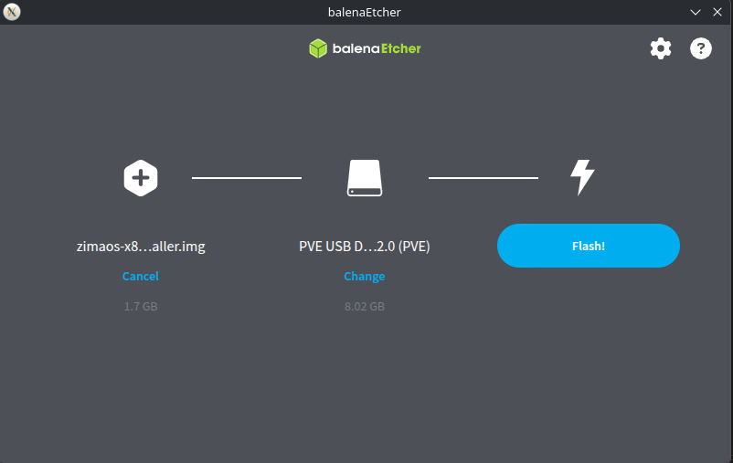

# Instalacion Zimaos

Voy a seguir la Guía Oficial: [https://www.zimaspace.com/docs/es/zimaos/how-to-install-zimaos](https://www.zimaspace.com/docs/es/zimaos/how-to-install-zimaos)

Te resumo aqui los pasos

## Primeros pasos

Para arrancar ZimaOS, activa el modo de arranque UEFI en la BIOS y desactiva Secure Boot.

### Paso 1: Descargar la imagen de instalación de ZimaOS

Descarga el archivo .img más reciente de ZimaOS desde la página oficial de versiones de GitHub:

[👉 Versiones de ZimaOS en GitHub](https://github.com/IceWhaleTech/ZimaOS/releases)

### Paso 2: Crear una unidad USB de arranque

Debes grabar la imagen de ZimaOS en una unidad USB. La herramienta más sencilla es Balena Etcher.

[👉](https://github.com/IceWhaleTech/ZimaOS/releases)Descarga e instala [Balena Etcher](https://etcher.balena.io/)

Abre Etcher y selecciona el archivo .img de ZimaOS.

Inserta la unidad USB y selecciónala como destino.

Haz clic en Flash para escribir la imagen.



### Paso 3: Entrar en la BIOS y configurar USB en boot

En mi caso para entrar en la BIOS en con la tecla F10.

Luego dentro de la BIOS buscamos el BOOT order y seleccionamos el USB como dispositivo de arranque y importante deshabilitamos el Secure Boot.

Por último con F10 salimos guardando los cambios

Ahora se reiniciara y empezaremos el proceso de Instalacion.

### Paso 4: Instalación ZimaOS

Este paso es seguir las pantallas de instalación en la ultima version actual de Zimaos 1.8 ahora este proceso tiene una GUI y es mas sencillo de configurar, es practicamente darle todo a continuar, solo te tienes que asegurar de seleccionar bien el disco de destino.

### *Problemas con el Disco HDD*

En mi caso me dio error en la instalacion ya que el disco tenia sectores mal estoy pasando un proceso de reparación con un live USB con [System Rescue.](https://www.system-rescue.org/Download/)

No consegui rescatar el disco ya que esta corrupto y roto se queda pendiente esta instalacion hasta que consiga un disco bueno.

### Paso 5: Acceder a ZimaOS

Después de reiniciar, la forma más sencilla de iniciar sesión es utilizar el dashboard web de Zimaos, se accede a traves de la IP del equipo se puede ver directamente en la consola tras la instalación.

```
http://IP_Portatil:80
```
