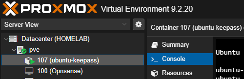

# Upgradear Proxmox 8 a 9

Debido a que Proxmox VE 8 deja de tener soporte voy a upgradear mis dos nodos a Proxmox VE 9, voy a seguir la guia oficial de Proxmox VE.

[Guia Oficial](https://pve.proxmox.com/wiki/Upgrade_from_8_to_9#Upgrade_the_system_to_Debian_Trixie_and_Proxmox_VE_9.0)

## Primero hacemos el chequeo

`pve8to9 --full`

Este chequeo en mi caso, me da esta warning:

```Shell
WARN: The matching CPU microcode package 'intel-microcode' could not be found! Consider installing it to receive the latest security and bug fixes for your CPU.

        Ensure you enable the 'non-free-firmware' component in the apt sources and run:

        apt install intel-microcode
```

Lo vamos a solucionar añadiendo los repos non-free-firmware

```Shell
# Editamos el archivo
nano /etc/apt/sources.list

# Deberia de quedar asi.

deb http://ftp.es.debian.org/debian bookworm non-free-firmware main contrib

deb http://ftp.es.debian.org/debian bookworm-updates non-free-firmware main contrib

# security updates

deb http://security.debian.org bookworm-security non-free-firmware main contrib

deb http://download.proxmox.com/debian/pve bookworm pve-no-subscription
```

## Ahora hay que seguir el tutorial y actualizar todas las rutas de los repositorios a trixie

```Shell
apt update
apt dist-upgrade
pveversion

# Actualizamos repos Debian a Trixie

sed -i 's/bookworm/trixie/g' /etc/apt/sources.list
sed -i 's/bookworm/trixie/g' /etc/apt/sources.list.d/pve-enterprise.list

# Actualizamos repos Proxmox VE a trixie

cat > /etc/apt/sources.list.d/proxmox.sources << EOF
Types: deb
URIs: http://download.proxmox.com/debian/pve
Suites: trixie
Components: pve-no-subscription
Signed-By: /usr/share/keyrings/proxmox-archive-keyring.gpg
EOF

# Actualizamos Ceph a trixie

cat > /etc/apt/sources.list.d/ceph.sources << EOF
Types: deb
URIs: http://download.proxmox.com/debian/ceph-squid
Suites: trixie
Components: no-subscription
Signed-By: /usr/share/keyrings/proxmox-archive-keyring.gpg
EOF

# Actualizamos Tailscale a trixie

sudo sed -i 's/bookworm/trixie/g' /etc/apt/sources.list.d/tailscale.list

# Luego es importante que borres algunas configuraciones de repositorios antiguos, mi configuracion queda asi

root@pve:~# cat /etc/apt/sources.list
deb http://ftp.es.debian.org/debian trixie non-free-firmware main contrib

deb http://ftp.es.debian.org/debian trixie-updates non-free-firmware main contrib

# security updates
deb http://security.debian.org trixie-security non-free-firmware main contrib

root@pve:/etc/apt/sources.list.d# ls
ceph.sources  proxmox.sources  tailscale.list

# Actualizamos y nos fijamos que o de ningun error el apt update.
apt update
apt policy

# Proceso de instalacion aqui te ira preguntando si quieres modificar ciertos archivos de configuracion 
# o no, depende de tu caso personal te interesa o no pero la mayoria si te interesa.

apt dist-upgrade

# Comprobamos que este todo bien y reiniciamos

pve8to9
reboot
```

## Resultado

Luego ya podemos ver la nueva version en la GUI directamente


