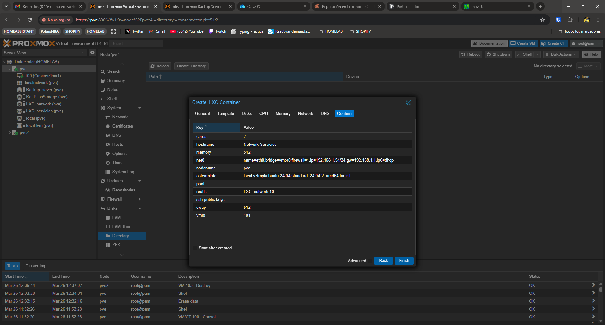

# Procedimiento de Migración — Proxmox Homelab

> **Sistema operativo LXC:** Ubuntu 24.04
> **Gestión de servicios:** Docker + Docker Compose
> **Referencia:** Ver `migracion_servicios_proxmox.md` para planificación y estado general.

---

## Fase 1 — Crear y preparar un LXC

### 1.1 Descargar la plantilla de Ubuntu 24.04

Antes de crear el LXC hay que tener la plantilla descargada en el storage `local`:

1. En la interfaz web → **local → CT Templates → Templates**
2. Buscar **Ubuntu 24.04** y hacer clic en **Download**

> ℹ️ El LVM-thin no puede almacenar plantillas, solo discos de contenedor. Por eso la plantilla va en `local` y el disco del LXC en `LXC_Servicios`.

### 1.2 Crear el LXC en Proxmox

1. En la interfaz web de Proxmox → **Create CT**
2. En el paso **Template** → seleccionar storage `local` y la plantilla de Ubuntu 24.04
3. En el paso **Disks** → seleccionar storage `LXC_Servicios`
4. Configuración recomendada:

| Campo                   | LXC 1 (Red)                | LXC 2 (Aplicaciones)       |
| ----------------------- | -------------------------- | -------------------------- |
| **Template**      | Ubuntu 24.04 (desde local) | Ubuntu 24.04 (desde local) |
| **Storage disco** | LXC_Servicios              | LXC_Servicios              |
| **Disk**          | 10 GB                      | 20 GB                      |
| **CPU**           | 1 core                     | 2 cores                    |
| **RAM**           | 512 MB                     | 4096 MB                    |
| **IP**            | x.x.x.x/24                 | x.x.x.x/24                 |
| **Gateway**       | x.x.x.1                    | x.x.x.1                    |
| **DNS**           | 1.1.1.1                    | 1.1.1.1                    |

> ⚠️ **Desmarcar "Unprivileged container"** (contenedor privilegiado) y desmarcar **"Start after created"**
> ℹ️ El contenedor privilegiado es necesario para que herramientas de monitorización como Beszel muestren las métricas correctamente.

### 1.2 Ajustes previos al arranque (en Proxmox shell)

Si vas a usar Docker dentro del LXC, hay que habilitar el nesting:

```bash
# En la shell del nodo Proxmox, no dentro del LXC
pct set <ID> --features nesting=1
```

Para poder configurar el Tailscale tambien es necesario pasar el device de interfaces de red al LXC:

```bash
/dev/net/tun
```

### 1.3 Arrancar y acceder al LXC

```bash
pct start <ID>
pct enter <ID>
```

---

## Fase 2 — Configuración base del LXC (Ubuntu 24.04)

### 2.1 Corregir DNS temporal

Al crear el LXC hereda el DNS del nodo Proxmox (`100.100.100.100` de Tailscale), que no funciona hasta que Tailscale esté instalado. Hay que corregirlo primero:

```bash
echo -e "nameserver 1.1.1.1\nnameserver 8.8.8.8" > /etc/resolv.conf
```

### 2.2 Actualizar el sistema

```bash
apt update && apt upgrade -y
```

### 2.3 Instalar utilidades básicas

```bash
apt install -y curl wget git nano htop
```

### 2.4 Instalar Docker

```bash
curl -fsSL https://get.docker.com | sh
```

### 2.5 Instalar Docker Compose

```bash
apt install -y docker-compose-plugin
```

### 2.6 Verificar instalación de Docker

```bash
docker --version
docker compose version
```

### 2.7 Instalar Tailscale

```bash
curl -fsSL https://tailscale.com/install.sh | sh
```

Arrancar y autenticar:

```bash
tailscale up
```

Se generará un enlace, ábrelo en el navegador para autenticar el nodo en tu cuenta de Tailscale.

Verificar que está conectado:

```bash
tailscale status
```

> ℹ️ Repetir en cada LXC y en cada nodo Proxmox para tener acceso remoto completo a toda la infraestructura.

### 2.8 Crear estructura de directorios

```bash
mkdir -p /opt/docker/{nombre-servicio}/data
```

---

## Fase 3 — Migrar un servicio

> Repetir este proceso para cada servicio que se migre.

### 3.1 Snapshot de seguridad antes de empezar

Desde la shell del nodo Proxmox:

```bash
pct snapshot <ID> pre-migracion-<servicio> --description "Antes de migrar <servicio>"
```

### 3.2 Copiar datos desde CasaOS al LXC

Desde la shell del nodo Proxmox (o desde CasaOS directamente):

```bash
# Desde el nodo Proxmox
scp -r root@<IP_CASAOS>:/DATA/AppData/<servicio>/ root@<IP_LXC>:/opt/docker/<servicio>/
```

Si usas estas opcion hay que habilitar el login de ssh con root esto se activa en `sshd_config`

```bash
PermitRootLogin prohibit-password 
# Lo cambiamos por
PermitRootLogin yes
```

*Luego cuando acabe el scp lo dejamos como antes.*

O si tienes acceso directo desde la shell del nodo:

```bash
pct push <ID> /ruta/local/origen /ruta/destino/en/lxc
```

### 3.3 Ajustar permisos

Dentro del LXC:

```bash
chown -R 1000:1000 /opt/docker/<servicio>/
```

### 3.4 Crear el docker-compose.yml

```bash
nano /opt/docker/<servicio>/docker-compose.yml
```

> Usar la misma configuración que tenías en CasaOS, ajustando las rutas de volúmenes a `/opt/docker/<servicio>/data`.

### 3.5 Arrancar el servicio

```bash
cd /opt/docker/<servicio>
docker compose up -d
```

### 3.6 Verificar que funciona

```bash
docker compose ps
docker compose logs -f
```

### 3.7 Actualizar Nginx Proxy Manager

En la interfaz web de Nginx Proxy Manager:

- Editar el proxy host del servicio migrado
- Cambiar la IP de destino a la IP del nuevo LXC
- Verificar que el acceso externo sigue funcionando

### 3.8 Apagar el contenedor antiguo en CasaOS

En CasaOS, parar el contenedor del servicio migrado **sin borrarlo** hasta confirmar que todo va bien.

---

## Fase 4 — Configurar replicación (solo LXC 1)

Desde la interfaz web de Proxmox:

1. Seleccionar el LXC 1 → **Replication** → **Add**
2. Configuración:

| Campo                | Valor                          |
| -------------------- | ------------------------------ |
| **Target**     | Nodo 2                         |
| **Schedule**   | `*/15 * * * *` (cada 15 min) |
| **Rate limit** | Sin límite                    |

1. Verificar que la primera replicación se completa sin errores en **Replication → Job log**

---

## Fase 5 — Procedimiento de failover (LXC 1)

Si el Nodo 1 cae y necesitas arrancar Nginx en el Nodo 2:

```bash
# 1. Verificar que el LXC original en Nodo 1 está apagado
# 2. En la shell del Nodo 2, arrancar la réplica
pct start <ID>

# 3. Verificar que Nginx responde
curl -I http://localhost
```

> ⚠️ Nunca arrancar la réplica si el LXC original sigue encendido — conflicto de IP.

---

## Fase 6 — Limpieza final

Una vez todos los servicios estén migrados y verificados durante varios días:

```bash
# Borrar los contenedores antiguos en CasaOS uno a uno
# Verificar primero que el servicio funciona en el LXC antes de borrar

# Opcional: apagar la VM de CasaOS completamente
qm stop <VMID>

# Cuando estés seguro, borrar la VM
qm destroy <VMID> --purge
```

---

## Referencia rápida de red

```bash
# Ver todas las IPs activas en la red
arp -a

# Escanear toda la subred (más completo)
nmap -sn 192.168.x.0/24
```

---

## Referencia rápida de comandos LXC

```bash
pct list                        # Listar todos los LXCs
pct start <ID>                  # Arrancar LXC
pct stop <ID>                   # Parar LXC
pct enter <ID>                  # Acceder a la consola
pct snapshot <ID> <nombre>      # Crear snapshot
pct listsnapshot <ID>           # Ver snapshots
pct rollback <ID> <nombre>      # Restaurar snapshot
pct destroy <ID>                # Borrar LXC
```

## Referencia rápida de comandos Docker

```bash
docker compose up -d            # Arrancar servicios en segundo plano
docker compose down             # Parar y eliminar contenedores
docker compose ps               # Ver estado de los contenedores
docker compose logs -f          # Ver logs en tiempo real
docker compose pull             # Actualizar imágenes
docker stats                    # Ver consumo de recursos
```

---

## Tareas futuras

- [ ] **Ansible** — automatizar la configuración base de nuevos LXCs (DNS, Docker, Tailscale, utilidades) mediante playbooks. Rentable cuando haya 4+ nodos o se creen LXCs frecuentemente.
- [ ] **Git/GitHub** — versionar los docker-compose.yml y la documentación en un repositorio `homelab` para tener historial de cambios y recuperación rápida de configuraciones.
- [ ] **Hardware transcoding en Jellyfin** — activar Intel QuickSync para delegar la transcodificación a la GPU integrada y reducir el uso de CPU.


