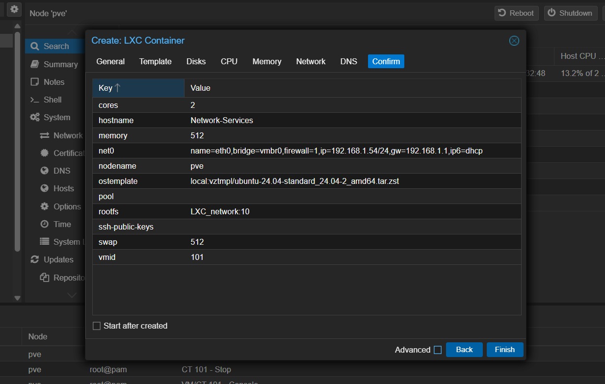
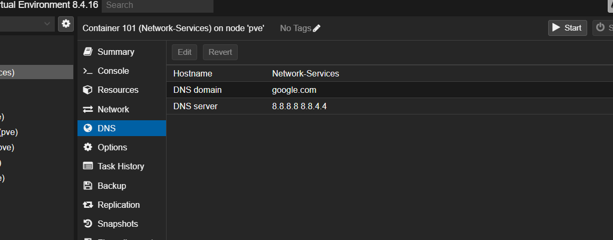

# Migration of Network Services

Actualmente tengo diferentes servicios de red como un proxy inverso y otros para gestionar diferentes servicios que necesitan ser accesibles desde fuera de la red o que simplemente necesitan HTTP's. Estos servicios son esenciales ya que sin ellos perderia el acceso a estos servicios por lo que quiero separar estos servicios en un contenedor facil de replicar y de recuperar si mi VM con CasaOS falla por cualquier motivo.

## Process

Vamos a crear una LXC con Ubuntu24.04 ya que es el mas compatible y completo, la vamos a crear con la siguiente configuración.



Tambien le vamos a añadir los DNS de google para poder instalar los y actualizar los servicios.



Una vez iniciada y creada vamos a instalar los siguientes requisitos minimos que necesitamos para que podamos crear nuestros servicios.

- [Docker]('https://docs.docker.com/engine/install/ubuntu/#install-using-the-repository')
- Docker Compose
- Tailscale

**IMPORTANTE** para que Tailscale funciona hay que pasarlo a la LXC un device Passthrough

```
/dev/net/tun
```

## Docker Compose

Ahora vamos a crear los servicios con Docker Compose, en este caso vamos a lanzar un Nginx Proxy Manager y un Ddns Updater.

```
services:
  nginxproxymanager:
    container_name: nginxproxymanager
    image: jc21/nginx-proxy-manager:2.12.3
    ports:
      - "80:80"
      - "81:81"
      - "443:443"
    restart: unless-stopped
    volumes:
      - /DATA/AppData/nginxproxymanager/data:/data
      - /DATA/AppData/nginxproxymanager/etc/letsencrypt:/etc/letsencrypt

  ddns-updater:
    container_name: ddns-updater
    image: qmcgaw/ddns-updater:v2.9.0
    ports:
      - "8000:8000"
    restart: unless-stopped
    environment:
      - PERIOD=5m
      - UPDATE_COOLDOWN_PERIOD=5m
      - PUBLICIP_FETCHERS=all
      - HTTP_TIMEOUT=10s
      - LOG_LEVEL=info
    volumes:
      - /DATA/AppData/ddns-updater/data:/updater/data
```

Antes de lanzar nuestro docker compose tenemos que crear un archivo de configuracion para nuestro Ddns-updater ya que sin el no funciona.

```
mkdir -p /DATA/AppData/ddns-updater/data
nano /DATA/AppData/ddns-updater/data/config.json
```

Dependiendo de tu proveedor tendras que configurarlo de una manera o otra.

Ahora creamos este archivo en nuestro LXC y luego lanzamos el docker-compose.

```
sudo nano docker-compose.yml

docker compose up -d
```

## Configuración

Vamos a empezar a configurar el Nginx Proxy Manager, primero accedemos a la web.

```
http://192.168.1.55:81/login
```

Vamos a configurar el login, por defecto hay que loguearse con <admin@example.com> como usuario y de contraseña changeme. Una vez iniciemos sesion nos va a mandar configurar el usuario admin puedes dejarlo por defecto pero yo recomiendo cambiarlo siempre.

Una vez tenemos la web configurada ahora tenemos que entrar a la configuracion de nuestro Router y abrir los puertos 80 y 443 para la IP de este servidor.

```
192.168.1.1
```

Ya con esto ya podemos empezar a crear Proxy's, ahora creare manualmente cada proxy que tengo en mi CasaOS.

Sobre Ddns-Updater no hace falta configurar nada ya que ya lo configuramos con el archivo de configuracion que creamos anteriormente.

### Conclusión

Con esto hemos descentralizado dos servicios muy importantes que gestionan muchos de mis servicios actuales de esta manera vamos a poder supervisar y replicar de manera mas facil, manteniendo la misma estructura que teniamos anteriormente.
