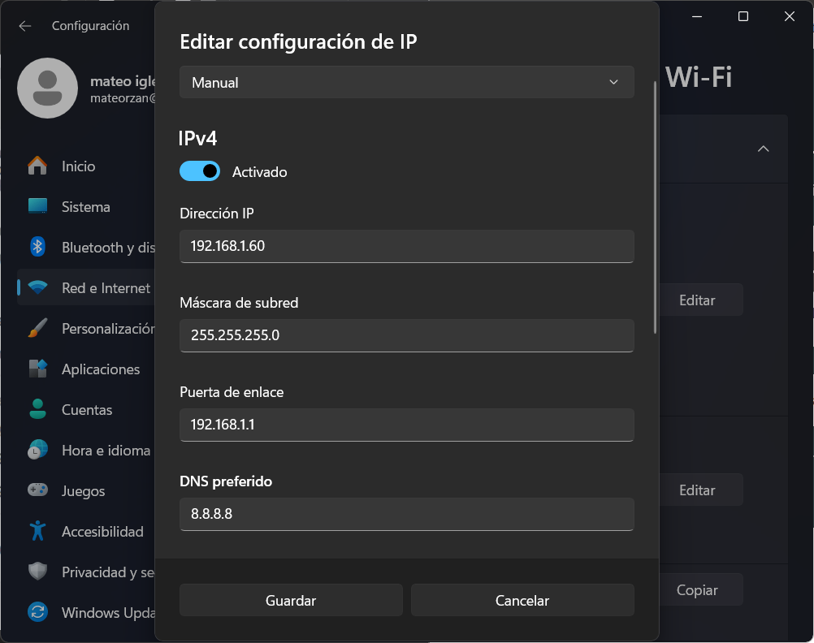
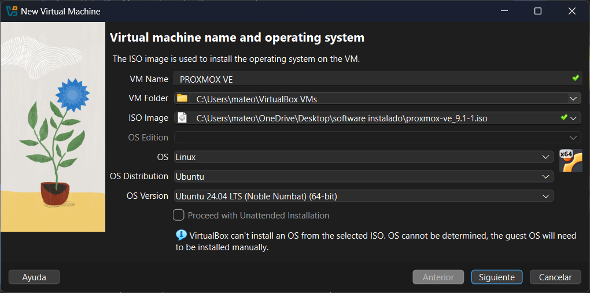
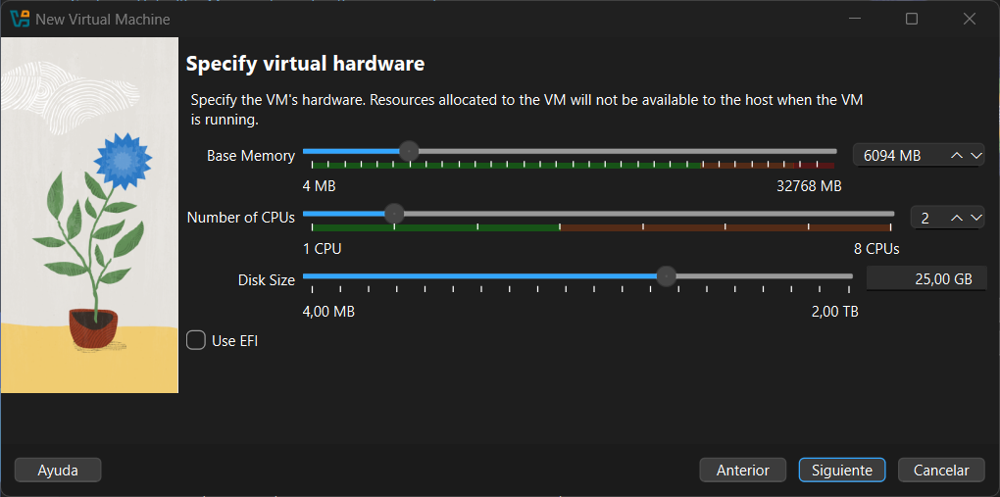
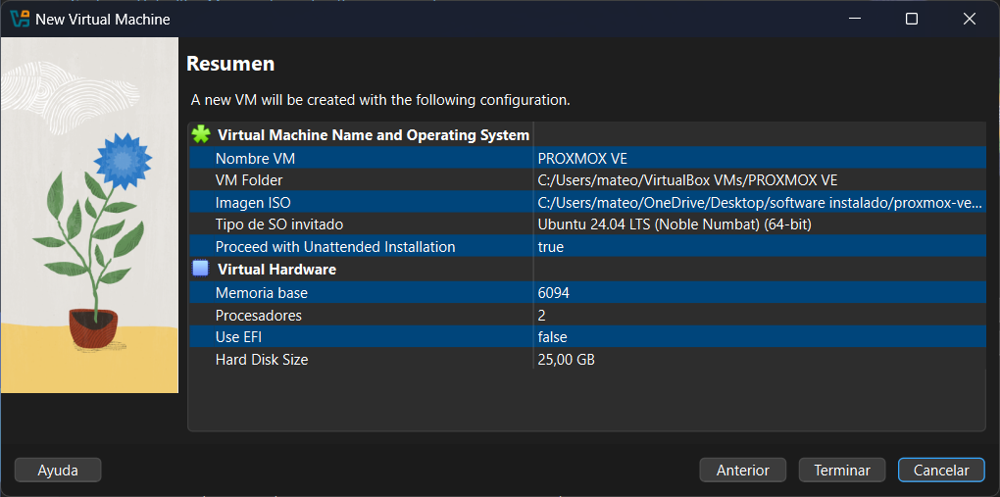
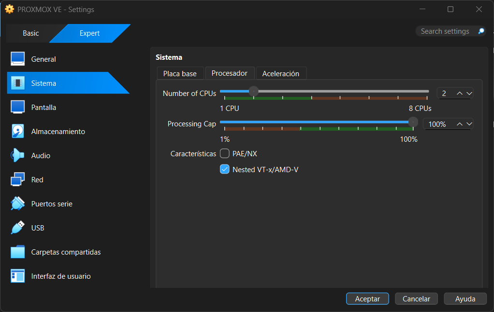
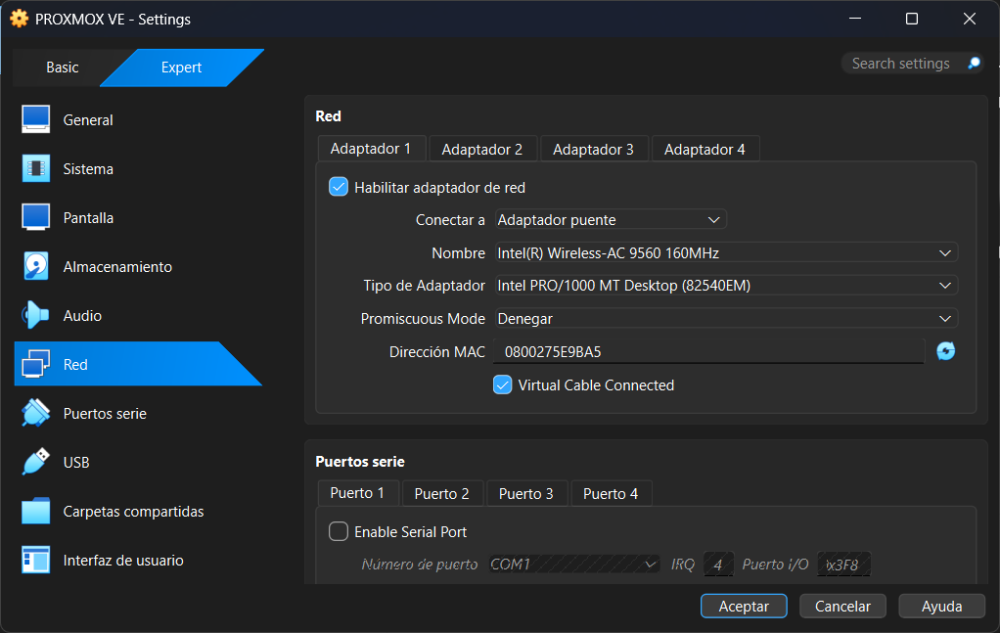
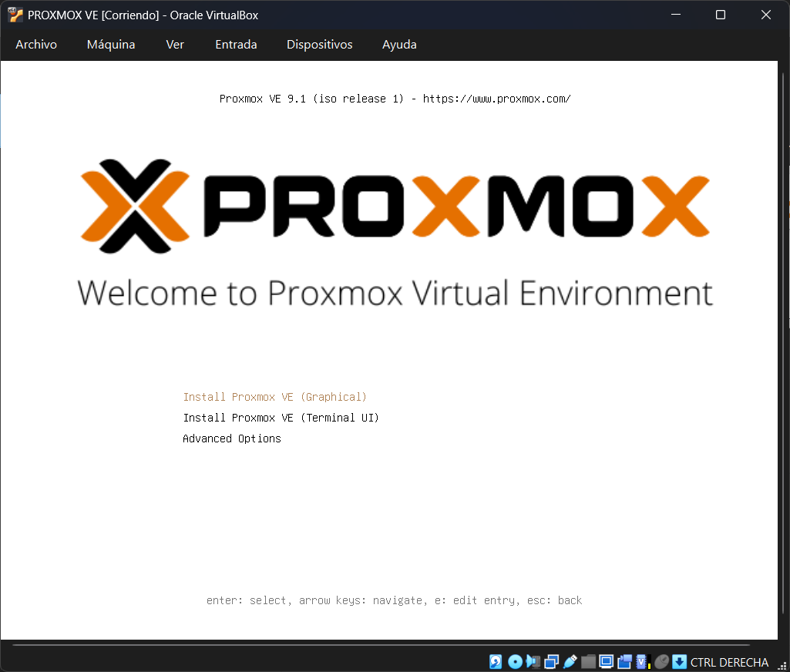
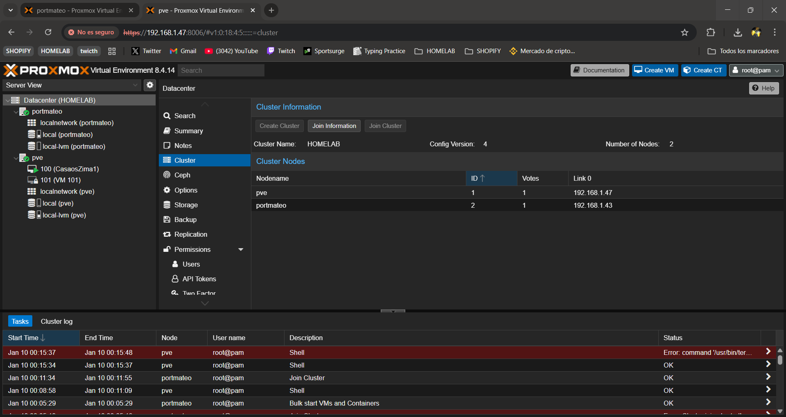

# PREPARACION DE PORTATIL PARA HACER PRUEBAS

## Situación actual

Queremos acondicionar un portatil para que sea versatil y sirva para crear proyectos supervisar nuestro HOMELAB y crear servicios sin que pierda su proposito principal como portatil. Para ello vamos a empezar creando una maquina virtual para poder usar proxmox y asi este conectado a nuestro nodo local pero sin perder su sistema operativo ni su funcionalidad como portatil.

## Instalaciones

VIRTUALBOX

VISUAL STUDIO

microsoft visual c++ 2019

## PROBLEMAS Y SOLUCIONES

### VIRTUALBOX opcion bios

VIRTUALBOX nos da el siguiente error al intentar iniciar la VM.

VT-x is disabled in the BIOS

Para que la VM funcione necesitamos activar esta opcion en la BIOS, para esto hay que reiniciar el dispositivo y pulsar F2 o DEL o la tecla correspondiente de tu dispositivo para entrar en la BIOS todo esto mientras se inicia.

En mi caso particular tuve que activar tanto Intel-VT-d y la virtualizacion.

## PROGRESOS

Antes de nada vamos a configurar una IP estatica para nuestro portatil en nuestra red local.

Luego vamos a descargar Tailsacale para unir por VPN nuestro portatil con el resto de dispositivos de la red.

https://tailscale.com/download

Vamos a crear la VM con VIRTUALBOX para esto una vez instalado el programa necesitamos el archivo .iso de instalacion de PROXMOX VE.

https://www.proxmox.com/en/downloads/proxmox-virtual-environment

Una vez descargamos la ISO que queremos vamos a crear la VM en VIRTUALBOX

daadwasdadwadawd

adadwda

dadawda

Configuramos para que use la misma red que el dispositivo.

Arrancamos y instalamos proxmox

Seguimos la configuracion de instalacion configuramos IP y nombre, importante que no repites ni la IP ni el nombre con otros dispositivos.

Una vez iniciado nos dara una url que podremos usar para conectarnos a nuestro proxmox VE y ya estaria configurado.

### Unimos el proxmox al nodo de nuestro HOMELAB

Desde las opciones del Datacenter de nuestro HOMELAB en cluester copiamos la informacion de union.

Luego hacemos lo mismo pero en el dispositivo nuevo y seleccionamos la opcion Join cluster aqui pegamos la informacion de union de nuestro HOMELAB, y con esto ya tenemos los dos dispositivos en un mismo nodo.
