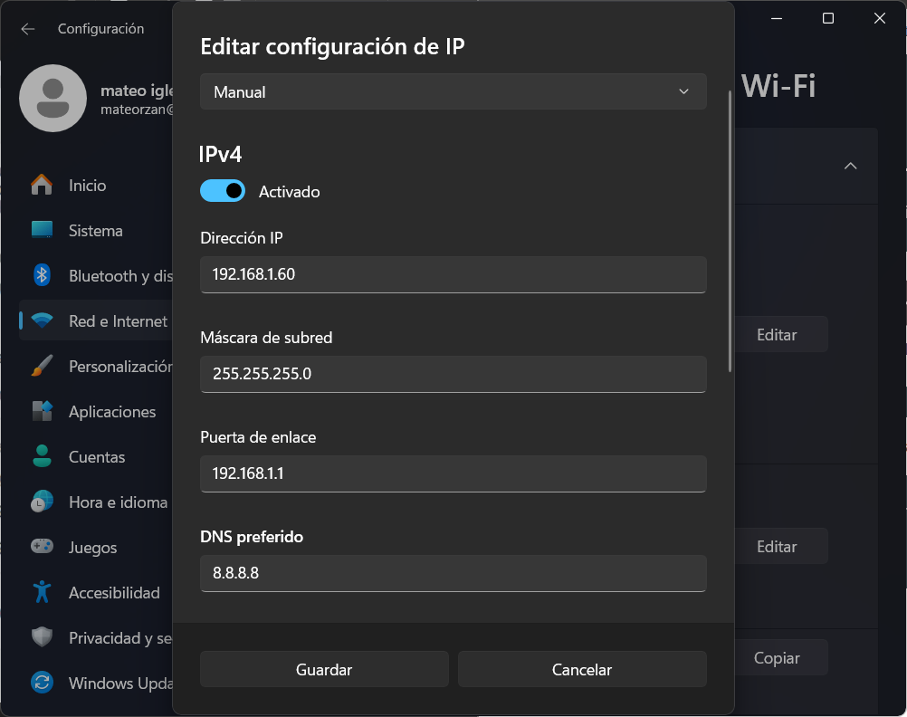
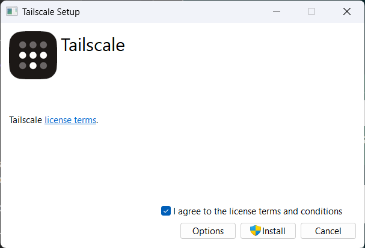
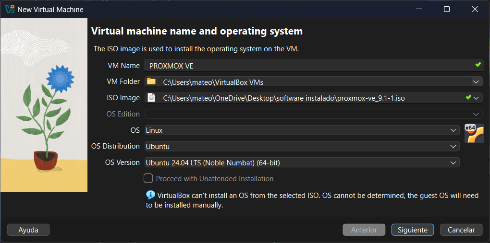
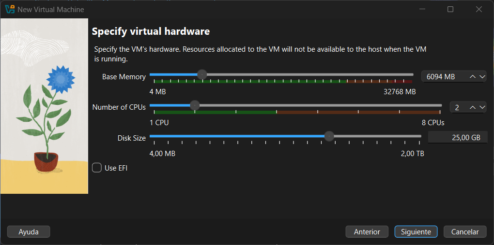
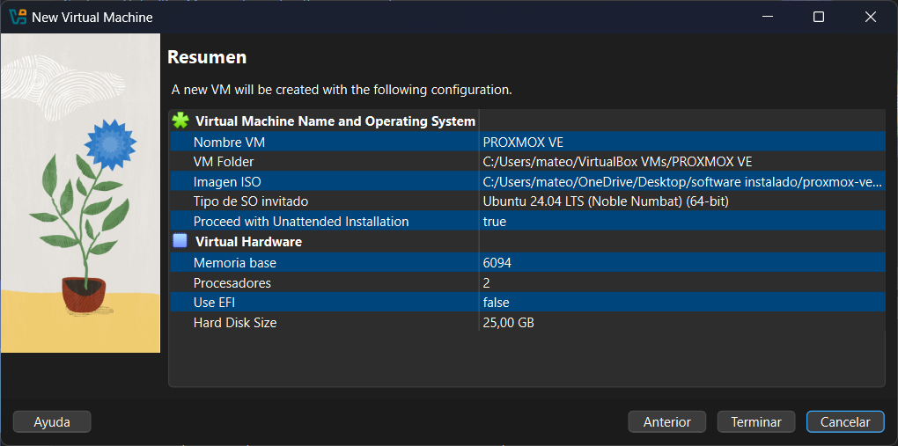
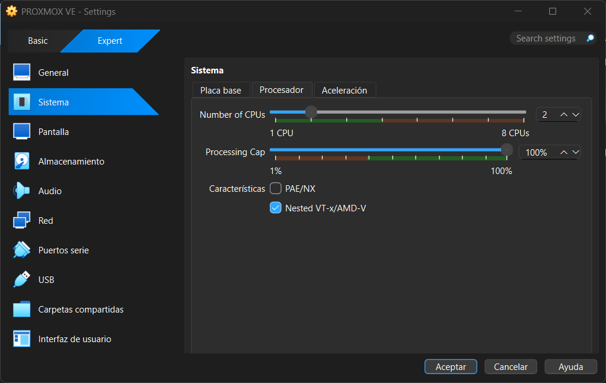
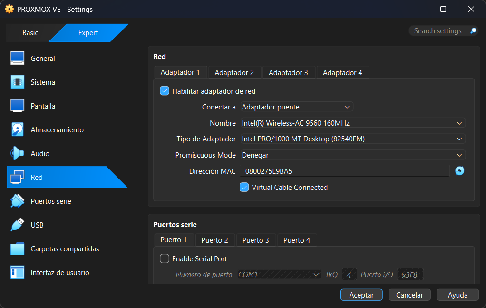
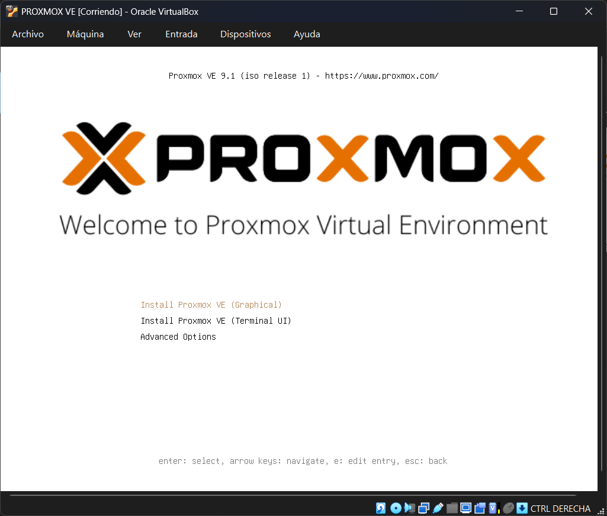
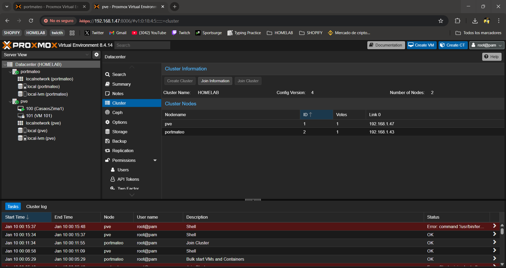

# PREPARACIÓN DE PORTÁTIL PARA HACER PRUEBAS

## Objetivo

Queremos acondicionar un portátil para que sea versátil y sirva para crear proyectos supervisar nuestro HOMELAB y crear servicios sin que pierda su propósito principal como portátil. Para ello vamos a empezar creando una maquina virtual para poder usar Proxmox y asi este conectado a nuestro nodo local pero sin perder su sistema operativo ni su funcionalidad como portátil.

## Requisitos

- VIRTUALBOX

## Instalación VM

Antes de nada vamos a configurar una IP estática para nuestro portátil en nuestra red local.



Luego vamos a descargar Tailscale para unir por VPN nuestro portátil con el resto de dispositivos de la red.

``` text
https://tailscale.com/download
```



Vamos a crear la VM con VIRTUALBOX para esto una vez instalado el programa necesitamos el archivo .iso de instalación de PROXMOX VE, vamos a la pagina oficial de Proxmox y descargamos la ultima version de Proxmox VE.

``` text
https://www.proxmox.com/en/downloads/proxmox-virtual-environment
```

Una vez descargamos la ISO que queremos vamos a crear la VM en VIRTUALBOX con la siguiente configuración, yo decidí usar esta configuración pero tu puedes usar cualquier otra según tu caso.



Yo esta maquina solo la quiero para hacer pruebas no para correr servicios 24/7 por lo que la voy a hacer con recursos limitados ya que no me interesa que me consuma muchos recursos de mi dispositivo.



El resumen de nuestra instalación debería de ser algo asi, una vez asi la creamos.



Una vez creada es importante activar la Característica "Nested VT-x/AMD-V" esto activa la virtualización dentro de la VM.



Configuramos la red de la VM en adaptador puente ya que asi no tenemos que configurar y usa la misma red del Portátil.



## Configuración

Arrancamos y instalamos Proxmox.

> ***Si te da error al intentar la VM hay que activar la virtualización en la BIOS***



*Seguimos la configuración de instalación configuramos IP y nombre, **IMPORTANTE** que no repites ni la IP ni el nombre con otros dispositivos.*

> Una vez iniciado nos dará una url que podremos usar para conectarnos a nuestro Proxmox VE y ya estaría configurado.

### Unimos el Proxmox al nodo de nuestro HOMELAB (Deprecated)

Desde las opciones del DataCenter de nuestro HOMELAB en cluster copiamos la información de union.



Luego hacemos lo mismo pero en el dispositivo nuevo y seleccionamos la opción Join cluster aquí pegamos la información de union de nuestro HOMELAB, y con esto ya tenemos los dos dispositivos en un mismo nodo.
