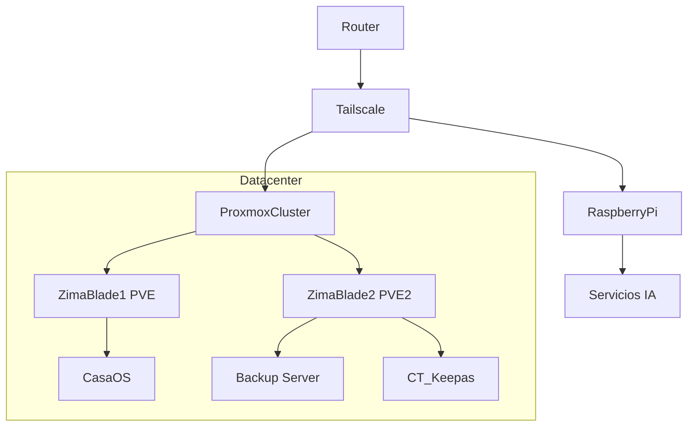

# 🏠 HOMELAB INFRASTRUCTURE PROJECT

### 🚀 High Availability Cluster with ZimaBlade & Raspberry Pi

<p align="center">

[](https://www.proxmox.com/en/proxmox-virtual-environment)
[](https://www.docker.com/)
[](https://tailscale.com/)
[](https://www.proxmox.com/en/proxmox-backup-server)
[](https://www.raspberrypi.com/products/raspberry-pi-5/)
[](#)

</p>

---

# 📖 Descripción

En este repositorio voy a explicar como yo configure mi actual homelab, compartire algunos archivos de configuracion que pueden ser de ayuda para la gente que quiere hacer algo parecido en su propio servidor.

Este proyecto tiene como objetivo construir una infraestructura doméstica orientada a:

- 🏗️ Alta disponibilidad
- 🔁 Replicación entre nodos
- 💾 Backups incrementales diarios
- ⚖️ Balance estructural
- 🌍 Servicios 24/7
- 🤖 Nodo independiente para IA

---

# 🏗️ Arquitectura General

## 🔹 Diagrama de Infraestructura



---

## 🔹 Estructura Actual

```
Datacenter (Proxmox Cluster)
│
├── pve     → zimablade1 (Nodo 1 - Servicios)
├── pve2    → zimablade2 (Nodo 2 - Backup / Replicacion / Servicios)
│
└── Raspberry Pi 5
    └── Servidor independiente corriendo servicios de IA
```

---

## 🎯 Estructura Objetivo

```
Datacenter (Alta Disponibilidad)
│
├── Nodo 1 → Servicios principales
├── Nodo 2 → Replicación + Backups
├── Nodo 3 → Expansión futura (Quorum)
│
└── Raspberry Pi 5 → Laboratorio IA (ARM)
```

---

# 🧠 Arquitectura Técnica

## 🔹 Virtualización

- Cluster basado en Proxmox VE
- Contenedores LXC para servicios ligeros
- Máquinas virtuales para servicios críticos
- Snapshots periódicos

## 🔹 Backups

- Backups incrementales diarios
- Deduplicación
- Compresión
- Replicación entre nodos

## 🔹 Red

- VPN Mesh privada
- Acceso remoto seguro
- Servicios expuestos mediante proxy inverso
- Certificados SSL

## 🔹 Orquestación

- Gestión manual estructurada
- Evaluación futura de Kubernetes
- Segmentación por tipo de servicio

---

# 📊 Servicios Activos

## 🔹 Infraestructura

| Servicio              | Función              |
| --------------------- | --------------------- |
| Proxmox VE            | Virtualización       |
| Proxmox Backup Server | Backups               |
| CasaOS                | Gestión de servicios |
| Tailscale             | VPN privada           |
| Portainer             | Gestión Docker       |
| Beszel                | Monitorización       |

---

## 🔹 Servicios Usuario

| Servicio            | Función                   |
| ------------------- | -------------------------- |
| NextCloud           | Almacenamiento Cloud Local |
| Jellyfin            | Servicio Multimedia        |
| Nginx Proxy Manager | Proxy inverso              |
| Radarr              | Gestión Películas        |
| Sonar               | Gestión Series            |
| Prowlar             | Indexer Torrent            |
| Deluge              | Cliente Torrent            |
| Downtify            | Música                    |
| Sure                | Gestión de gastos         |
| Ddns-Updater        | Actualización IP pública |
| VaultWarden         | Gestor de contraseñas     |

---

# 📈 Métricas de Infraestructura

*(Sección preparada para actualizar con métricas reales)*

- 🖥️ Nodos activos: 2
- 💾 Tipo almacenamiento: HDD
- 🌐 Acceso remoto: VPN privada
- 🔄 Backups: Incrementales diarios
- ⏱️ Objetivo disponibilidad: 24/7

---

# 🛣️ Roadmap Técnico

## Infraestructura

- [X] Migración a Proxmox
- [X] Implementación de PBS
- [X] Integración VPN privada
- [ ] Añadir nodo para quorum
- [ ] Migración a almacenamiento SSD
- [ ] Monitorización avanzada (Grafana / Prometheus)

## Automatización

- [ ] Backups automáticos verificados
- [ ] Alertas por caída de servicios
- [ ] CI/CD para despliegues

## IA (Raspberry Pi 5)

- [ ] Servidor IA local
- [ ] Automatización inteligente
- [ ] Experimentos ML
- [ ] Integración futura con cluster principal

---

# 🧪 Evolución del Proyecto

## 🏗 Fase Inicial

Una raspberry Pi5 con CasaOS instalado localmente con diferentes servicios creados a traves de CasaOS:

- NextCloud
- Jellyfin
- Nginx Proxy Manager
- Prowlar
- Sonar
- Radarr
- DdnsUpdater
- Sure

---

# 🎯 Objetivo Final

Crear una red de nodos de alta disponibilidad y respaldada, este proyecto es muy ambicioso y aun no se el alcance de este mismo, probablemente ira a mas, ire actualizando con las novedades este Readme.

Este proyecto funciona como:

- 🧠 Laboratorio personal de infraestructura
- 🏗️ Entorno de pruebas DevOps
- 🔬 Plataforma de experimentación IA
- 📚 Proyecto documentado como portfolio técnico

---

# 👨‍💻 Autor

Proyecto desarrollado como laboratorio personal de infraestructura, virtualización y servicios autoalojados.

Infraestructura en evolución constante 🚀
