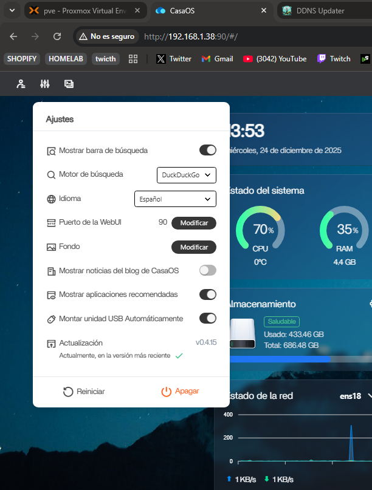
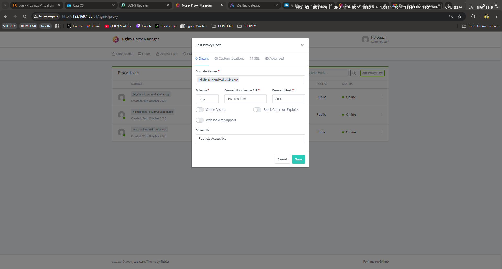
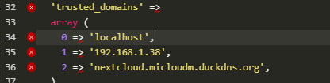
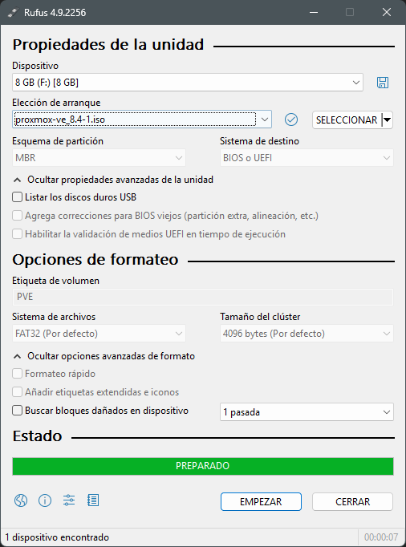
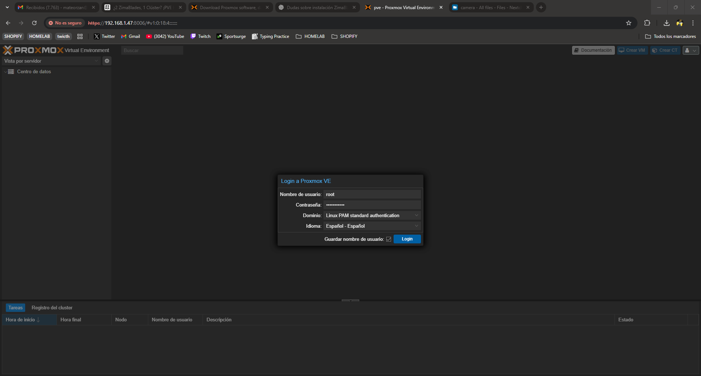
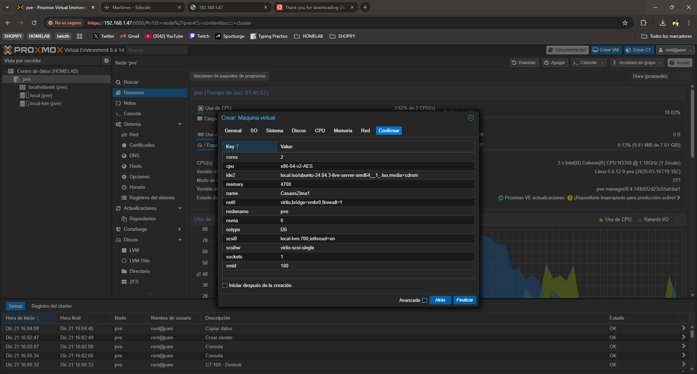
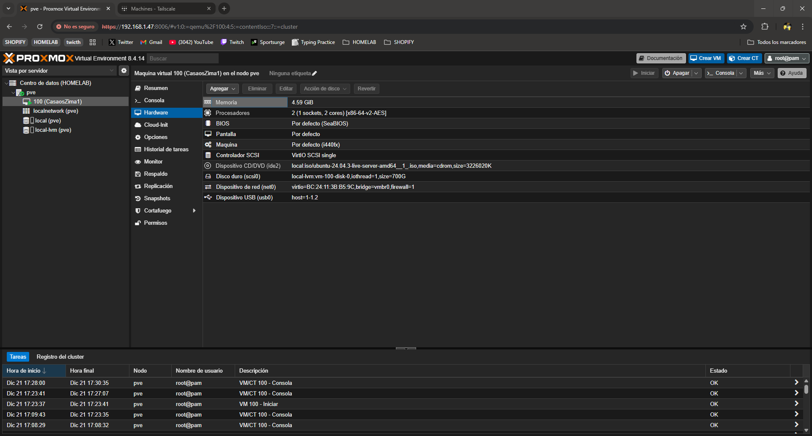

# HOMELAB PROJECT CON RASPBERRY Y ZIMABLADE SERVERS

En este repositorio voy a explicar como yo configure mi actual homelab, compartire algunos archivos de configuracion que pueden ser de ayuda para la gente que quiere hacer algo parecido en su propio servidor.

## Histórico

### Estructura actual :

Una raspberry pi con CasaOS instalado localmente con diferentes servicios creados a traves de CasaOS

NextCloud, servicio Cloud
Jellyfin, servicio de medios Multimedia
Nginx Proxy Manager, proxy que publica los servicios
Prowlar, indexer
Sonar, servicio de series
Radarr, servicio de peliculas
DdnsUpdater, servicio para actualizar la ip publica
Sure, servicio finanzas

### Situacion actual :

Dispongo de dos servidores más, dos zimablades, queremos ampliar nuestro Homelab con dos servidores más, los cuales queremos poner tambien a funcionar y crear un nodo con tres servidores que corran diferentes servicios. Estos zimablades traen ya preinstalado CasaOS ya que son de los creadores de este sistema.

La idea de esta estructura es crear un red de alta disponibilidad, respaldada y gestionar cargas de trabajo entre nodos, y disponer de los servicios 24/7.

### Estructura final(Objetivo) :

La intencion final de este proyecto es crear una red de nodos de alta disponibilidad y respaldada,este proyecto es muy ambicioso y aun no se el alcance de este mismo, ire actualizando con las novedades este Readme.

### Ideas y pruebas que voy realizando:

#### Estructural

| APLICADO | PROBADO | TECNOLOGÍA | NOTAS                                                                                                                                                                                                                                         |
| :------: | :-----: | :----------: | :-------------------------------------------------------------------------------------------------------------------------------------------------------------------------------------------------------------------------------------------- |
|    NO    |   SI   | Docker Swarm | No tiene soporte y es bastante limitado tengo que probar con otro<br />orquestador.                                                                                                                                                           |
|    SI    |   SI   |  Tailscale  | Es una VPN que conecta todos los servidores entre si por una red<br />publica pero privada, hace accesible a todos los servidores desde <br />cualquier sitio si estas conectado a esta VPN.                                                  |
|    SI    |   SI   |   Proxmox   | Es una plataforma de vistualizacion de servidores, tiene<br />una cierta orquestación ya que te permite gestionar nodos.<br />Esto seria una buena opción para mi caso, queda pendiente<br />necesito los discos duros para los zimablades. |
|    NO    |   NO   |  Kubernetes  | Es el orquestador mas usado a nivel de servicios queda<br />pendiente de ver como funciona y si tiene sentido en <br />mi estructura.                                                                                                        |
|    SI    |   SI   |    CasaOS    | Todos mis servidores tienen este sistema instalado<br />facilita mucho los crear servicios y implementarlos.                                                                                                                                  |

#### Servicios

| APLICADO | APROBADO |      SERVICIO      | NOTAS                                                                              |
| :------: | :------: | :-----------------: | ---------------------------------------------------------------------------------- |
|    SI    |    SI    |      NextCloud      | Almacenamiento Cloud Local.                                                        |
|    SI    |    SI    |      Jellyfin      | Servicio Multimedia                                                                |
|    SI    |    SI    |        Sure        | Servicio de gestion de gastos                                                      |
|    SI    |    SI    |       Deluge       | Servicio Torrent                                                                   |
|    SI    |    SI    |      Downtify      | Servicio Musica                                                                    |
|    SI    |    SI    |        Sonar        | Servicio busqueda de Musica                                                        |
|    SI    |    SI    |       Radarr       | Servicio busqueda de Pelis                                                         |
|    SI    |    SI    | Nginx Proxy Manager | Servicio Proxy inverso para exponer servicios<br />con certificados SSL.           |
|    SI    |    SI    |       Prowlar       | Servicio Indexer Torrent                                                           |
|    SI    |    SI    |    Ddns-Updater    | Serviucio que actualiza la ip publica de<br />nuestro router, conectado a duckdns. |
|    NO    |    NO    |       Asenble       |                                                                                    |
|    NO    |    NO    |       Coolify       |                                                                                    |

## Problemas o inquietudes :

Como la raspberry y zima tienen diferentes arquitecturas no todos los servicios se pueden ejecutar en los dos servidores, por lo que hay servicios que no son multi-arch que hay que ejecutar por separado.

Tuve problemas para montar el servicio nfs como un servicio en docker swarm fíjate que todas las rutas, la els y imágenes estén bn elegidas y sean compatibles.

Debido a los problemas y poco soporte viste en docker swarm vamos a empezar de 0 y probar a instalar K3s, el cual es una distribucion mas ligera de Kubernetes pensada para ahorrar memoria y recursos del sistema, lo cual es justo lo que necesitamos.

## TroubleShooting

### CasaOS

#### No funciona URL Web

Reinstalar CasaOS

```
curl -fsSL https://get.casaos.io/uninstall | bash
```

Borrar CasaOS

```
curl -fsSL https://get.casaos.io | bash
```

Instalar CasaOS

```
reboot
```

Reiniciar.

*Si esto sigue sin funcionar y crees que es un problema de puertos.*

```
cd /etc/casaos
```

```
nano gateway.ini
```

*Entramos a la configuracion del puerto y lo cambiamos por uno disponible, ej: port=90.*

```
sudo systemctl restart casaos-gateway
```

#### NEXTCLOUD borra carpeta DATA al instalarlo en CasaOS

Hay que primero crear la aplicacion en CasaOS y luego hacer la sincronizacion de la carpeta DATA.

```
sudo systemctl stop casaos
sudo systemctl stop docker
```

Paramas los servicios.

```
sudo rsync -avh --progress /mnt/rpi/DATA/AppData/big-bear-nextcloud/ /DATA/AppData/big-bear-nextcloud/
```

Copiamos la carpeta DATA pero en este caso solo la de nextcloud, que el resto no tuvimos problemas de borrado.

```
sudo systemctl start casaos
sudo systemctl start docker
```

Una vez copiado iniciamos todo y empezara a migrar los datos.

#### Nginx Proxy Manager

Para que este servicio funcione como lo tenemos configurado en mi HOMELAB primero hay que abrir los puertos 80 y 443 del router para la ip de este servidor. 

```
http://192.168.1.1/
```

La ruta para acceder a tu router suele ser esta.

Importante tambien hay que cambiar el puero del CasaOS ya que por defecto usa el 80, en mi caso le configure el 90 para la pagina de inicio.



Una vez configurado los pueros del router hay que modificar los Proxy Hosts ya que estan configurados para la ip del servidor anterior y hay que configurarle la IP de este nuevo servidor para que funcionen.



Para que el proxy de NEXTCLOUD tambien funcione hay que editar el siguiente archivo de configuracion con la ip de este servidor.

```
/DATA/AppData/big-bear-nextcloud/html/config/config.php
```



#### Problema BD Postgres Nextcloud 

La aplicacion Nextcloud no era capaz de iniciarse  ya que daba un error de que la base de datos estaba unhealthy. 

Para solucionar este error probamos a borrar la carpeta /pgdata de nextcloud, esta carpeta solo contiene la informacion de la base de datos por lo que no perdemos informacion ni datos como tal, todos los datos o archivos estan almacenados en /html/data.

Una vez borrado instalamos nextcloud otra vez y ahora no nos dio error, pero no consigue iniciar, esto se debe a que le falta los datos de las tablas para poder inicia, para ello tuvimos que copiar las tablas y los datos de la base de datos de la Raspberry.

```
docker exec -i db-postgres pg_dump -U nextcloud nextcloud > nextcloud.sql

scp nextcloud.sql user@zima:/ruta/destino/
```

```
sed -i 's/oc_admin/casaos/g' /ruta/destino/nextcloud.sql

docker exec -i db-nextcloud psql -U casaos nextcloud < /ruta/destino/nextcloud.sql
```

En el archivo config.php tuvimos que cambiar el usuario y la contraseña con el que se conecta a la db por el usuario y contraseña que tenemos configurado en la pantalla de instalacion de la db postgres, ademas tuvimos que activar la actualizacion via web, modificando el archivo upgrade-disable.

### Tailscale

#### Error no me deja instalar Tailscale en proxmox, hay que editar el siguiente archivo para que instale los programas desde un repositorio gratuito.

```
nano /etc/apt/sources.list.d/pve-enterprise.list
```

Comente la linea que aparece en y añade el repositorio que no tiene subscription, luego actualiza los paquetes.

```
# deb https://enterprise.proxmox.com/debian/pve bookworm pve-enterprise

echo "deb http://download.proxmox.com/debian/pve bookworm pve-no-subscription" > /etc/apt/sources.list.d/pve-no-subscription.list
apt update
```

Hay que hacer lo mismo con el siguiente archivo.

```
nano /etc/apt/sources.list.d/ceph.list

# deb https://enterprise.proxmox.com/debian/ceph-quincy bookworm InRelease

echo "deb http://download.proxmox.com/debian/ceph-quincy bookworm main" > /etc/apt/sources.list.d/ceph-no-subscription.list
apt update
```

### Proxmox

## Soluciones y Progresos :

Usar IP local fija en todos los servidores, ejemplo de como configurar en los zimablades, cada equipo tiene su forma. Tambien vamos a cambiar el hostname para identificarlo mejor y la contraseña del usuario por defecto.

```
hostnamectl
sudo hostnamectl set-hostname NUEVO_NOMBRE
sudo nano /etc/hosts
sudo passwd casaos
sudo passwd root
sudo reboot
```

Cambio de IP a IP fija.

```
sudo nmtui
```

Con este comando ya nos sale una interfaz con la que podemos configurar la IPV4 incluso aqui podemos configurar el hostname configurado anteriormente.

### Tailscale

Primero antes de hacer nada añadimos los equipos a tailscale que es una VPN gratuita que nos permite acceder a los equipos y que los equipos se vean entre si aunque no esten en la misma red interna. En este caso no seria necesario ya que tengo los equipos en la misma red local, pero esto añade disponibilidad a nuestro servidor y facilidades de añadir proximos dispositivos a la red y poder acceder a ellos desde fuera de la red local, sin tener que configurar proxys.

```
curl -fsSL https://tailscale.com/install.sh | sh
```

Instalamos Tailscale.

```
sudo tailscale up
```

Activamos Tailscale y seguimos las indicaciones par vincilarlo.

```
tailscale status
```

Puedes ver que esta bien configurado.

### Proxmox

Seguimos el tutorial creado por los propies creadores de zimablade ([ZimaBlade_proxmoxInstall](https://www.zimaspace.com/docs/es/zimaboard/ZimaBlades-Cluster-PVE-Makes-Your-Service-Migratable))

El Hub si se inicia la zima con el no funciona hay q iniciar con el y mientras inicia meterlo.



Creamos el usb de instalacion con RUFUS y con esta configuracion, es importante que el esquema de la partición sea MBR.


Es importante que en la BIOS cambiar el Boot Options Priorities y seleccionar el usb como primero ya que sino iniciara con el almacenamiento interno y no instalara.


Una vez confugirado dentro de la BIOS en el ultimo menu seleccionamos save and exit con esto se nos guardara y se reiniciara solo.

Una vez iniciado nos saldra el menu de instalacion en nuestro caso seleccionaremos modo terminal y seguiremos esta configuracion. IMPORTANTE NO INSTARLAR PROXMOX EN EL DISCO SSD INTERNO HAY QUE INTALARLO EN EL DISCO HDD EXTERNO.

PONER FOTO

Una vez termina de instalar se nos reiniciara y antes de que se inicie hay que quitar el usb de instalacion para que incie con el disco con el que hicimos la instalacion. Ahora nos pedira meternos en la web para hacer la instalacion inicial.



Creamos nuestro primera VM, vamos a crear un casaos para ello primero necesitamos un contenedor con sistema base debian con la siguiente configuración:



### CasaOS

Instalamos Casaos con el comando de instalacion.

```
curl -fsSL https://get.casaos.io | sudo bash
```

Procedemos a copiar lo configuracion de nuestro CasaOS de la raspberry Pi a este zima, para ello conectamos el disco duro externo SSD a nuestro zima y lo montamos en nuestra VM.



Ahora vamos a montar el disco y realizar el copiado con los siguientes comandos.

```
lsblk
```

Mostramos los discos y vemos que el disco externo esta montado

```
sudo mkdir -p /mnt/rpi
sudo mount /dev/sdb2 /mnt/rpi
```

Creamos la ruta para montar el disco externo y lo montamos en /mnt/rpi

```
lsblk -f
```

si da error puedes ver mas informacion de los discos aquí.

```
sudo systemctl stop casaos
sudo systemctl stop docker
```

Paramos tanto docker como casaos para poder hacer el copiado.

```
sudo lvdisplay

sudo lvextend -l +100%FREE /dev/ubuntu-vg/ubuntu-lv

sudo resize2fs /dev/ubuntu-vg/ubuntu-lv

df -h
```

Antes de copiar vamos a extender el almacenamiento para que nos entre todo

```
sudo rsync -avh --progress /mnt/rpi/DATA/ /DATA/
sudo rsync -avh /mnt/rpi/var/lib/casaos/ /var/lib/casaos/
sudo rsync -avh /mnt/rpi/etc/casaos/ /etc/casaos/
sudo rsync -avh /mnt/rpi/srv/lsio/ /srv/lsio/
```

Hacemos el copiado de la carpetas de configuracion y DATA del disco externo a la carpeta data del zimablade1, copiamos esta carpeta ya que es la que contiene todos los datos y las configuraciones de los servicios el propio CasaOS no nos interesa ya que ya lo tenemos creado.

```
sudo chown -R root:root /DATA
sudo chown -R root:root /var/lib/casaos
sudo chown -R root:root /etc/casaos
sudo chown -R root:root /srv/lsio/
```

Le damos permisos de root a la carpeta por si acaso.

```
sudo systemctl start docker
sudo systemctl start casaos
```

Una vez todo funciono bien iniciamos Docker y CasaOS.

Desmontamos disco SSD externo

sudo lsof +D /mnt/rpi 2>/dev/null

sudo umount /mnt/rpi

lsblk

Una vez desmontado retiramos el SSD externo y reiniciamos la VM ahora deberia de arrancar bien con el HDD.
