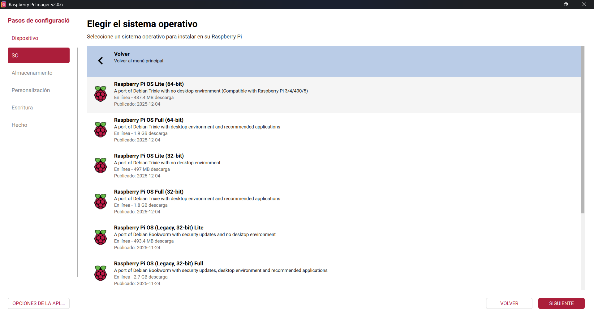
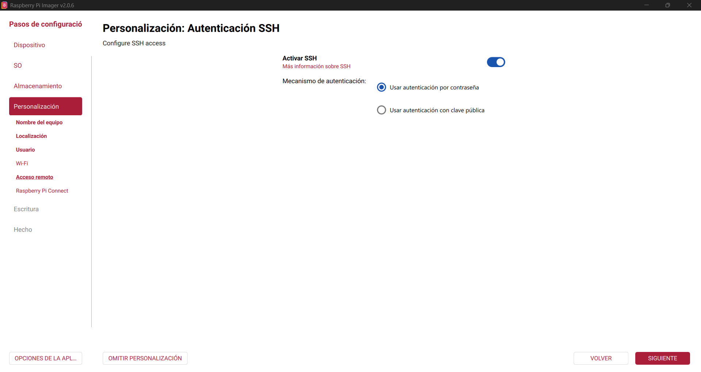
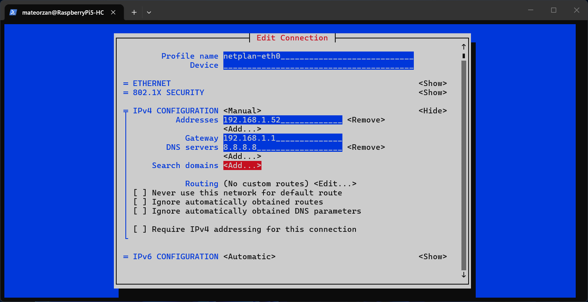

# Configuración Raspberry Pi 5

Este equipo lo vamos a centrar en IA, no es un equipo muy potente para esta tarea pero nos sirve para hacer pruebas. Este dispositivo presenta un problema ya que por su arquitectura ARM no es compatible con Proxmox VE por que lo no podremos instalar este sistema operativo y unirlo a nuestro nodo, pero aun asi podemos hacer y probar cosas y aplicarlas en nuestro nodo.

## Requisitos

- Raspberry Pi
- USB/Disco externo.
- Raspberry Imager
- Teclado

## Instalación

Vamos a empezar con la instalacion, en este caso vamos a usar el software Raspberry Pi Imager para crear nuestra disco de arranque.

```
https://www.raspberrypi.com/software/
```

Una vez instalado vamos a conectar nuestro disco de arranque en mi caso un disco SSD externo en el que vamos a instalar el sistema operativo.

Iniciasmos el software y vamos a instalar Raspberry Pi OS Lite en nuestro disco.



Seguimos los pasos de instalacion que nos indican el software, añadimos un nombre al equipo y usuario que queramos para iniciar sersion. En mi caso no voy a configurar WI-FI ya que lo voy a conectar por cable Ethernet pero algo importante que si hay que seleccionar es la opcion "Activar SSH".



Con todo esto ya podemos escribir en el disco.

> IMPORTANTE ESTO BORRARA TODO LO QUE TENGAS ALMACENADO EN EL DISCO SELECCIONADO.

Una vez termine la des escribir en el disco ya tenemos todo listo para empezar con la instalacion del sistema operativo.

Conectamos el disco externo a uno de los USB de nuestra Raspberry Pi y la iniciamos.

Una vez iniciado vamos a la pagina web local de nuestro Router para ver la IP local de nuestra Raspberry Pi y asi poder conectarnos por SSH.

```
http://192.168.1.1/
```

Una vez sabemos la IP nos conectamos con el nombre de usuario (el que configuraste en Raspberry Pi Imager) y la IP local.

```
ssh mateorzan@192.168.1.44
```

Con todo esto ya tenemos todo instalado ahora vamos a pasar con la configuración.

## Configuración

El primer paso que vamos a hacer es configurar un IP estatica, ejecutamos en la terminal el siguiente comando.

```
sudo nmtui
```

Dentro editamos la conexion y escribimos la IP local que tengamos libre, Importante que ningun dispositivo de la red local tenga esa IP pillada.



Con esto ya tenemos la IP estatica configurada.

Lo siguiente que vamos a configurar va a ser Tailscale para poder acceder al dispositivo desde fuera de la red local, para ello desde la propia web de Tailscale seleccionamos para añadir un cliente Linux y nos dara el comando de instalacion.

```
curl -fsSL https://tailscale.com/install.sh | sh
```

Una vez instale nos mandara ejecutar otro comando

```
sudo tailscale up
```

Este comando nos dara una URL a la cual tenemos que acceder para aceptar el dispositivo en nuestra red de Tailscale.

Con esto ya tenemos tailscale instalado y funcionando.

## Servicios
