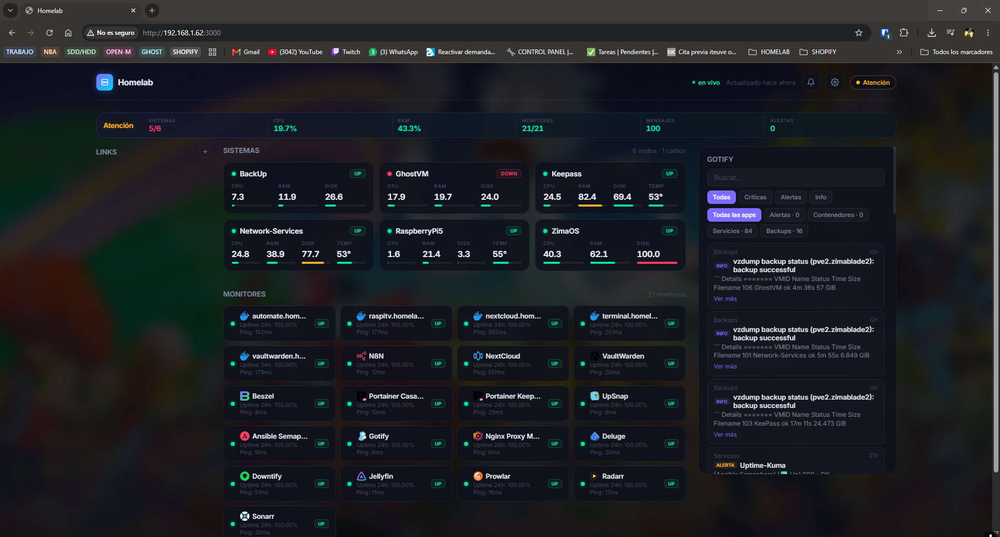
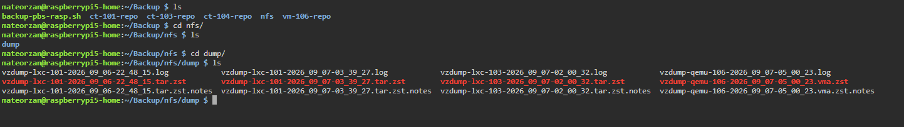

# Configuración Raspberry Pi 5

Este equipo lo vamos a centrar en IA, no es un equipo muy potente para esta tarea pero nos sirve para hacer pruebas. Este dispositivo presenta un problema ya que por su arquitectura ARM no es compatible con Proxmox VE por que lo no podremos instalar este sistema operativo y unirlo a nuestro nodo, pero aun asi podemos hacer y probar cosas y aplicarlas en nuestro nodo.

## Requisitos

- Raspberry Pi
- USB/Disco externo.
- Raspberry Imager
- Teclado

## Instalación

Vamos a empezar con la instalación, en este caso vamos a usar el software Raspberry Pi Imager para crear nuestra disco de arranque.

```text
https://www.raspberrypi.com/software/
```

Una vez instalado vamos a conectar nuestro disco de arranque en mi caso un disco SSD externo en el que vamos a instalar el sistema operativo.

Iniciamos el software y vamos a instalar Raspberry Pi OS Lite en nuestro disco.


Seguimos los pasos de instalación que nos indican el software, añadimos un nombre al equipo y usuario que queramos para iniciar sesión. En mi caso no voy a configurar WI-FI ya que lo voy a conectar por cable Ethernet pero algo importante que si hay que seleccionar es la opción "Activar SSH".


Con todo esto ya podemos escribir en el disco.

> IMPORTANTE ESTO BORRARA TODO LO QUE TENGAS ALMACENADO EN EL DISCO SELECCIONADO.

Una vez termine la des escribir en el disco ya tenemos todo listo para empezar con la instalación del sistema operativo.

Conectamos el disco externo a uno de los USB de nuestra Raspberry Pi y la iniciamos.

Una vez iniciado vamos a la pagina web local de nuestro Router para ver la IP local de nuestra Raspberry Pi y asi poder conectarnos por SSH.

```text
http://192.168.1.1/
```

Una vez sabemos la IP nos conectamos con el nombre de usuario (el que configuraste en Raspberry Pi Imager) y la IP local.

```bash
ssh mateorzan@192.168.1.44
```

Con todo esto ya tenemos todo instalado ahora vamos a pasar con la configuración.

## Configuración

El primer paso que vamos a hacer es configurar un IP estática, ejecutamos en la terminal el siguiente comando.

```bash
sudo nmtui
```

Dentro editamos la conexión y escribimos la IP local que tengamos libre, Importante que ningún dispositivo de la red local tenga esa IP pillada.


Con esto ya tenemos la IP estática configurada.

Lo siguiente que vamos a configurar va a ser Tailscale para poder acceder al dispositivo desde fuera de la red local, para ello desde la propia web de Tailscale seleccionamos para añadir un cliente Linux y nos dará el comando de instalación.

```bash
curl -fsSL https://tailscale.com/install.sh | sh
```

Una vez instale nos mandara ejecutar otro comando

```bash
sudo tailscale up
```

Este comando nos dará una URL a la cual tenemos que acceder para aceptar el dispositivo en nuestra red de Tailscale.

Con esto ya tenemos Tailscale instalado y funcionando.

## Servicios

### OLLAMA

Vamos a probar a correr un modelo de IA local para ver como rinde.

```bash
curl -fsSL https://ollama.com/install.sh | sh
```

Una vez instalado vamos a correr un modelo ligero, vamos a probar con LFM2.5.

```bash
ollama run lfm2.5-thinking
```

Una vez instalado el modelo y que vemos que funciona bien vamos a instalar un chat para poder usar el modelo cómodamente, en mi caso elegí [Open-webui](https://github.com/open-webui/open-webui).

Para usar este chat necesitamos tener Docker instalado.

```bash
# Add Docker's official GPG key:
sudo apt update
sudo apt install ca-certificates curl
sudo install -m 0755 -d /etc/apt/keyrings
sudo curl -fsSL https://download.docker.com/linux/debian/gpg -o /etc/apt/keyrings/docker.asc
sudo chmod a+r /etc/apt/keyrings/docker.asc

# Add the repository to Apt sources:
sudo tee /etc/apt/sources.list.d/docker.sources <<EOF
Types: deb
URIs: https://download.docker.com/linux/debian
Suites: $(. /etc/os-release && echo "$VERSION_CODENAME")
Components: stable
Signed-By: /etc/apt/keyrings/docker.asc
EOF

sudo apt update
```

```bash
sudo apt install docker-ce docker-ce-cli containerd.io docker-buildx-plugin docker-compose-plugin
```

Con este comando comprobamos que se instalo bien.

```bash
sudo docker run hello-world
```

También vamos a comprobar que tengamos Python instalado.

```bash
sudo apt install python3
sudo apt install python3-venv python3-pip
```

Una vez instalado todo ejecutamos el siguiente comando para ejecutar el contenedor docker.

```bash
span
```

Con el comando `sudo docker ps` podemos ver como esta el contenedor, si esta healthy podemos acceder a el con la IP de la maquina y el puerto 3000

```text
http://192.168.1.52:8080
```

### OpenClaw

Instalamos OpenClaw con el siguiente comando.

```bash
curl -fsSL https://openclaw.ai/install.sh | bash
```

Una vez instalado configuramos y añadimos un proveedor de IA en mi caso estoy usando codex, no voy a explicar como hice esto ya que es algo que me puede comprometer, pero actualmente tengo codex conectado a mi OpenClaw y me comunico con el a traves de un bot de telegram.

Con este servicio actualmente me encuentro haciendo pruebas pero no tengo nada corriendo lo uso mas como un asistente ya que ahora mismo uso la raspberry como herramienta de monitorización de el resto de mis maquinas virtuales y servicios.

### Jellyfin

Vamos a montar un Jellyfin en este servidor, con esto quiero ver el rendimiento de este servicio en una raspberry Pi 5. Actualmente tengo este servicio corriendo en mi ZimaOS, debido a la carga de otros servicios no funciona todo lo bien que esperaria.

Para montar este jellyfin vamos a aprovechar la estructura que ya tengo montada en mi ZimaOS y vamos a crear un almacenamiento compartido entre mi raspberry Pi 5 y mi ZimaOS asi solo tengo que recrear mi servidor Jellyfin en este servidor.

#### Requisitos

- Docker
- Docker Compose
- smdbclient y cifs-utils

#### Docker Compose

Para crear nuestro servidor jellyfin vamos a usar el siguiente compose.yml

```Dockerfile
services:
  jellyfin:
    image: jellyfin/jellyfin
    container_name: jellyfin
    # Optional - specify the uid and gid you would like Jellyfin to use instead of root
    user: uid:gid
    ports:
      - 8096:8096/tcp
      - 7359:7359/udp
    volumes:
      - /path/to/config:/config
      - /path/to/cache:/cache
      - type: bind
        source: /path/to/media
        target: /media
      - type: bind
        source: /path/to/media2
        target: /media2
        read_only: true
      # Optional - extra fonts to be used during transcoding with subtitle burn-in
      - type: bind
        source: /path/to/fonts
        target: /usr/local/share/fonts/custom
        read_only: true
    restart: 'unless-stopped'
    # Optional - alternative address used for autodiscovery
    environment:
      - JELLYFIN_PublishedServerUrl=http://example.com
    # Optional - may be necessary for docker healthcheck to pass if running in host network mode
    extra_hosts:
      - 'host.docker.internal:host-gateway'
```

Una vez creado y levantado ya podemos acceder al servidor desde nuestro navegador con la url

`htpp://IP:8096`

#### SMDB

Ahora como explique antes vamos a aprovechar las peliculas que ya tengo en mi servidor y vamos a montar la carpeta compartida por SMDB en nuestra Raspberry.

La ruta es la siguiente que compartimos en nuestro servidor es:

`//zimaos/media`

Ahora para poder acceder a esta ruta tenemos que instalar primero las herramientas para poder acceder al smbd, lo hacemos con estos comandos.

`sudo apt update`

`sudo apt install samba-client cifs-utils -y`

Ahora para montar esta nueva ruta de almacenamiento usamos el siguiente comando.

`sudo mount -t cifs //IP_SERVIDOR/nombre_carpeta /home/mateorzan/media -o username=tu_usuario,password=tu_contraseña,uid=1000,gid=1000`

Ejemplo

`sudo mount -t cifs //zimaos/media /home/mateorzan/media -o username=****,password=******,uid=1000,gid=1000`

Como lo estamos montando con nuestro usuario, para que se monte automaticamente siempre al arrancar necesitamos crear un archivo que guarde las credenciales.

`sudo nano /etc/samba/credenciales`

Luego protegemos el archivo.

`sudo chmod 600 /etc/samba/credenciales`

Luego creamos el archivo que hace que se monte la ruta siempre.

`sudo nano /etc/fstab`

`//IP_SERVIDOR/nombre_carpeta  /home/mateorzan/media  cifs  credentials=/etc/samba/credenciales,uid=1000,gid=1000,_netdev  0  0`

Por ultimo probamos que todo funciona bien y no nos da ningun error de sintaxis.

`sudo mount -a`

### Homelab Nexus

Cree mi imagen personalizada de un dashboard tipo Homepage pero que integras las Apis de Uptime-Kuma, Beszel y Gotify para asi de una vista ver toda la informacion de esos tres servicios en uno, le añadi links a los monitores para que puedas configurarlo y que haga el mismo uso que le doy a Homepage agragando que tengo un monitoreo avanzado y superior a Homepage. Sus funcionalidades estan explicadas en el repo pero tiene todo lo que necesito ahora mismo, monitorizacion y links para acceder a los servicios o servidores que necesito, ademas de bookmarks que puedo personalizar como quiera.

#### Docker Compose

```
services:
  homelab-nexus:
    image: ghcr.io/mateorzan/homelab-nexus:latest
    container_name: homelab-nexus
    restart: unless-stopped
    ports:
      - "3000:3000"
    environment:
      - PORT=3000
      - HOST=0.0.0.0
      - POLL_INTERVAL_MS=1000
      - CACHE_TTL_MS=1000
      - BG_IMAGE=
      - BESZEL_URL=http://tu-beszel:8090
      - BESZEL_USER_EMAIL=tu@email.com
      - BESZEL_USER_PASSWORD=tu-password
      - UPTIMEKUMA_URL=http://tu-uptimekuma:3001
      - UPTIMEKUMA_STATUS_PAGE=tu-status-page
      - GOTIFY_URL=http://tu-gotify:8081
      - GOTIFY_TOKEN=tu-token
    volumes:
      - homelab-nexus-data:/app/data

volumes:
  homelab-nexus-data:
```

Funciona como cualquier compose, pero como por ahora la imagen es privada ya que estoy en testing hay que hacer login con

```
# LOGIN
echo "TU_GITHUB_TOKEN" | docker login ghcr.io -u mateorzan --password-stdin

# ARRANQUE
docker-compose up -d
```

Con esto nos metemos a la url en el puerto :3000 y ya lo tenemos.



## Backups Redudency

Quiero tener mis Backups de mis maquinas en diferentes equipos por si mi disco se corrompe para ello vamos a usar la Rasp que tiene un disco SSD externo de 1TB con espacio de sobra para almacenar un historial de copias de seguridad de mis maquinas mas pequeñas. Esto es importante ya que mi PBS corre en PVE2 como una VM y mis LXCs y una VM corren en PVE2 por lo que si el disco se corrompe las copias de seguridad no servirian de nada ya que ya viven en ese disco.

### NFS

La version facil de todo esto es crear un almacenmiento en red por ejemplo NFS en mi rasp, conectarlo a Promox VE y crear ejecuciones de Backups a mayores que manden estas Backups a mi Raspberry, tambien vamos a aplicar esta metodologia ya que ahora mismo me sobra espacio en mi disco.

#### Ventajas

* Facilidad de configuracion y comodidad
* Rapidez
* Configurado todo desde la interfaz web de Proxmox
* Restauracion de Backups desde la propia interfaz de Proxmox sin necesidad de comandos

#### Desventajas

* No son incrementales, es decir siempre copia la backup desde 0
* Ocupa mucho mas espacio por lo que puedes mantener menos Backups lo que resulta en un menor historial
* Mas carga para el Proxmox ya que ahora tiene que hacer el doble de Backups.

Para hacer esto simplemente vamos a configurar un script bash que haga un restore de las copias de seguirdad que nosotros queramos, en mi caso hago copias de seguridad diarias de mis maquinas, por lo que voy a configurar que en mi rasp se guarden hasta 5 backups de cada maquina asi tengo un historial de 5 días de cada maquina.

#### Configuracion

En la raspberry pi instalamos y creamos la carpeta compartida por nfs

```
sudo apt install nfs-kernel-server # Instalamos NFS
sudo nano /etc/exports # archivo donde exportamos la ruta por nfs

/ruta/backups 192.168.1.0/24(rw,sync,no_subtree_check,no_root_squash) # Ruta compartida en toda tu red Local

sudo exportfs -ra # exportamos la ruta
sudo systemctl restart nfs-kernel-server # Reiniciamos el servidor para que se aplique
```

#### Añadimos el Storage en Proxmox VE

En la interfaz web de Proxmox VE → Datacenter → Storage

 	Click Add NFS:

		 Rellena:

  			ID: el nomrbe que tu quieras en mi caso rasp_bks

  			**Server**: añades la IP de tu maquina.

			**Export**: ruta nfs compartida

			**Content**: Backup

**Guarda** — te va a mostrar el storage en tus PVEs

#### Crear tareas Backup

En la interfaz web de Proxmox VE → Datacenter → Backup

 	Click Add NFS:

		 Rellena:

  			Storage: el nomrbe que tu quieras en mi caso rasp_bks

  			**Schedule**: el que tu consideres

			**Selection Mode**: eliges la vm o lxc que quieras.

			**Compresion**: ZSTD

			**Mode**: Snapshot

**Create** — te va a mostar la tareada creada

Ahora haz esto con todas las VMs o LXCs que quieras.

#### Comprobación

Como ultimo paso puedes ir a la ruta que compartiste en tu maquina y ver como se guardan las backups alli.



### Script Bash

Esta es la segunda forma o version requiere de mas configuracion pero tiene ciertas ventajas

#### Ventajas

* Aqui las copias si son incrementales ya que usamos Borg.
* Más Control y capacidad de tener un historial más grande.
* Saca las copias del propio PBS por lo que no carga tanto el Proxmox VE.

#### Desventajas

* Mucha más configuración y mucho mas complejo.
* No se puede restaurar las backups desde la interfaz de Proxmox.
* Más incomodo cuando necesites recuperar una maquina.

Para hacer esto simplemente vamos a configurar un script bash que haga un restore de las copias de seguirdad que nosotros queramos, en mi caso hago copias de seguridad diarias de mis maquinas, por lo que voy a configurar que en mi rasp se guarden hasta 5 backups de cada maquina asi tengo un historial de 5 días de cada maquina.

El primer paso es configurar y crear el script bash este es el script que va a correr en la Raspberry y va a hacer el pull de los datos de las VMs o LXCs indicadas a la hora que yo indique. El unico requisito que tenemos que configurar es una clave SSH para que se conecten sin interrupciones.

antes de crear el archivo vamos a crear el .env que va a almacenar todas nuestras credenciales.

`nano .env`

```
PBS_HOST="mateo@ip-vm-pbs"
PBS_REPO="mateo@pam!rasp-backup@localhost:zfs_bk"
export PBS_PASSWORD="el-secret-del-token"
export PBS_FINGERPRINT="AA:BB:CC:DD:...(el que copiaste)"
```

Lo portegemos para que solo nosotros podamos usarlo

`chmod 600 /ruta/backups/.env`

Importante crear el archivo como .sh

`nano script.sh`

```
#!/bin/bash
set -euo pipefail

# cargar credenciales
source /ruta/backups/.env

DEST_BASE="/ruta/backups"
TMP_BASE="/tmp/pbs-restore"
KEEP=5

ITEMS=("ct/101" "ct/103" "ct/104" "vm/106")

for ITEM in "${ITEMS[@]}"; do
  NAME=$(echo "$ITEM" | tr '/' '-')
  echo "=== $NAME ==="

  SNAPSHOT=$(ssh "$PBS_HOST" \
    "PBS_PASSWORD='$PBS_PASSWORD' proxmox-backup-client snapshot list $ITEM --repository $PBS_REPO --output-format json" \
    | python3 -c "import json,sys; d=json.load(sys.stdin); print(sorted(d, key=lambda x: x['backup-time'])[-1]['backup-time'])")

  if [ -z "$SNAPSHOT" ]; then
    echo "  ! Sin snapshot, saltando"
    continue
  fi
  echo "  snapshot: $SNAPSHOT"

  FILES=$(ssh "$PBS_HOST" \
    "PBS_PASSWORD='$PBS_PASSWORD' proxmox-backup-client snapshot files ${ITEM}/${SNAPSHOT} --repository $PBS_REPO --output-format json" \
    | python3 -c "import json,sys; [print(f['filename']) for f in json.load(sys.stdin) if not f['filename'].startswith('client.log') and not f['filename'].startswith('index.json')]")

  TMP_DIR="$TMP_BASE/$NAME"
  rm -rf "$TMP_DIR"
  mkdir -p "$TMP_DIR"

  for FILE in $FILES; do
    echo "  restaurando: $FILE"
    ssh "$PBS_HOST" \
      "PBS_PASSWORD='$PBS_PASSWORD' proxmox-backup-client restore ${ITEM}/${SNAPSHOT} ${FILE} - --repository $PBS_REPO" \
      > "$TMP_DIR/$FILE"
  done

  REPO_PATH="$DEST_BASE/$NAME-repo"
  [ -d "$REPO_PATH" ] || borg init --encryption=none "$REPO_PATH"

  borg create "$REPO_PATH::$(date +%Y-%m-%d_%H%M)" "$TMP_DIR"
  borg prune --keep-daily="$KEEP" "$REPO_PATH"

  rm -rf "$TMP_DIR"
  echo "  OK"
done
```

#### Requisitos

- SSH & SSH Key
- Borg
- API Token en PBS
- Python3
- Fingerprit del certificado
- PV

### Instalar paquetes

Es necesario tener estos paquetes instalados en tu Raspberry

```
sudo apt update && sudo apt install pv borg python3
```

### SSH Key

Vamos a generar la key en la Rasp

> `ssh-keygen -t ed25519 -C "rasp-backup"`

Luego la copiamos en nuestro PBS

> `ssh-copy-id mateo@pbs-vm-ip`

Por ultimo comprobamos

> `ssh mateo@pbs-vm-ip "echo ok"`

### API Token

#### Cómo crearlo

En la interfaz web de PBS → Configuration → Access Control → API Token

 	Click Add

		 Rellena:

  			**User**: root@pam (o crea un usuario dedicado solo para esto, más limpio)

  			**Token Name**: algo como rasp-backup

**Guarda** — te va a mostrar el secret del token una sola vez, cópialo ya que no se puede volver a ver.

#### Dar permisos de lectura al token

	Ve a Access Control → Permissions, añade una entrada:

 		**Path**: /datastore/zfs_backup

 		**API Token:** selecciona el que creaste (root@pam!rasp-backup)

 		**Role**: DatastoreReader (permite listar snapshots y leer/restaurar, pero no borrar ni modificar)

### Certificado

Desde pbs ejecutamos

`proxmox-backup-manager cert info`

Y buscamos algo tipo AA:BB:CC... en la linea Fingerprint (sha256):

### Creamos ejecutable

Ahora que ya tenemos el script bien configurado y el ssh creamos el ejecutable.

> `chmod +x /ruta/a/tu/script.sh`

Por ultimo antes de configurar el cron hacemos una prueba y vemos que funciona bien el ejecutable, como es una prueba solo vasmos a provar con ct/101, haz una copia del script original y edita el script para que solo haga la backup con ct/101

```
cp script.sh script_bk.sh
nano script.sh
bash /ruta/a/tu/script.sh
```

Una vez se termina de ejecutar ya podemos poner todas las VMs o LXCs que queramos copiar.

### Cron

Una vez creado y viendo que nos podemos conectar y que funciona ya lo tenemos todo ahora solo activar el cron para que se ejecute los dias y a las horas que queramos, en mi caso sera todos los dias a las 8 de la mañana.

# Tutorial de restauración — Backups PBS guardados en la Raspberry Pi

Este documento cubre cómo recuperar un CT o una VM a partir de los backups
guardados con `backup-pbs-rasp.sh` en la Raspberry Pi (repos de borg), para
el escenario en que el PBS principal no está disponible.

Aplica a: `ct-101`, `ct-103`, `ct-104`, `vm-106` (backups ligeros guardados
en `~/Backup/<nombre>-repo`).

---

## 0. Antes de empezar

- Necesitas acceso SSH/consola al nodo Proxmox VE donde vas a restaurar.
- Necesitas `borg` instalado en la Raspberry Pi (ya lo tienes).
- Necesitas la herramienta `pxar` en el nodo Proxmox para restaurar CTs
  (viene incluida en Proxmox VE por defecto).

---

## 1. Ver qué copias tienes disponibles

En la Raspberry Pi:

```bash
borg list ~/Backup/<nombre>-repo
```

Ejemplo:

```bash
borg list ~/Backup/ct-101-repo
```

Te da una lista de snapshots tipo `2026-09-06_1835`, `2026-09-05_1902`, etc.
Elige el que quieras restaurar (normalmente el más reciente).

---

## 2. Extraer el snapshot elegido

```bash
mkdir -p ~/Backup/restore-tmp/<nombre>
cd ~/Backup/restore-tmp/<nombre>
borg extract ~/Backup/<nombre>-repo::<snapshot>
```

Ejemplo:

```bash
mkdir -p ~/Backup/restore-tmp/ct-101
cd ~/Backup/restore-tmp/ct-101
borg extract ~/Backup/ct-101-repo::2026-09-06_1835
```

Dentro encontrarás archivos como:

- **CT:** `pct.conf.blob`, `root.pxar.didx`, `catalog.pcat1.didx`
- **VM:** `qemu-server.conf.blob`, `drive-scsi0.img.fidx` (o el nombre del disco que tengas)

> **Importante:** aunque el nombre incluya `.didx`/`.fidx`, el contenido ya
> es el archivo real y completo (fue reconstruido en el momento del backup
> con `proxmox-backup-client restore`), no un índice vacío.

Renombra quitando el sufijo, para que las herramientas de Proxmox lo reconozcan:

```bash
# CT
mv root.pxar.didx root.pxar

# VM (ajusta el nombre de disco si no es scsi0)
mv drive-scsi0.img.fidx drive-scsi0.img
```

---

## 3. Copiar los archivos al nodo Proxmox

```bash
scp -r ~/Backup/restore-tmp/<nombre> root@<ip-proxmox>:/tmp/restore-<nombre>/
```

---

## 4. Restaurar un CT

**4.1 — Crea un CT nuevo vacío** con un template base (mismo OS que el original si lo sabes; si no, cualquiera sirve como base, se sobrescribe el contenido igualmente):

```bash
pct create 999 local:vztmpl/debian-12-standard_*.tar.zst \
  --rootfs local-lvm:8 \
  --hostname restaurado \
  --net0 name=eth0,bridge=vmbr0,ip=dhcp
```

(Ajusta `999` a un ID libre, y los recursos rootfs/red según lo que necesites.)

**4.2 — Arranca una vez y detenlo** (esto asegura que el rootfs está inicializado):

```bash
pct start 999
pct stop 999
```

**4.3 — Extrae el contenido real por encima del rootfs:**

```bash
pxar extract /tmp/restore-<nombre>/root.pxar /var/lib/lxc/999/rootfs/ --overwrite
```

**4.4 — Ajusta la configuración** comparando con la original.
El archivo `pct.conf.blob` tiene el texto de configuración con un pequeño
header binario delante. Para verlo:

```bash
tail -c +9 /tmp/restore-<nombre>/pct.conf.blob
```

(el `+9` salta el header; si el texto sale con basura al principio, prueba
`+13` o revisa a ojo dónde empieza el texto legible tipo `arch: amd64`)

Copia los valores relevantes (memoria, CPU, red, mount points) a la config
real del CT nuevo:

```bash
nano /etc/pve/lxc/999.conf
```

**4.5 — Arranca el CT:**

```bash
pct start 999
```

---

## 5. Restaurar una VM

**5.1 — Crea una VM nueva vacía:**

```bash
qm create 999 --name restaurada --memory 2048 --net0 virtio,bridge=vmbr0
```

(Ajusta memoria/red a lo que corresponda; revisa `qemu-server.conf.blob`
igual que en el paso 4.4 para saber los valores originales.)

**5.2 — Importa el disco:**

```bash
qm importdisk 999 /tmp/restore-<nombre>/drive-scsi0.img local-lvm
```

**5.3 — Asocia el disco importado a la VM:**

```bash
qm set 999 --scsi0 local-lvm:vm-999-disk-0
qm set 999 --boot order=scsi0
```

**5.4 — Arranca la VM:**

```bash
qm start 999
```

---

## 6. Ver la config original (referencia rápida)

Para leer cualquier archivo `.conf.blob` (tanto CT como VM), el patrón es
el mismo: saltar el header binario y quedarte con el texto:

```bash
tail -c +9 archivo.conf.blob
```

---

## 7. Limpieza

Cuando termines, borra los temporales tanto en la Rasp como en Proxmox:

```bash
# En la Rasp
rm -rf ~/Backup/restore-tmp/<nombre>

# En Proxmox
rm -rf /tmp/restore-<nombre>
```

---

## Resumen ultra-rápido (cheat sheet)

```bash
# 1. En la Rasp: extraer
borg list ~/Backup/<nombre>-repo
mkdir -p ~/Backup/restore-tmp/<nombre> && cd ~/Backup/restore-tmp/<nombre>
borg extract ~/Backup/<nombre>-repo::<snapshot>
mv root.pxar.didx root.pxar          # CT
mv drive-scsi0.img.fidx drive-scsi0.img   # VM

# 2. Copiar a Proxmox
scp -r ~/Backup/restore-tmp/<nombre> root@<ip-proxmox>:/tmp/restore-<nombre>/

# 3a. CT
pct create 999 local:vztmpl/<template> --rootfs local-lvm:8
pct start 999 && pct stop 999
pxar extract /tmp/restore-<nombre>/root.pxar /var/lib/lxc/999/rootfs/ --overwrite
# ajustar /etc/pve/lxc/999.conf con pct.conf.blob
pct start 999

# 3b. VM
qm create 999 --name restaurada --memory 2048 --net0 virtio,bridge=vmbr0
qm importdisk 999 /tmp/restore-<nombre>/drive-scsi0.img local-lvm
qm set 999 --scsi0 local-lvm:vm-999-disk-0
qm set 999 --boot order=scsi0
qm start 999
```
