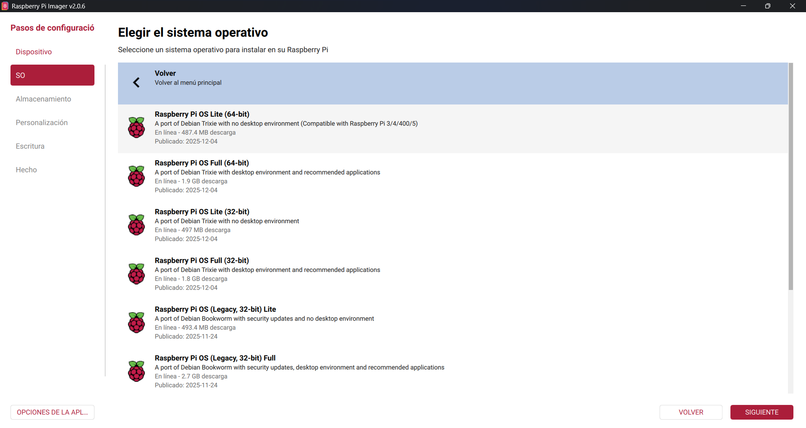
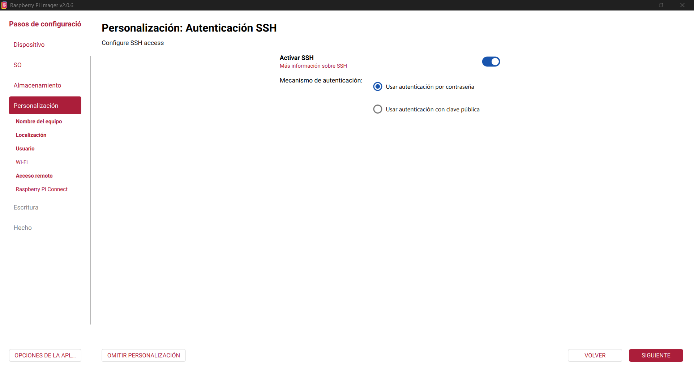
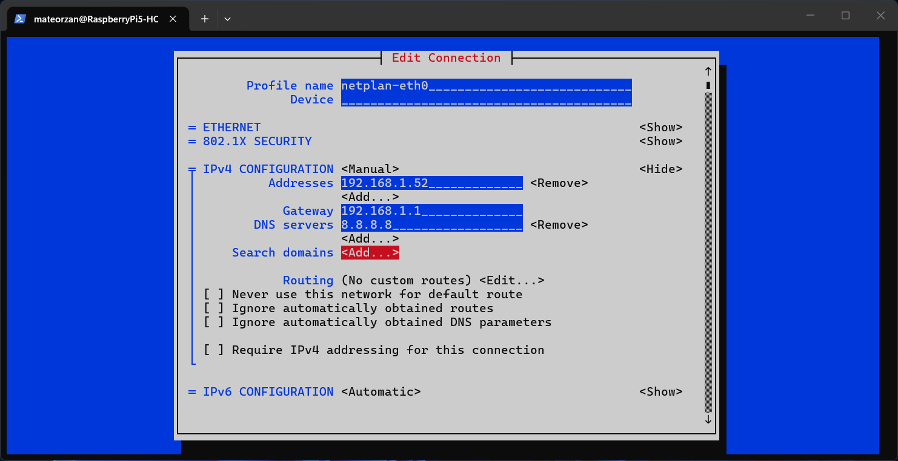

# Configuración Raspberry Pi 5

Este equipo lo vamos a centrar en IA, no es un equipo muy potente para esta tarea pero nos sirve para hacer pruebas. Este dispositivo presenta un problema ya que por su arquitectura ARM no es compatible con Proxmox VE por que lo no podremos instalar este sistema operativo y unirlo a nuestro nodo, pero aun asi podemos hacer y probar cosas y aplicarlas en nuestro nodo.

## Requisitos

- Raspberry Pi
- USB/Disco externo.
- Raspberry Imager
- Teclado

## Instalación

Vamos a empezar con la instalación, en este caso vamos a usar el software Raspberry Pi Imager para crear nuestra disco de arranque.

```text
https://www.raspberrypi.com/software/
```

Una vez instalado vamos a conectar nuestro disco de arranque en mi caso un disco SSD externo en el que vamos a instalar el sistema operativo.

Iniciamos el software y vamos a instalar Raspberry Pi OS Lite en nuestro disco.



Seguimos los pasos de instalación que nos indican el software, añadimos un nombre al equipo y usuario que queramos para iniciar sesión. En mi caso no voy a configurar WI-FI ya que lo voy a conectar por cable Ethernet pero algo importante que si hay que seleccionar es la opción "Activar SSH".



Con todo esto ya podemos escribir en el disco.

> IMPORTANTE ESTO BORRARA TODO LO QUE TENGAS ALMACENADO EN EL DISCO SELECCIONADO.

Una vez termine la des escribir en el disco ya tenemos todo listo para empezar con la instalación del sistema operativo.

Conectamos el disco externo a uno de los USB de nuestra Raspberry Pi y la iniciamos.

Una vez iniciado vamos a la pagina web local de nuestro Router para ver la IP local de nuestra Raspberry Pi y asi poder conectarnos por SSH.

```text
http://192.168.1.1/
```

Una vez sabemos la IP nos conectamos con el nombre de usuario (el que configuraste en Raspberry Pi Imager) y la IP local.

```bash
ssh mateorzan@192.168.1.44
```

Con todo esto ya tenemos todo instalado ahora vamos a pasar con la configuración.

## Configuración

El primer paso que vamos a hacer es configurar un IP estática, ejecutamos en la terminal el siguiente comando.

```bash
sudo nmtui
```

Dentro editamos la conexión y escribimos la IP local que tengamos libre, Importante que ningún dispositivo de la red local tenga esa IP pillada.



Con esto ya tenemos la IP estática configurada.

Lo siguiente que vamos a configurar va a ser Tailscale para poder acceder al dispositivo desde fuera de la red local, para ello desde la propia web de Tailscale seleccionamos para añadir un cliente Linux y nos dará el comando de instalación.

```bash
curl -fsSL https://tailscale.com/install.sh | sh
```

Una vez instale nos mandara ejecutar otro comando

```bash
sudo tailscale up
```

Este comando nos dará una URL a la cual tenemos que acceder para aceptar el dispositivo en nuestra red de Tailscale.

Con esto ya tenemos Tailscale instalado y funcionando.

## Servicios

### OLLAMA

Vamos a probar a correr un modelo de IA local para ver como rinde.

```bash
curl -fsSL https://ollama.com/install.sh | sh
```

Una vez instalado vamos a correr un modelo ligero, vamos a probar con LFM2.5.

```bash
ollama run lfm2.5-thinking
```

Una vez instalado el modelo y que vemos que funciona bien vamos a instalar un chat para poder usar el modelo cómodamente, en mi caso elegí [Open-webui](https://github.com/open-webui/open-webui).

Para usar este chat necesitamos tener Docker instalado.

```bash
# Add Docker's official GPG key:
sudo apt update
sudo apt install ca-certificates curl
sudo install -m 0755 -d /etc/apt/keyrings
sudo curl -fsSL https://download.docker.com/linux/debian/gpg -o /etc/apt/keyrings/docker.asc
sudo chmod a+r /etc/apt/keyrings/docker.asc

# Add the repository to Apt sources:
sudo tee /etc/apt/sources.list.d/docker.sources <<EOF
Types: deb
URIs: https://download.docker.com/linux/debian
Suites: $(. /etc/os-release && echo "$VERSION_CODENAME")
Components: stable
Signed-By: /etc/apt/keyrings/docker.asc
EOF

sudo apt update
```

```bash
sudo apt install docker-ce docker-ce-cli containerd.io docker-buildx-plugin docker-compose-plugin
```

Con este comando comprobamos que se instalo bien.

```bash
sudo docker run hello-world
```

También vamos a comprobar que tengamos Python instalado.

```bash
sudo apt install python3
sudo apt install python3-venv python3-pip
```

Una vez instalado todo ejecutamos el siguiente comando para ejecutar el contenedor docker.

```bash
span
```

Con el comando `sudo docker ps` podemos ver como esta el contenedor, si esta healthy podemos acceder a el con la IP de la maquina y el puerto 3000

```text
http://192.168.1.52:8080
```

### OpenClaw

Instalamos OpenClaw con el siguiente comando.

```bash
curl -fsSL https://openclaw.ai/install.sh | bash
```

Una vez instalado configuramos y añadimos un proveedor de IA en mi caso estoy usando codex, no voy a explicar como hice esto ya que es algo que me puede comprometer, pero actualmente tengo codex conectado a mi OpenClaw y me comunico con el a traves de un bot de telegram.

Con este servicio actualmente me encuentro haciendo pruebas pero no tengo nada corriendo lo uso mas como un asistente ya que ahora mismo uso la raspberry como herramienta de monitorización de el resto de mis maquinas virtuales y servicios.

### Jellyfin

Vamos a montar un Jellyfin en este servidor, con esto quiero ver el rendimiento de este servicio en una raspberry Pi 5. Actualmente tengo este servicio corriendo en mi ZimaOS, debido a la carga de otros servicios no funciona todo lo bien que esperaria.

Para montar este jellyfin vamos a aprovechar la estructura que ya tengo montada en mi ZimaOS y vamos a crear un almacenamiento compartido entre mi raspberry Pi 5 y mi ZimaOS asi solo tengo que recrear mi servidor Jellyfin en este servidor.

#### Requisitos

- Docker
- Docker Compose
- smdbclient y cifs-utils

#### Docker Compose

Para crear nuestro servidor jellyfin vamos a usar el siguiente compose.yml

```Dockerfile
services:
  jellyfin:
    image: jellyfin/jellyfin
    container_name: jellyfin
    # Optional - specify the uid and gid you would like Jellyfin to use instead of root
    user: uid:gid
    ports:
      - 8096:8096/tcp
      - 7359:7359/udp
    volumes:
      - /path/to/config:/config
      - /path/to/cache:/cache
      - type: bind
        source: /path/to/media
        target: /media
      - type: bind
        source: /path/to/media2
        target: /media2
        read_only: true
      # Optional - extra fonts to be used during transcoding with subtitle burn-in
      - type: bind
        source: /path/to/fonts
        target: /usr/local/share/fonts/custom
        read_only: true
    restart: 'unless-stopped'
    # Optional - alternative address used for autodiscovery
    environment:
      - JELLYFIN_PublishedServerUrl=http://example.com
    # Optional - may be necessary for docker healthcheck to pass if running in host network mode
    extra_hosts:
      - 'host.docker.internal:host-gateway'
```

Una vez creado y levantado ya podemos acceder al servidor desde nuestro navegador con la url

`htpp://IP:8096`

#### SMDB

Ahora como explique antes vamos a aprovechar las peliculas que ya tengo en mi servidor y vamos a montar la carpeta compartida por SMDB en nuestra Raspberry.

La ruta es la siguiente que compartimos en nuestro servidor es:

`//zimaos/media`

Ahora para poder acceder a esta ruta tenemos que instalar primero las herramientas para poder acceder al smbd, lo hacemos con estos comandos.

`sudo apt update`

`sudo apt install samba-client cifs-utils -y`

Ahora para montar esta nueva ruta de almacenamiento usamos el siguiente comando.

`sudo mount -t cifs //IP_SERVIDOR/nombre_carpeta /home/mateorzan/media -o username=tu_usuario,password=tu_contraseña,uid=1000,gid=1000`

Ejemplo

`sudo mount -t cifs //zimaos/media /home/mateorzan/media -o username=****,password=******,uid=1000,gid=1000`

Como lo estamos montando con nuestro usuario, para que se monte automaticamente siempre al arrancar necesitamos crear un archivo que guarde las credenciales.

`sudo nano /etc/samba/credenciales`

Luego protegemos el archivo.

`sudo chmod 600 /etc/samba/credenciales`

Luego creamos el archivo que hace que se monte la ruta siempre.

`sudo nano /etc/fstab`

`//IP_SERVIDOR/nombre_carpeta  /home/mateorzan/media  cifs  credentials=/etc/samba/credenciales,uid=1000,gid=1000,_netdev  0  0`

Por ultimo probamos que todo funciona bien y no nos da ningun error de sintaxis.

`sudo mount -a`
