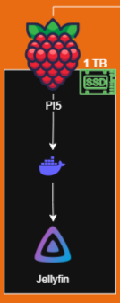

# SetUp Raspberry Pi 5

Este equipo lo vamos a centrar en IA, no es un equipo muy potente para esta tarea pero nos sirve para hacer pruebas. Este dispositivo presenta un problema ya que por su arquitectura ARM no es compatible con Proxmox VE por que lo no podremos instalar este sistema operativo y unirlo a nuestro nodo de manera directa. Este equipo lo vamos a usar como equipo externo fuera del nodo, todo documentado aquí.

## Requisitos

- Raspberry Pi 5.
- USB 8gb.
- Disco externo.
- Raspberry Imager.

[Instalacion](./1-Instalación.md)

## Estado Actual

Aqui voy a ir documentando el estado actual y todo lo que se va montando en este nodo de manera visual, para mas información revisa el resto de .mds.

### Servicios

|   Servicio   |   Tipo   |  Maquina  | Estado |
| :-----------: | :-------: | :-------: | :-----: |
|   Jellyfin   |   Media   | Raspberry | Activo |
|    Ollama    |    IA    | Raspberry | Desuso |
|   OpenClaw   |    IA    | Raspberry | Desuso  |
| Homelab Nexus | Dashboard | Raspberry | Activo |
