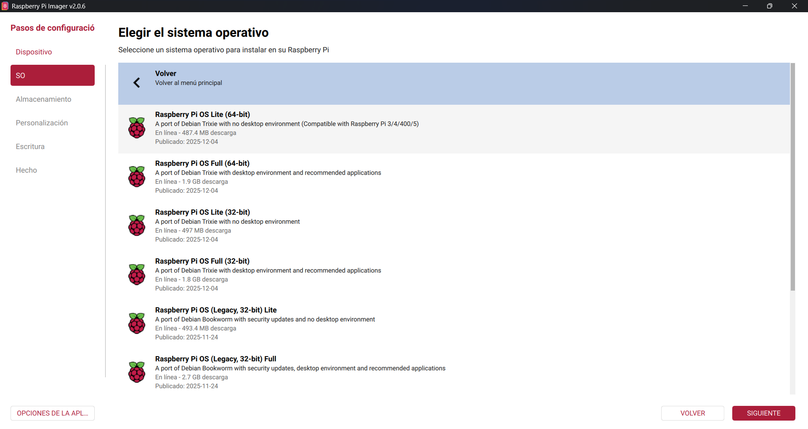
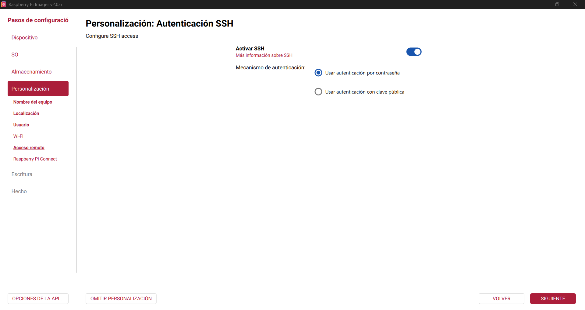
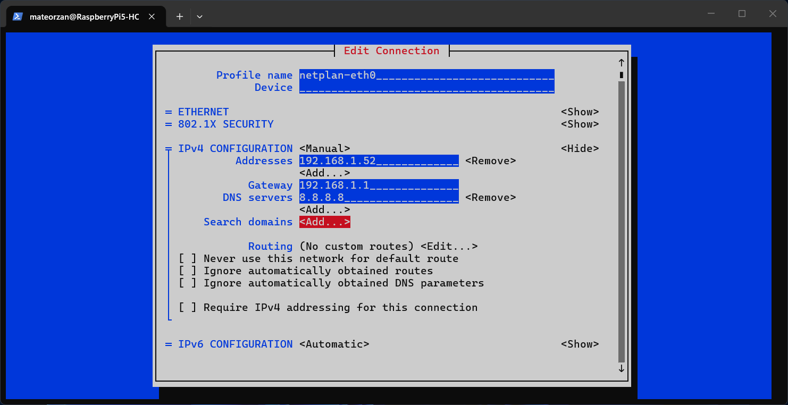

## Instalación

Vamos a empezar con la instalación, en este caso vamos a usar el software Raspberry Pi Imager para crear nuestra disco de arranque.

```text
https://www.raspberrypi.com/software/
```

Una vez instalado vamos a conectar nuestro disco de arranque en mi caso un disco SSD externo en el que vamos a instalar el sistema operativo.

Iniciamos el software y vamos a instalar Raspberry Pi OS Lite en nuestro disco.



Seguimos los pasos de instalación que nos indican el software, añadimos un nombre al equipo y usuario que queramos para iniciar sesión. En mi caso no voy a configurar WI-FI ya que lo voy a conectar por cable Ethernet pero algo importante que si hay que seleccionar es la opción "Activar SSH".



Con todo esto ya podemos escribir en el disco.

> IMPORTANTE ESTO BORRARA TODO LO QUE TENGAS ALMACENADO EN EL DISCO SELECCIONADO.

Una vez termine la des escribir en el disco ya tenemos todo listo para empezar con la instalación del sistema operativo.

Conectamos el disco externo a uno de los USB de nuestra Raspberry Pi y la iniciamos.

Una vez iniciado vamos a la pagina web local de nuestro Router para ver la IP local de nuestra Raspberry Pi y asi poder conectarnos por SSH.

```text
http://192.168.1.1/
```

Una vez sabemos la IP nos conectamos con el nombre de usuario (el que configuraste en Raspberry Pi Imager) y la IP local.

```bash
ssh mateorzan@192.168.1.44
```

Con todo esto ya tenemos todo instalado ahora vamos a pasar con la configuración.

## Configuración

El primer paso que vamos a hacer es configurar un IP estática, ejecutamos en la terminal el siguiente comando.

```bash
sudo nmtui
```

Dentro editamos la conexión y escribimos la IP local que tengamos libre, Importante que ningún dispositivo de la red local tenga esa IP pillada.



Con esto ya tenemos la IP estática configurada.

Lo siguiente que vamos a configurar va a ser Tailscale para poder acceder al dispositivo desde fuera de la red local, para ello desde la propia web de Tailscale seleccionamos para añadir un cliente Linux y nos dará el comando de instalación.

```bash
curl -fsSL https://tailscale.com/install.sh | sh
```

Una vez instale nos mandara ejecutar otro comando

```bash
sudo tailscale up
```

Este comando nos dará una URL a la cual tenemos que acceder para aceptar el dispositivo en nuestra red de Tailscale.

Con esto ya tenemos Tailscale instalado y funcionando.
