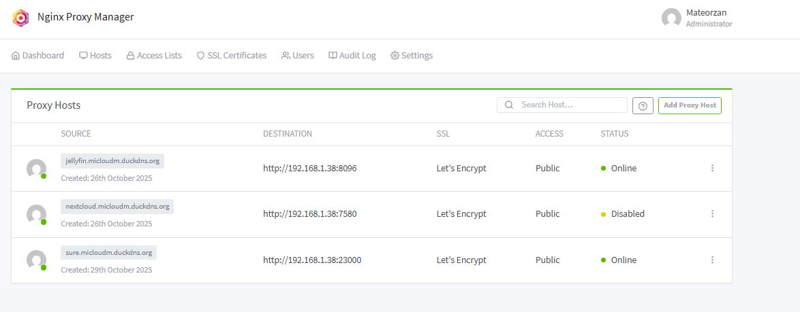
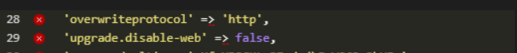
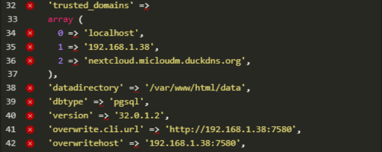
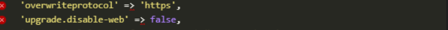
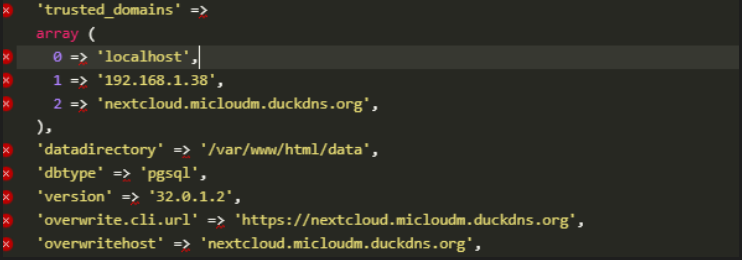
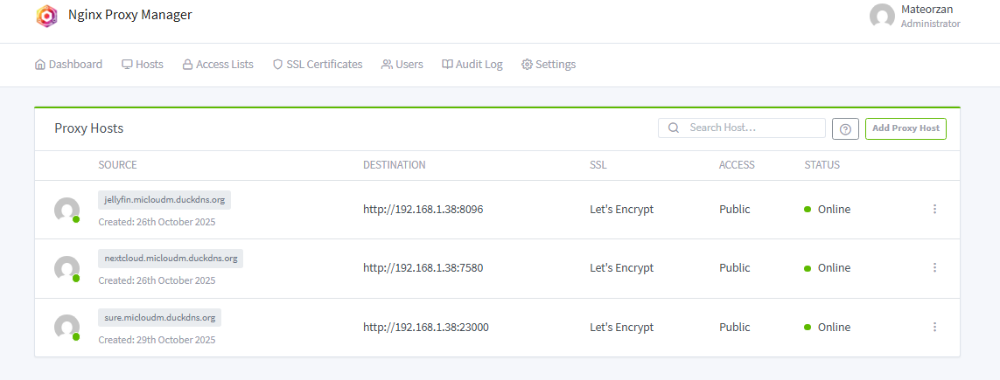

## TroubleShooting :

Como la raspberry y zima tienen diferentes arquitecturas no todos los servicios se pueden ejecutar en los dos servidores, por lo que hay servicios que no son multi-arch que hay que ejecutar por separado.

Tuve problemas para montar el servicio nfs como un servicio en docker swarm fíjate que todas las rutas, la els y imágenes estén bn elegidas y sean compatibles.

Debido a los problemas y poco soporte viste en docker swarm vamos a empezar de 0 y probar a instalar K3s, el cual es una distribucion mas ligera de Kubernetes pensada para ahorrar memoria y recursos del sistema, lo cual es justo lo que necesitamos.

### CasaOS

#### HOMEPAGE No funciona URL Web

Reinstalar CasaOS

```
curl -fsSL https://get.casaos.io/uninstall | bash
```

Borrar CasaOS

```
curl -fsSL https://get.casaos.io | bash
```

Instalar CasaOS

```
reboot
```

Reiniciar.

*Si esto sigue sin funcionar y crees que es un problema de puertos.*

```
cd /etc/casaos
```


```
nano gateway.ini
```

*Entramos a la configuracion del puerto y lo cambiamos por uno disponible, ej: port=90.*

```
sudo systemctl restart casaos-gateway
```

#### NEXTCLOUD borra carpeta DATA al instalarlo en CasaOS

Hay que primero crear la aplicacion en CasaOS y luego hacer la sincronizacion de la carpeta DATA.

```
sudo systemctl stop casaos
sudo systemctl stop docker
```

Paramas los servicios.

```
sudo rsync -avh --progress /mnt/rpi/DATA/AppData/big-bear-nextcloud/ /DATA/AppData/big-bear-nextcloud/
```

Copiamos la carpeta DATA pero en este caso solo la de nextcloud, que el resto no tuvimos problemas de borrado.

```
sudo systemctl start casaos
sudo systemctl start docker
```

Una vez copiado iniciamos todo y empezara a migrar los datos.

#### NGINX Proxy Manager

Para que este servicio funcione como lo tenemos configurado en mi HOMELAB primero hay que abrir los puertos 80 y 443 del router para la ip de este servidor.

```
http://192.168.1.1/
```

La ruta para acceder a tu router suele ser esta.

Importante tambien hay que cambiar el puero del CasaOS ya que por defecto usa el 80, en mi caso le configure el 90 para la pagina de inicio.

    

Una vez configurado los pueros del router hay que modificar los Proxy Hosts ya que estan configurados para la ip del servidor anterior y hay que configurarle la IP de este nuevo servidor para que funcionen.


Para que el proxy de NEXTCLOUD tambien funcione hay que editar el siguiente archivo de configuracion con la ip de este servidor.

```
/DATA/AppData/big-bear-nextcloud/html/config/config.php
```


#### NEXTCLOUD Problema BD Postgres

La aplicacion Nextcloud no era capaz de iniciarse  ya que daba un error de que la base de datos estaba unhealthy.

Para solucionar este error probamos a borrar la carpeta /pgdata de nextcloud, esta carpeta solo contiene la informacion de la base de datos por lo que no perdemos informacion ni datos como tal, todos los datos o archivos estan almacenados en /html/data.

Una vez borrado instalamos nextcloud otra vez y ahora no nos dio error, pero no consigue iniciar, esto se debe a que le falta los datos de las tablas para poder inicia, para ello tuvimos que copiar las tablas y los datos de la base de datos de la Raspberry.

```
docker exec -i db-postgres pg_dump -U nextcloud nextcloud > nextcloud.sql

scp nextcloud.sql user@zima:/ruta/destino/
```


```
sed -i 's/oc_admin/casaos/g' /ruta/destino/nextcloud.sql

docker exec -i db-nextcloud psql -U casaos nextcloud < /ruta/destino/nextcloud.sql
```

En el archivo config.php tuvimos que cambiar el usuario y la contraseña con el que se conecta a la db por el usuario y contraseña que tenemos configurado en la pantalla de instalacion de la db postgres, ademas tuvimos que activar la actualizacion via web, modificando el archivo upgrade-disable.

#### NEXTCLOUD Problema iniciar sesien en cliente desktop

No conseguia iniciar sesion se quedaba pillado, para soluciunar esto tuve que hacer que el servicio solo fuera accesible completamente local.



Primero desactive el proxy para nextcloud.





Luego en el archivo config.php de la carpete html/config hay que editar toda esta configuracion de esta manera.





Con esto ya deberia de funcionar luego ya puedes restablecer la configuracion como estaba antes y asi se pueda acceder online.



#### SONARR Problema permisos

No importaba los epidsodias por que le faltaba permisos en la carpeta /tv, para ello ejecutamos los siguientes comandos.

```
sudo chown -R 1000:1000 /DATA/Media/TV
sudo chown -R 1000:1000 /DATA/Downloads
sudo chmod -R 775 /DATA/Media/TV
sudo chmod -R 775 /DATA/Downloads
```

*Esto tiene que estar adaptado a tus rutas concretas.*

#### ALMACENAMIENTO aumento de disco de la VM

Queremos aumentar el almacenamiento para esto tuvimos que usar estos comandos dentro de la terminal de la VM.

```
sudo systemctl stop docker
sudo systemctl stop casaos
```

Paramos tanto docker como casaos para asi evitar posibles problemas.

```
lsblk
sudo growpart /dev/sda 3
lsblk
```

Expandimos la partición.

```
sudo pvresize /dev/sda3
sudo vgs
```

Hacmeos que la VM vea el nuevo almacenamiento.

```
sudo lvextend -l +100%FREE /dev/ubuntu-vg/ubuntu-lv

sudo resize2fs /dev/ubuntu-vg/ubuntu-lv
```

Expandimos y redimensionamos el almacenamiento.

```
sudo systemctl start docker
sudo systemctl start casaos
```

Iniciamos todo.

#### ERROR AL CAMBIAR A IP FIJA NO VES LA RED LAN

Al cambiar la red de mi PC a una ip fija local no consegui acceder a mi CasaOS para esto tuve que hacer lo siguiente.

Abrir el CMD como administrador y ejecutar los siguientes comandos

```
route print
```

buscamos una linea como esta

```
192.168.1.0    255.255.255.0      En vínculo      192.168.1.50   281
```

Si en puerta de enlace nos sale En vínculo tenemos que modificarla para q apunte a nuestro router con los siguientes comandos.

```
route delete 192.168.1.0 mask 255.255.255.0
route add 192.168.1.0 mask 255.255.255.0 192.168.1.1 metric 1 -p
```

Una vez echo esto hacemos ping a nuestro servidor y vemos que ya tenemos conexión

```
ping IP_CASAOS
```

### Tailscale

#### Error no me deja instalar Tailscale en proxmox, hay que editar el siguiente archivo para que instale los programas desde un repositorio gratuito.

```
nano /etc/apt/sources.list.d/pve-enterprise.list
```

Comente la linea que aparece en y añade el repositorio que no tiene subscription, luego actualiza los paquetes.

```
# deb https://enterprise.proxmox.com/debian/pve bookworm pve-enterprise

echo "deb http://download.proxmox.com/debian/pve bookworm pve-no-subscription" > /etc/apt/sources.list.d/pve-no-subscription.list
apt update
```

Hay que hacer lo mismo con el siguiente archivo.

```
nano /etc/apt/sources.list.d/ceph.list

# deb https://enterprise.proxmox.com/debian/ceph-quincy bookworm InRelease

echo "deb http://download.proxmox.com/debian/ceph-quincy bookworm main" > /etc/apt/sources.list.d/ceph-no-subscription.list
apt update
```

### VirtualBox

#### Activar virtualizacion en BIOS.

VIRTUALBOX nos da el siguiente error al intentar iniciar la VM.

VT-x is disabled in the BIOS

Para que la VM funcione necesitamos activar esta opcion en la BIOS, para esto hay que reiniciar el dispositivo y pulsar F2 o DEL o la tecla correspondiente de tu dispositivo para entrar en la BIOS todo esto mientras se inicia.

En mi caso particular tuve que activar tanto Intel-VT-d y la virtualizacion.
