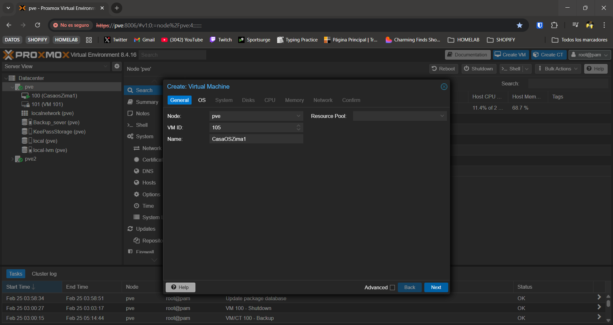
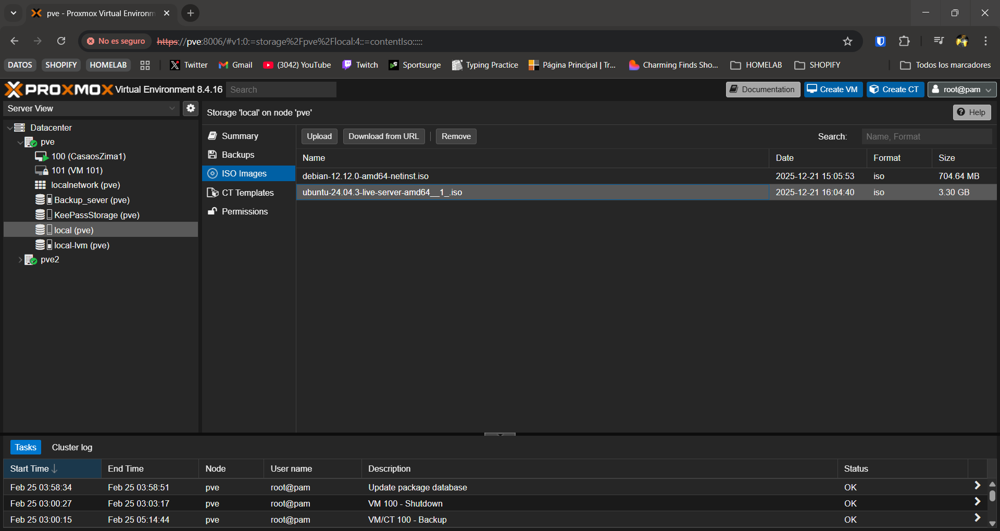
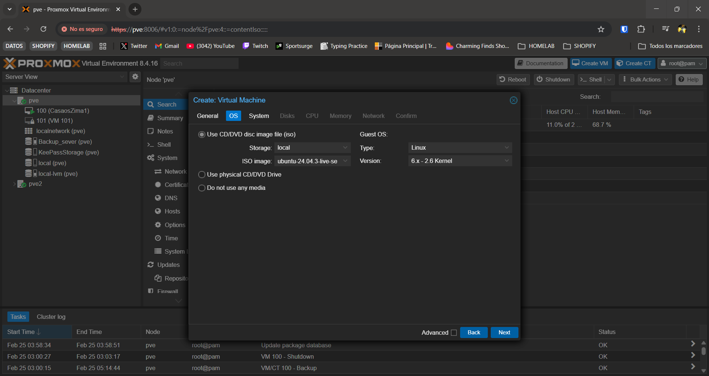
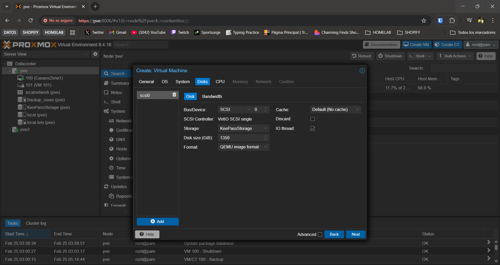
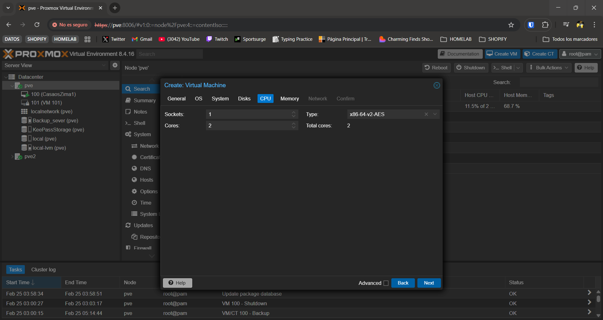
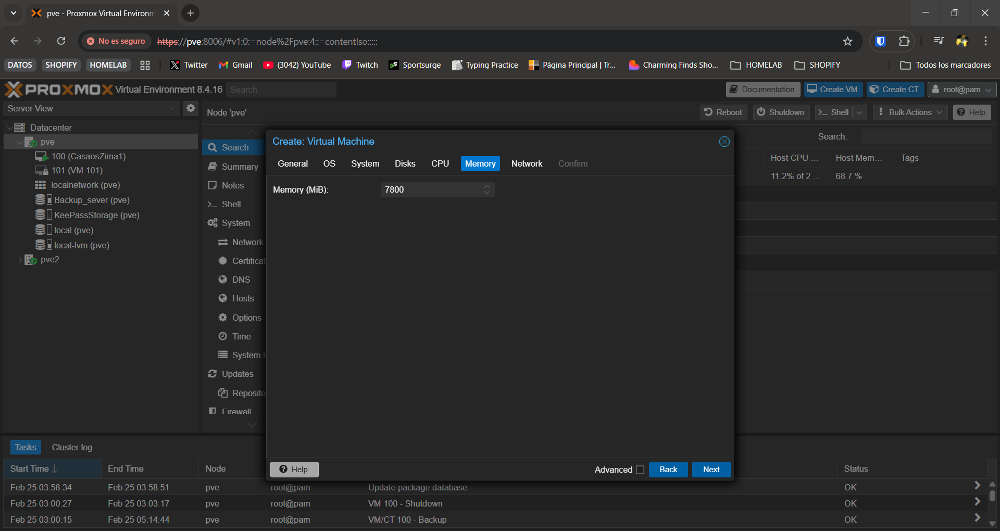
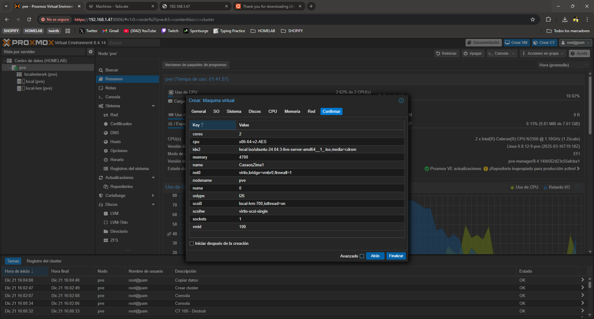
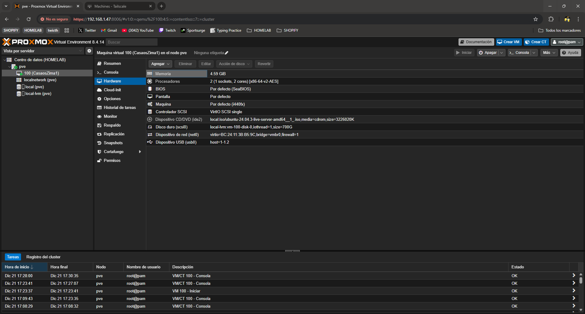
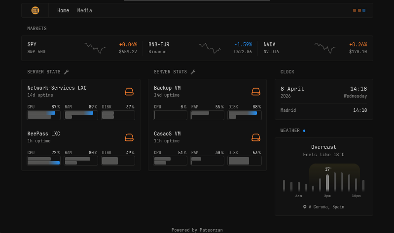

# Set Up Zimablade1 Servidor Principal 💻

## Objetivo

Usaremos uno de los Zimablades como servidor principal, en este servidor vamos a ejecutar la VM con casaos y todos los servicios principales que se usan, Nextcloud, Jellyfin, etc... Este servidor sera el principal y estará disponible 24/7. La idea es en un futuro descentralizar este servidor y dividir la carga entre los dos servidores.

## Requisitos

* Zimablade con RAM 8gb
* Pincho USB 8gb
* Cable Ethernet
* Monitor y adaptador miniDP a DP
* HUB usb

## Instalación

Vamos a empezar con la instalación, lo primero que necesitamos es desde otro dispositivo es descargar la iso de nuestro nuevo sistema operativo, Proxmox. Para ello vamos a la pagina oficial de [Proxmox](https://www.proxmox.com/en/downloads), en ella entramos en el apartado de downloads, aquí tenemos los diferentes sistemas que hay disponibles en este caso vamos a usar Proxmox Virtual Environment, lo seleccionamos y dentro de el veremos las diferentes versiones, este proyecto fue creado con la ultima version actual, Proxmox VE 8.4 ISO.

### Disco de arranque

Una vez instalado nuestro archivo de instalación ISO necesitamos crear el dispositivo de arranque con el que realizaremos la instalación, para esto necesitamos una unidad de almacenamiento, por ejemplo, un USB. En este proyecto se uso un usb cualquiera de 8 gb, puedes usar cualquiera unidad extraible que supere el tamaño de la ISO.

Para poder crear nuestro dispositivo de arranque necesitamos un programa, en este caso utilizamos Rufus, lo puedes descargar en su pagina oficial [Rufus](https://rufus.ie/es/#download).

### Inicio de instalación

Una vez tenemos los pasos previos completados pasamos a la instalación del software para instalar el sistema operativo es como cualquier otro sistema operativo, arrancamos el servidor conectado a una pantalla, un teclado y con el disco de instalación, por esto es necesario el hub USB.

Mientras nuestro servidor inicia presionamos la tecla F2 asi entraremos en la BIOS, aquí tenemos que editar el orden de arranque y indicar que arranque con el disco de instalación USB o el que usaste para la instalación. Una vez seleccionado pulsamos F10 para salir guardando los cambios, el servidor se reiniciara y arrancara con la instalación.

### Proceso de instalación

Proxmox VE.

Seguimos el tutorial creado por los propios creadores de Zimablade ([ZimaBlade_proxmoxInstall](https://www.zimaspace.com/docs/es/zimaboard/ZimaBlades-Cluster-PVE-Makes-Your-Service-Migratable))

*El Hub si se inicia la zima con el no funciona hay q iniciar con el y mientras inicia meterlo.*

Creamos el usb de instalación con RUFUS y con esta configuración, es importante que el esquema de la partición sea MBR.


Es importante que en la BIOS cambiar el Boot Options Priorities y seleccionar el usb como primero ya que sino iniciara con el almacenamiento interno y no instalara.


Una vez configurado dentro de la BIOS en el ultimo menu seleccionamos save and exit con esto se nos guardara y se reiniciara solo.


Una vez iniciado nos saldrá el menu de instalación en nuestro caso seleccionaremos modo terminal y seguiremos esta configuración. **IMPORTANTE** NO INSTALAR PROXMOX EN EL DISCO SSD INTERNO HAY QUE INsTALARLO EN EL DISCO HDD EXTERNO.

Una vez termina de instalar se nos reiniciara y antes de que se inicie hay que quitar el usb de instalación para que inicie con el disco con el que hicimos la instalación. Ahora nos pedirá meternos en la web para hacer la instalación inicial.

## Configuración VM

Una vez instalado Proxmox nos da una URL con la cual tenemos todo el panel de administración de el servidor.

```text
https://192.168.1.47:8006/
```

Aquí iniciaremos sesión con el usuario y contraseña creados durante la instalación, normalmente root.


Luego cambiamos el repositorio de Proxmox al No-Subscription, eliminando los siguientes repositorios.


Y añadimos el No-Subscription.


Luego actualizamos los repositorios.


Y los upgradeamos.


Primero antes de hacer nada añadimos los equipos a Tailscale que es una VPN gratuita que nos permite acceder a los equipos y que los equipos se vean entre si aunque no estén en la misma red interna. En este caso no seria necesario ya que tengo los equipos en la misma red local, pero esto añade disponibilidad a nuestro servidor y facilidades de añadir próximos dispositivos a la red y poder acceder a ellos desde fuera de la red local, sin tener que configurar Proxys. En nuestro caso nos conectamos a la shell de nuestro servidor pve y ejecutamos los siguientes comandos.

### Tailscale

```bash
curl -fsSL https://tailscale.com/install.sh | sh
```

Instalamos Tailscale.

```bash
sudo tailscale up
```

Activamos Tailscale y seguimos las indicaciones par vincularlo.

```bash
tailscale status
```

Puedes ver que esta bien configurado.

### Virtual Machine

En nuestro caso dentro de este servidor vamos a crear una Maquina Virtual que va a alojar un CasaOS con diferentes servicios, la configuración de la VM es la siguiente.

Creamos la VM, pulsamos el botón Create VM

Aquí seleccionamos el ID único de la maquina y su nombre, en este caso CasaOSZima1



Luego vamos a la segunda sección OS, aquí tenemos que seleccionar un sistema operativo que nosotros elijamos, en este caso Ubuntu-24-04-03. Previamente a esto si no queremos complicaciones vamos a descargar la imagen ISO desde Promox, para ellos nos vamos a nuestro servidor, en este caso pve y dentro de el local (pve).



Aquí podemos o subir la imagen o proporcionar la url con la imagen ISO para su descarga.

Una vez subida la ISO ya nos aparece para seleccionar la imagen ISO.



En system vamos a seleccionar machine q35 y Disk vamos a dejar todo por defecto salvo el tamaño en nuestro caso tenemos hasta 2TB pero vamos a utilizar hasta 1.35TB.



En CPU vamos a añadir dos cores, que es lo máximo que tiene disponible este servidor, el resto por defecto.



En memory vamos a poner 7800 que equivale a 7.62gb de 8gb que tenemos disponibles.



En Network lo vamos a dejar por defecto.

Con todo esto ya tenemos nuestra VM con Ubuntu24 para crear nuestro CasaOS, la configuración tendría que quedar algo asi.



### IP estática VM

Usar IP local fija en todos los servidores, ejemplo de como configurar en los Zimablades, cada equipo tiene su forma. También vamos a cambiar el hostname para identificarlo mejor y la contraseña del usuario por defecto.

```bash
hostnamectl
sudo hostnamectl set-hostname NUEVO_NOMBRE
sudo nano /etc/hosts
sudo passwd casaos
sudo passwd root
sudo reboot
```

Cambio de IP a IP fija.

```bash
sudo nmtui
```

Con este comando ya nos sale una interfaz con la que podemos configurar la IPV4 incluso aquí podemos configurar el hostname configurado anteriormente.

### CasaOS

Una vez creada nuestra VM vamos a crear nuestro servidor CasaOS en esta guía no se va a explicar como se creo esta estructura ya que se va a migrar un servidor casaOS ya creado, el cual estaba alojado en una Raspberry Pi5, a este servidor Proxmox nuevo. La migración se basa en copiar la carpeta /Data de nuestro antiguo servidor a este nuevo servidor, esto es simple ya que mi antiguo servidor tenia un disco SSD externo extraible, por lo cual es conectar este disco por USB a el nuevo servidor y seguir estos pasos.

Instalamos Casaos con el comando de instalación.

```bash
curl -fsSL https://get.casaos.io | sudo bash
```

Procedemos a copiar lo configuración de nuestro CasaOS de la raspberry Pi a este Zima, para ello conectamos el disco duro externo SSD a nuestro Zima y lo montamos en nuestra VM.



Ahora vamos a montar el disco y realizar el copiado con los siguientes comandos.

```bash
lsblk
```

Mostramos los discos y vemos que el disco externo esta montado

```bash
sudo mkdir -p /mnt/rpi
sudo mount /dev/sdb2 /mnt/rpi
```

Creamos la ruta para montar el disco externo y lo montamos en /mnt/rpi

```bash
lsblk -f
```

Si da error puedes ver mas información de los discos aquí.

```bash
sudo systemctl stop casaos
sudo systemctl stop docker
```

Paramos tanto docker como casaos para poder hacer el copiado.

```bash
sudo lvdisplay

sudo lvextend -l +100%FREE /dev/ubuntu-vg/ubuntu-lv

sudo resize2fs /dev/ubuntu-vg/ubuntu-lv

df -h
```

Antes de copiar vamos a extender el almacenamiento para que nos entre todo

```bash
sudo rsync -avh --progress /mnt/rpi/DATA/ /DATA/
sudo rsync -avh /mnt/rpi/var/lib/casaos/ /var/lib/casaos/
sudo rsync -avh /mnt/rpi/etc/casaos/ /etc/casaos/
sudo rsync -avh /mnt/rpi/srv/lsio/ /srv/lsio/
```

Hacemos el copiado de la carpetas de configuración y DATA del disco externo a la carpeta data del Zimablade1, copiamos esta carpeta ya que es la que contiene todos los datos y las configuraciones de los servicios el propio CasaOS no nos interesa ya que ya lo tenemos creado.

```bash
sudo chown -R root:root /DATA
sudo chown -R root:root /var/lib/casaos
sudo chown -R root:root /etc/casaos
sudo chown -R root:root /srv/lsio/
```

Le damos permisos de root a la carpeta por si acaso.

```bash
sudo systemctl start docker
sudo systemctl start casaos
```

Una vez todo funciono bien iniciamos Docker y CasaOS.

Desmontamos disco SSD externo

```bash
sudo lsof +D /mnt/rpi 2>/dev/null

sudo umount /mnt/rpi

lsblk
```

Una vez desmontado retiramos el SSD externo y reiniciamos la VM ahora debería de arrancar bien con el HDD.

## LXC Network-Services

Creamos esta LXC para descentralizar los servicios encargados de la exposición de ciertos servicios y asi sean mas accesibles y replicables el proceso de migración de estos servicios esta explicado en Migration.md de este Repositorio. Con esto vamos a aprovechar esta LXC para ademas crear un dashboard para poder ver que servicios hay en todo mi servidor y tener una vista general.

### Glance

Como dashboard elegí [Glance](https://github.com/glanceapp/glance?tab=readme-ov-file#installation) ya que me gusta su estética y sus funcionalidades, aunque no es un dashboard fácil de configurar. Vamos a seguir la instalación recomendad a traves de docker compose.

``` bash
mkdir glance && cd glance && curl -sL https://github.com/glanceapp/docker-compose-template/archive/refs/heads/main.tar.gz | tar -xzf - --strip-components 2
```

Una vez instalado lanzamos el contenedor con docker compose.

``` bash
docker compose up -d
```

Una vez lo tenemos corriendo podemos configurar a nuestra manera dentro de la carpeta `./glance/config/` ahi tenemos dos archivos que vienen ya con configuraciones de ejemplo `/home` es la pagina inicial y `glance` en la configuración del dashboard en general.

Yo borre esta configuración y cree la mia propia aunque aun sigue en proceso de construcción.



Para acceder al dashboard es desde la url que hayas configurado en tu docker-compose, por ejemplo `http://192.168.1.xx:8080/`

La configuración de server stats lo hice tanto usando el binaria como usando el docker-compose.yml para obtener las métricas de los contenedores.

``` bash
services:
  glance-agent:
    container_name: glance-agent
    image: glanceapp/agent:latest
    restart: unless-stopped
    # environment:
      # TOKEN: your_auth_token_here
    volumes:
      - /:/host:ro
      - /proc:/proc:ro
      - /sys:/sys:ro
      - /dev:/dev:ro
      - /var/run/docker.sock:/var/run/docker.sock:ro
      - /etc/os-release:/etc/os-release:ro
    ports:
      - "27973:27973"
```
