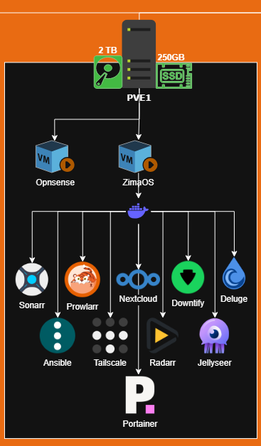

# Set Up Zimablade1 Servidor Principal 💻

## Objetivo

Usaremos uno de los Zimablades como servidor principal, en este servidor vamos a ejecutar la VM con casaos y todos los servicios principales que se usan, Nextcloud, Jellyfin, etc... Este servidor sera el principal y estará disponible 24/7. La idea es en un futuro descentralizar este servidor y dividir la carga entre los dos servidores.

## Requisitos

* Zimablade con RAM 8gb
* Pincho USB 8gb
* Cable Ethernet
* Monitor y adaptador miniDP a DP
* HUB usb

[Instalacion](./1-Instalación.md)

## Estado Actual

Aqui voy a ir documentando el estado actual y todo lo que se va montando en este nodo de manera visual, para mas información revisa el resto de .mds.

### Servidores *LXCs/VMs*

|  Nombre  | Tipo | Utilidad |  Estado  |
| :------: | :--: | :-------: | :------: |
|  ZimaOS  |  VM  | Servicios |  Activo  |
| OPNsense |  VM  | Firewall | Inactivo |

### Servicios

|     Servicio     |      Tipo      | Máquina |  Estado  |
| :---------------: | :-------------: | :-------: | :------: |
| Ansible Semaphore | Automatización | VM.ZimaOS |  Activo  |
|     Nextcloud     |      Drive      | VM.ZimaOS |  Activo  |
|      Prowlar      |     Indexer     | VM.ZimaOS |  Activo  |
|      Deluge      |     Torrent     | VM.ZimaOS |  Activo  |
|      Sonarr      |     Series     | VM.ZimaOS |  Activo  |
|      Radarr      |      Pelis      | VM.ZimaOS |  Activo  |
|     Downtify     |     Musica     | VM.ZimaOS |  Activo  |
|     Jellyfin     |      Media      | VM.ZimaOS | Inactivo |
|     Jellyseer     |      Media      | VM.ZimaOS |  Activo  |
|     Portainer     |     Docker     | VM.ZimaOS |  Activo  |
|   Ddns-Updater   |       IP       | VM.ZimaOS | Inactivo |
