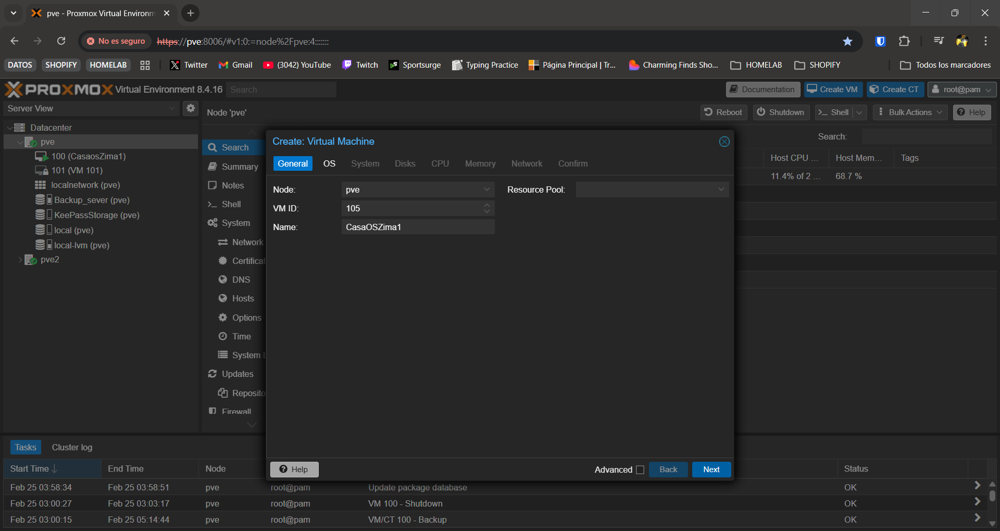
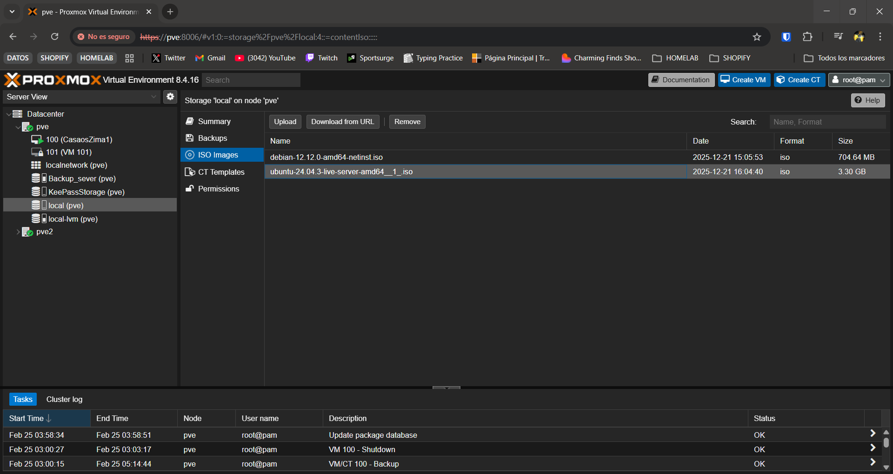
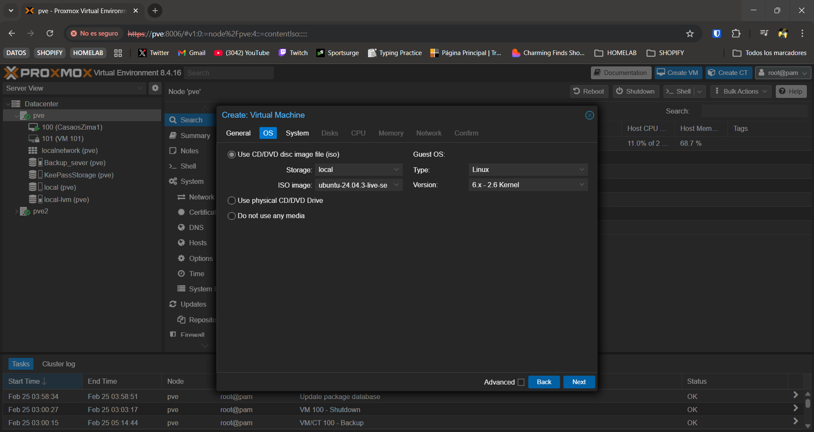
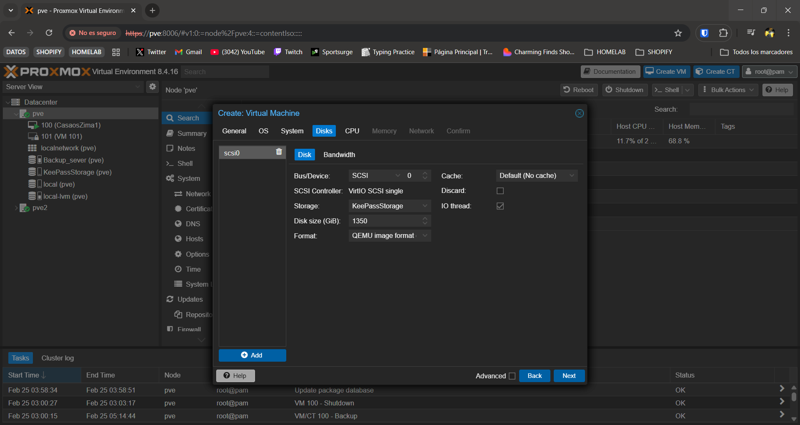
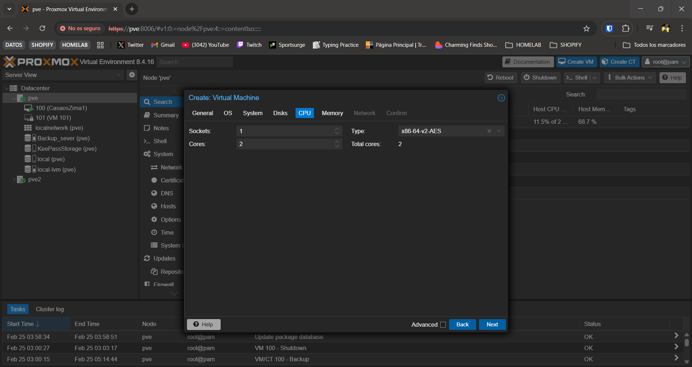
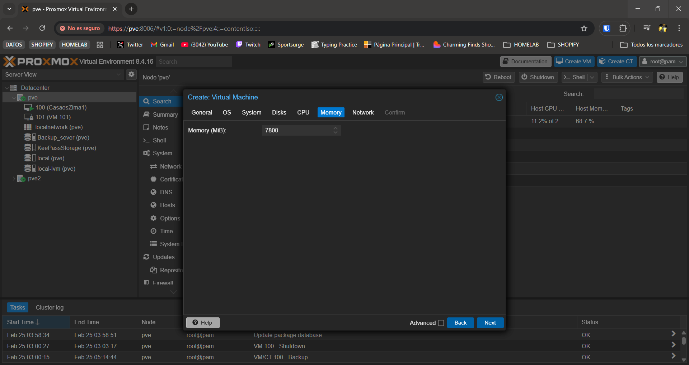
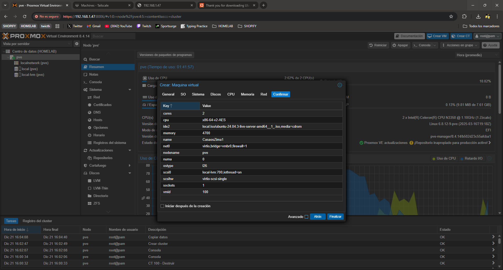
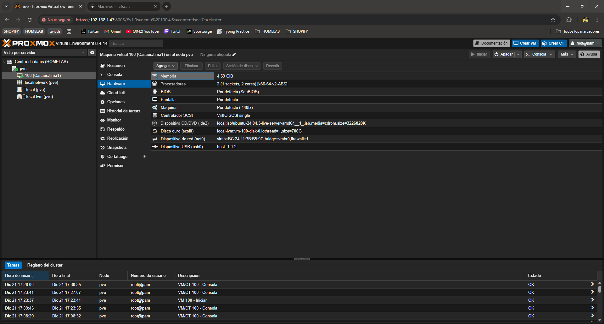

# CasaOS en Promox VE (Migrado)

### Virtual Machine

En nuestro caso dentro de este servidor vamos a crear una Maquina Virtual que va a alojar un CasaOS con diferentes servicios, la configuración de la VM es la siguiente.

Creamos la VM, pulsamos el botón Create VM

Aquí seleccionamos el ID único de la maquina y su nombre, en este caso CasaOSZima1



Luego vamos a la segunda sección OS, aquí tenemos que seleccionar un sistema operativo que nosotros elijamos, en este caso Ubuntu-24-04-03. Previamente a esto si no queremos complicaciones vamos a descargar la imagen ISO desde Promox, para ellos nos vamos a nuestro servidor, en este caso pve y dentro de el local (pve).



Aquí podemos o subir la imagen o proporcionar la url con la imagen ISO para su descarga.

Una vez subida la ISO ya nos aparece para seleccionar la imagen ISO.



En system vamos a seleccionar machine q35 y Disk vamos a dejar todo por defecto salvo el tamaño en nuestro caso tenemos hasta 2TB pero vamos a utilizar hasta 1.35TB.



En CPU vamos a añadir dos cores, que es lo máximo que tiene disponible este servidor, el resto por defecto.



En memory vamos a poner 7800 que equivale a 7.62gb de 8gb que tenemos disponibles.



En Network lo vamos a dejar por defecto.

Con todo esto ya tenemos nuestra VM con Ubuntu24 para crear nuestro CasaOS, la configuración tendría que quedar algo asi.



### IP estática VM

Usar IP local fija en todos los servidores, ejemplo de como configurar en los Zimablades, cada equipo tiene su forma. También vamos a cambiar el hostname para identificarlo mejor y la contraseña del usuario por defecto.

```bash
hostnamectl
sudo hostnamectl set-hostname NUEVO_NOMBRE
sudo nano /etc/hosts
sudo passwd casaos
sudo passwd root
sudo reboot
```

Cambio de IP a IP fija.

```bash
sudo nmtui
```

Con este comando ya nos sale una interfaz con la que podemos configurar la IPV4 incluso aquí podemos configurar el hostname configurado anteriormente.

### CasaOS

Una vez creada nuestra VM vamos a crear nuestro servidor CasaOS en esta guía no se va a explicar como se creo esta estructura ya que se va a migrar un servidor CasaOS ya creado, el cual estaba alojado en una Raspberry Pi5, a este servidor Proxmox nuevo. La migración se basa en copiar la carpeta /Data de nuestro antiguo servidor a este nuevo servidor, esto es simple ya que mi antiguo servidor tenia un disco SSD externo extraible, por lo cual es conectar este disco por USB a el nuevo servidor y seguir estos pasos.

Instalamos Casaos con el comando de instalación.

```bash
curl -fsSL https://get.casaos.io | sudo bash
```

Procedemos a copiar lo configuración de nuestro CasaOS de la raspberry Pi a este Zima, para ello conectamos el disco duro externo SSD a nuestro Zima y lo montamos en nuestra VM.



Ahora vamos a montar el disco y realizar el copiado con los siguientes comandos.

```bash
lsblk
```

Mostramos los discos y vemos que el disco externo esta montado

```bash
sudo mkdir -p /mnt/rpi
sudo mount /dev/sdb2 /mnt/rpi
```

Creamos la ruta para montar el disco externo y lo montamos en /mnt/rpi

```bash
lsblk -f
```

Si da error puedes ver mas información de los discos aquí.

```bash
sudo systemctl stop casaos
sudo systemctl stop docker
```

Paramos tanto docker como casaos para poder hacer el copiado.

```bash
sudo lvdisplay

sudo lvextend -l +100%FREE /dev/ubuntu-vg/ubuntu-lv

sudo resize2fs /dev/ubuntu-vg/ubuntu-lv

df -h
```

Antes de copiar vamos a extender el almacenamiento para que nos entre todo

```bash
sudo rsync -avh --progress /mnt/rpi/DATA/ /DATA/
sudo rsync -avh /mnt/rpi/var/lib/casaos/ /var/lib/casaos/
sudo rsync -avh /mnt/rpi/etc/casaos/ /etc/casaos/
sudo rsync -avh /mnt/rpi/srv/lsio/ /srv/lsio/
```

Hacemos el copiado de la carpetas de configuración y DATA del disco externo a la carpeta data del Zimablade1, copiamos esta carpeta ya que es la que contiene todos los datos y las configuraciones de los servicios el propio CasaOS no nos interesa ya que ya lo tenemos creado.

```bash
sudo chown -R root:root /DATA
sudo chown -R root:root /var/lib/casaos
sudo chown -R root:root /etc/casaos
sudo chown -R root:root /srv/lsio/
```

Le damos permisos de root a la carpeta por si acaso.

```bash
sudo systemctl start docker
sudo systemctl start casaos
```

Una vez todo funciono bien iniciamos Docker y CasaOS.

Desmontamos disco SSD externo

```bash
sudo lsof +D /mnt/rpi 2>/dev/null

sudo umount /mnt/rpi

lsblk
```

Una vez desmontado retiramos el SSD externo y reiniciamos la VM ahora debería de arrancar bien con el HDD.
