## OPNsense VM

Ya empiezo a tener bastantes servicios y contenedores por lo que le voy a añadir una casa de seguridad más grande a mi red, por ello vamos a instalar un VM con [OPNsense]('https://opnsense.org/#'), un firewall Open-source muy potente.

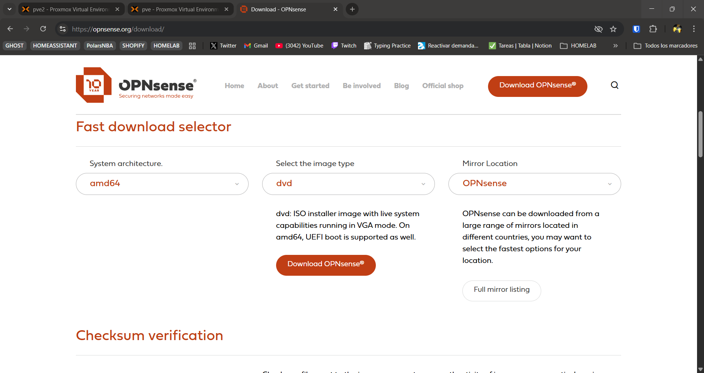

Como en nuestro caso vamos a crear un VM en Proxmox vamos a utilizar la imagen ISO que nos proporciona OPNsense en su web, una vez descargada y descomprimida subimos la ISO a uno de nuestros storages, yo en mi caso lo voy a subir en el storage local que viene por defecto.

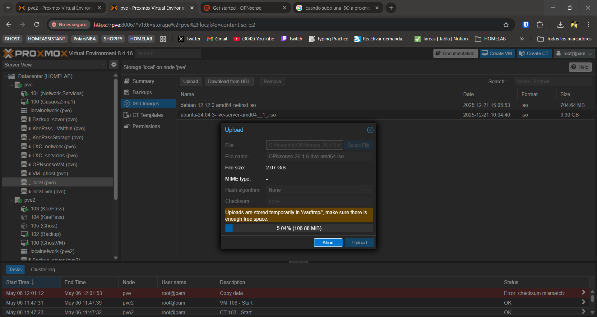

### Requisitos

* 1 core
* 4gb de ram o más
* 8gb de almacenamiento en disco o más

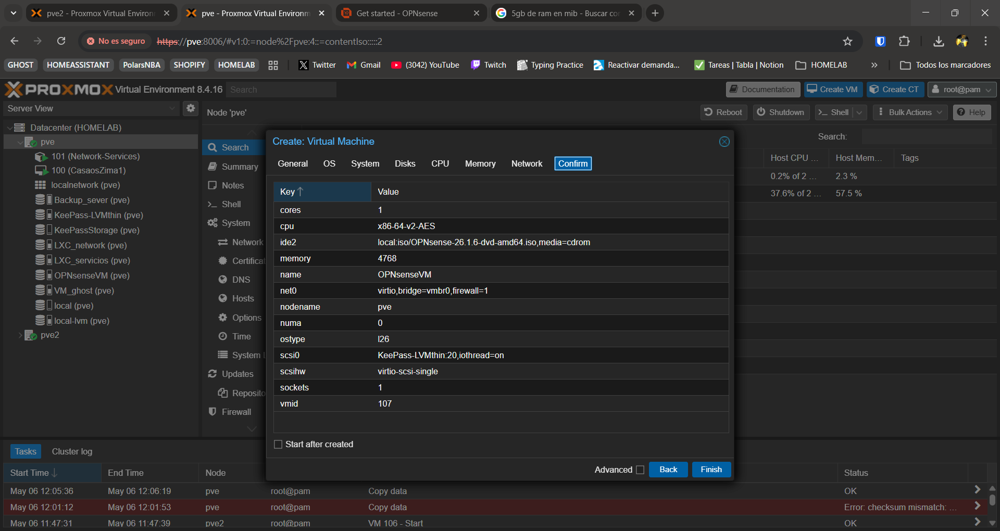

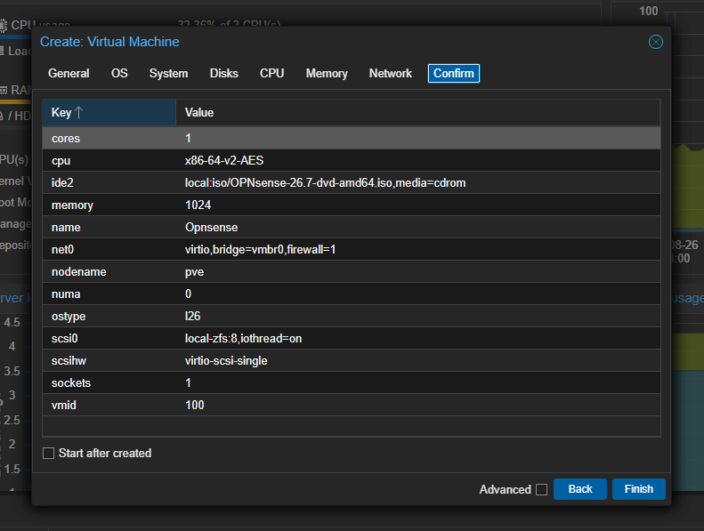

### Instalación

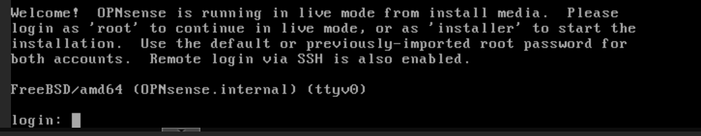

Ahora una vez inicia nos da estas dos opciones , como nosotros queremos instalar vamos a loguear con 'installer', y la contraseña por defecto es 'opnsense'.

Primero elegimos el idioma del teclado, como tengo teclado español vamos con Spanish

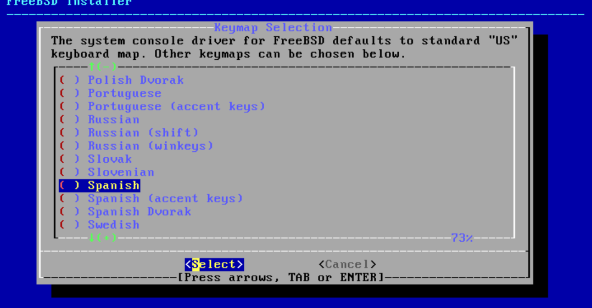

Ahora vamos a instalar el sistema de archivos, ya que es una VM con pocos recursos vamos a ir por la opción UFS.

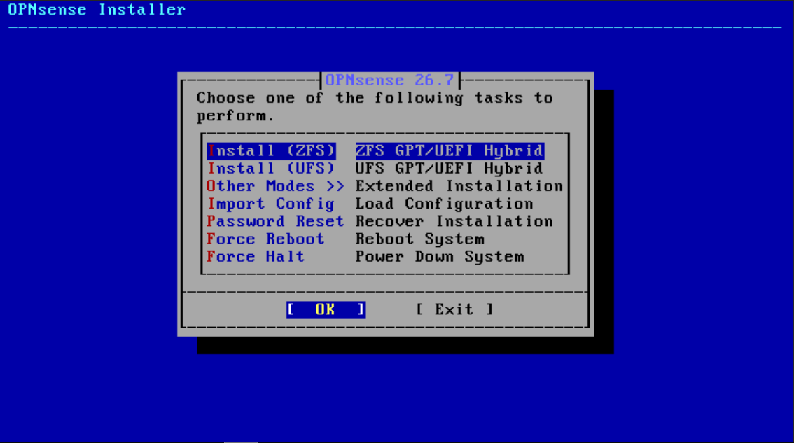

Importante ahora seleccionar el disco no el cd, que es realmente la ISO de instalacion.

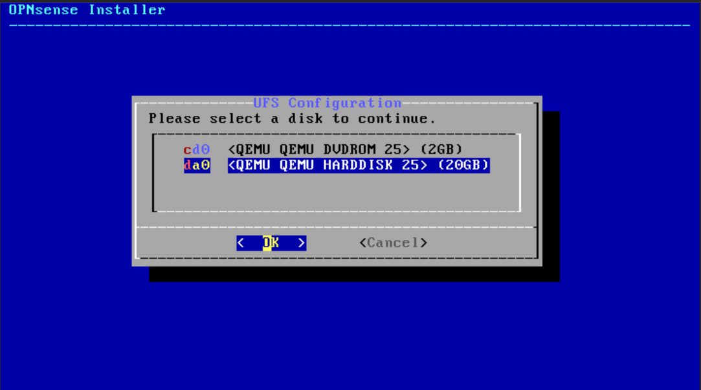

Ahora instalara el OPNsense en nuestro disco de 20gb que asignamos a nuestra VM.

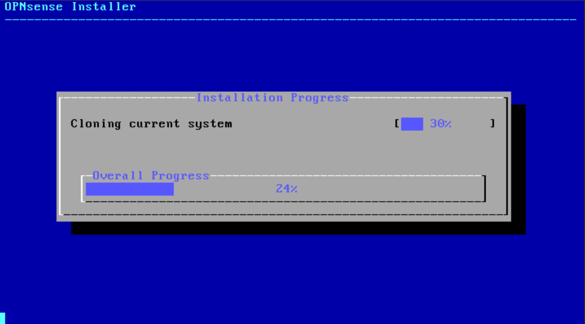

Una vez instalado nos va a pedir cambiar la contraseña, la cambiamos y podemos completar la instalación.

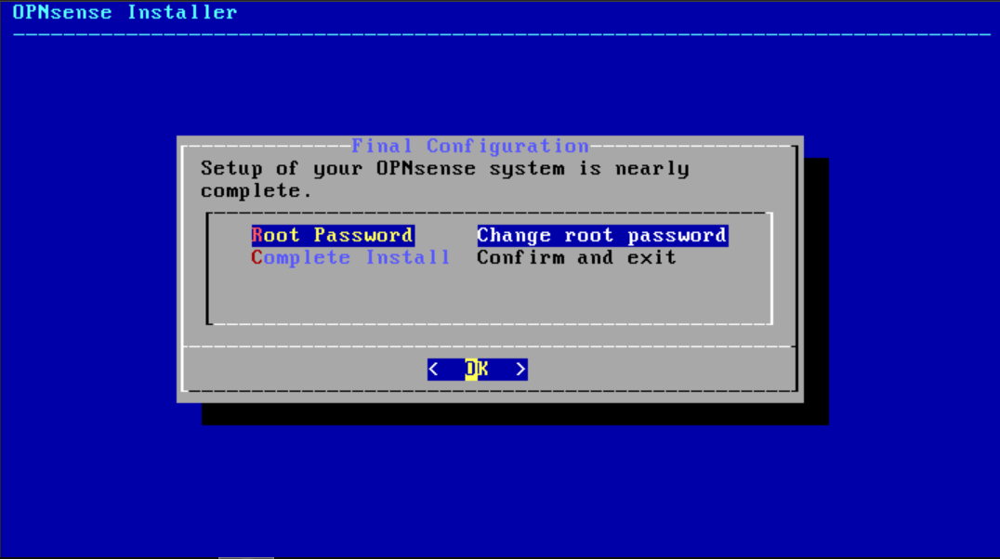

Una vez la completamos reiniciamos el sistema y quitamos el disco CD/ISO, y ahora nos iniciara desde el disco donde realizamos la instalación.

Ahora ya podemos iniciar sesión con root y la contraseña que configuramos anteriormente.

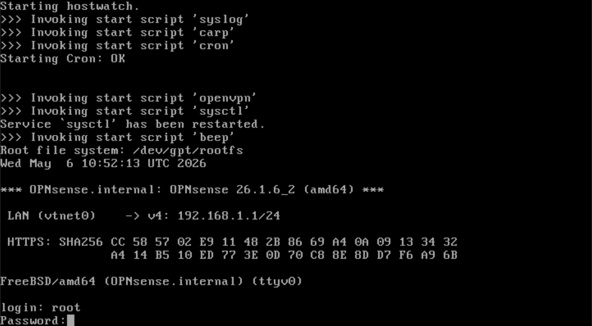

### Configuración

Ahora lo primero que vamos a hacer es configurar la IP, el la opción 2).

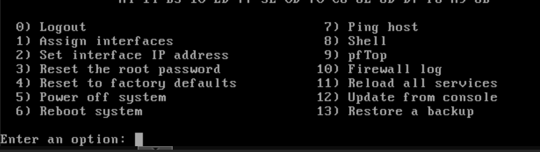

Asi es como configure la red IPV4

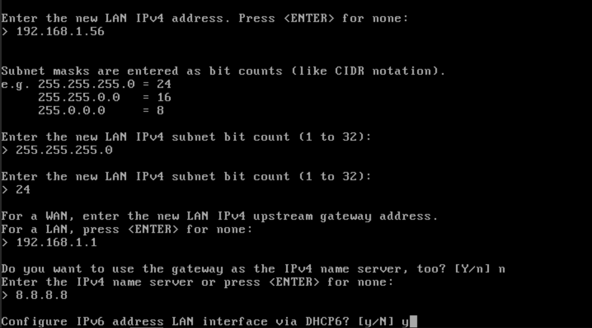

Una vez tenemos configurada la IP del host ya podemos acceder a la GUI web de OPNsense

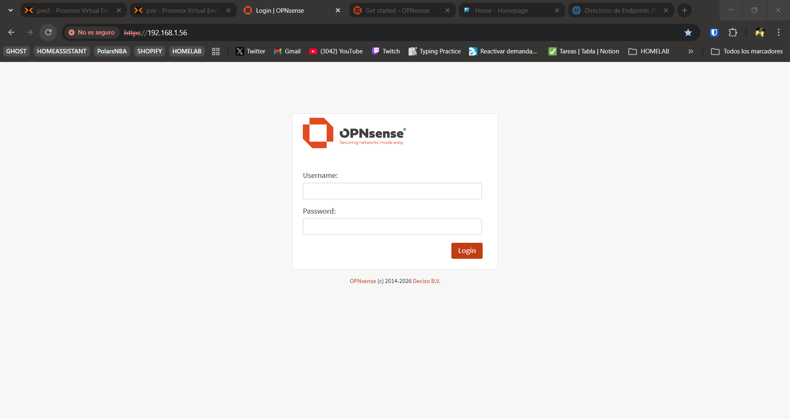

Una vez dentro vamos a ir al wizard y vamos a revisar la configuración básica.

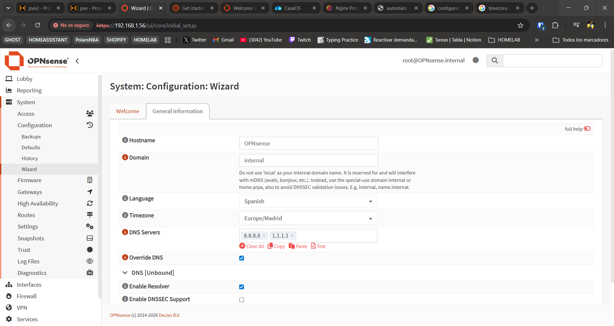

Ahora aqui tenemos un problema y vamos a contextualizar mi caso, este Opnsense es un firewall mas teorico que realista yo en mi red au no tengo equipos dedicados a redes solo tengo el router de la compañia ISP y un switch "tonto" que solo sirve como puerto de conexion eth no tiene ningun tipo de tecnologia ni sowftware, para poder hacer lo que yo tengo pensado necesito conseguir un buen router y switch.

Por esto me limita lo que puedo hacer con este Opnsense en mi Homelab por ahora vamos a usarlo simplemente para lo que podemos, que es como firewall para mi VM Zimaos, esto nos sirve ya que estan en el mismo nodo/maquina entonces no tengo problemas con que mi switch no etiquete las VLANs. Esto es simplemente una prueba probablemente no lo pueda implementar de manera definitiva ya que me va a dar mas problemas que seguridad, pero para aprender y ver como funciona Opnsense es buena práctica.
