## VM ZimaOS

Migración de CasaOS hacia ZimaOS, evolucion de este sofware con multiples mejoras y soporte actual, ya que casaos ya no recibia actualizaciones ni mejoras. En el apartado de migraciones esta documentado todo el proceso de migración y como consegui mover un disco de 800gb de una VM a otra con sus particularidades, ya que ZimaOS es bastante mas restrictivo que su version antigua CasaOS.

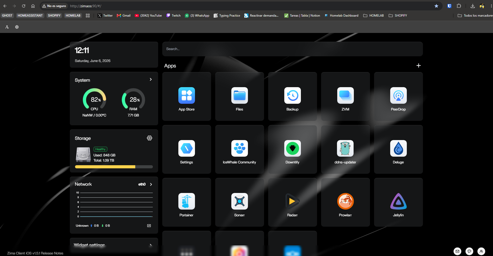

### Ansible

Vamos a añadir un nuevo servicio a mi ZimaOS, ansible es una herramienta que automatiza la configuración de servidores, el despliegue de programas y la gestión de redes sin necesidad de instalar agentes externos en los equipos controlado. Esta tambien te ayuda a monitorizar los servidores que tengamos, actualizaciones, versiones, etc...

Vamos a aprovechar la App Store que nos ofrece ZimaOS y vamos a instalar Ansile Semaphore que es una version de Ansible CLI que ofrece una capa visual para gestionar todo de manera mas comoda via web.

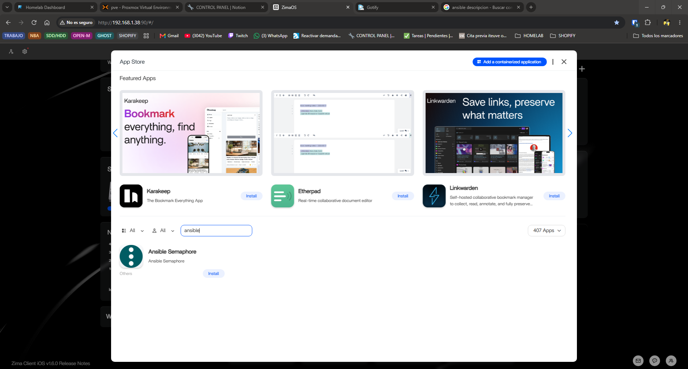

Vamos a entrar en la configuración en mi caso tengo el puerto 3000 ocupado por lo que voy a usar el puerto 3030

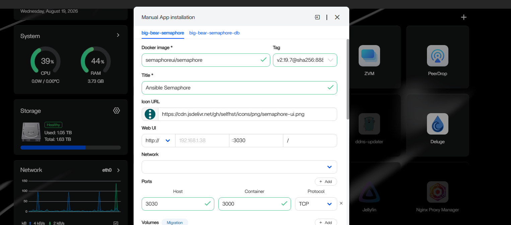

Luego tambien recomiendo configurar las contraseñas y usuario y no dejarlas por defecto por un tema de seguridad pero si tu servidor no esta expuesto al exterior puedes dejarlo por defecto

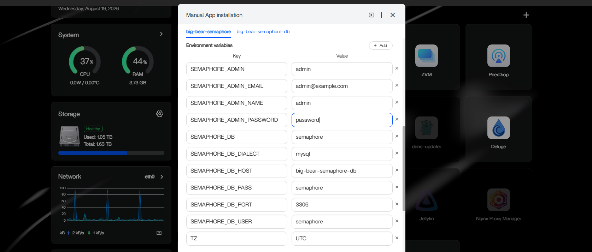

Luego una vez se instale la App accedemos a su web y iniciamos sesion


Luego lo primero es crear el proyecto con el nombre que tu quieras en mi caso Homelab

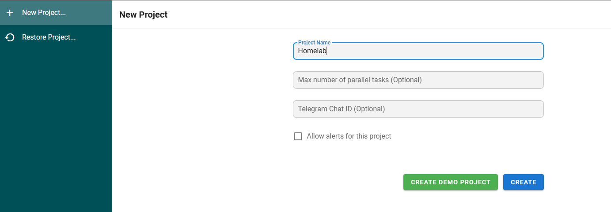

Yo ansible lo quiero principalmente para poder conectarme a mis servidores y poder lanzar playbooks desde aqui, por ejemplo me interesa poder lanzar actualizaciones de mis servidores semanales todo automatizado. Esto se puede hacer ya que Ansible se conecta por SSH a los servidores que tu quieras y lanza los playbooks, por esto lo primero es configurar las Keys, vamos a empezar con una prueba conectando mi Raspberry Pi 5

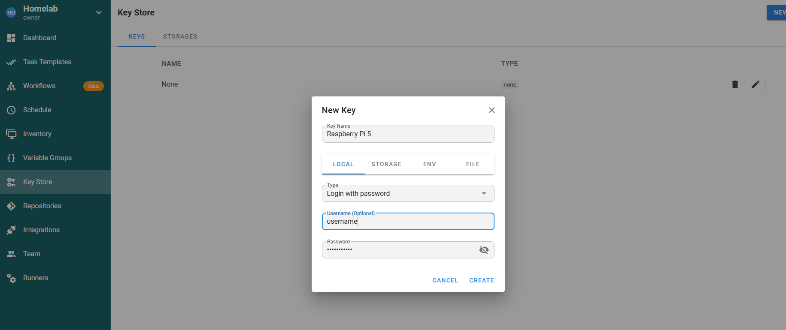

Tambien es interesante e importante crear una key para la autentificacion del sudo ya que la mayoria de operaciones lo necesitan, simplemente añade la contraseña

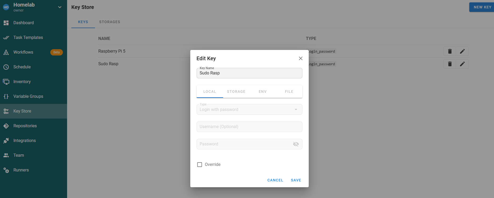

Luego tenemos que crear el repositorio para almacenar los playbooks yo voy a almacenarlos localmente

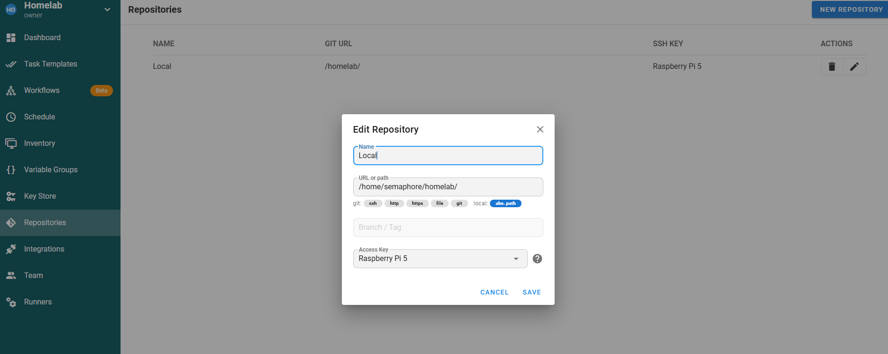

Para mayor redundacia voy a crear un repo privado en Github y conectarlo aqui, para esto necesitas configurar la key store con la ssh key que configures en la maquina donde corre semaphore y conectar esa key a github.

`ssh-keygen -t ed25519 -C "semaphore-homelab" -f ~/.ssh/semaphore_github -N ""`

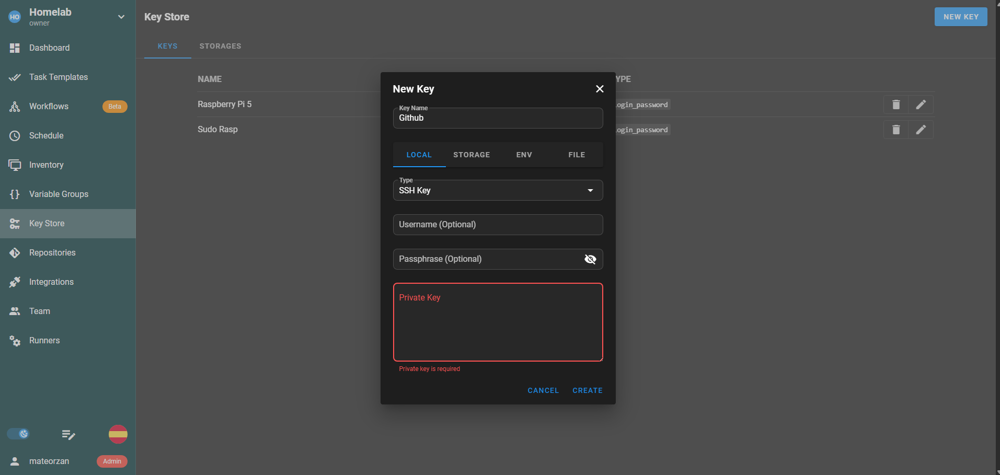

Luego simplemente creas el repositorio y añades las credenciales al repo que acabas de crear en github.

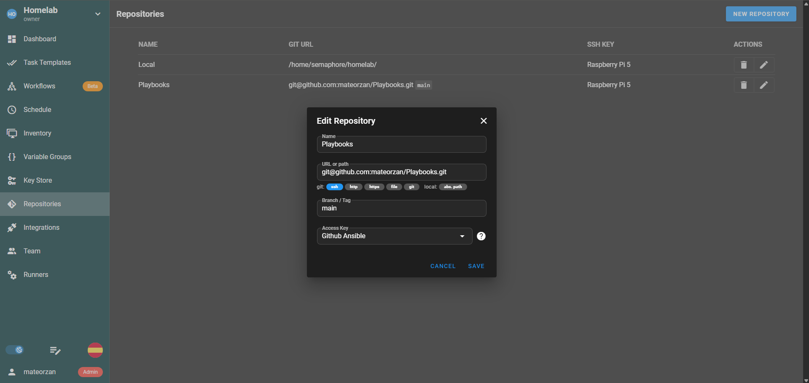

Luego por ultimo configuramos el inventory que es donde especidficamos la IP y a donde se tiene que conectar

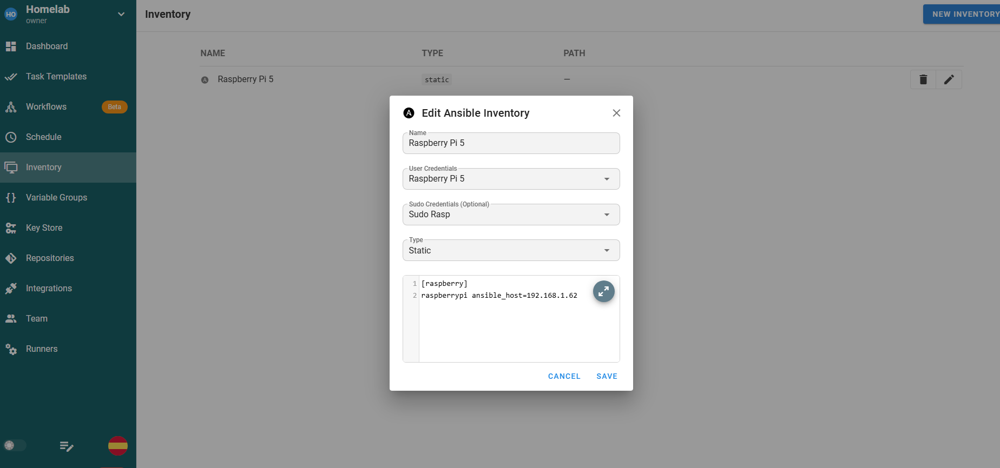

Ahora vamos a crear el primer playbook yml, este va a ser un playbook que simplemente ejecute un apt update, como lo configuramos con un repo local tenemos que meternos a la terminal de nuestro contenedor y dentro de la estructura creada crear el archivo `apt-update.yml`

```Shell
cat > apt-update.yml << 'EOF'
---
- name: Actualizar repositorios APT
  hosts: raspberry
  become: yes
  tasks:
    - name: apt update
      apt:
        update_cache: yes
EOF
```

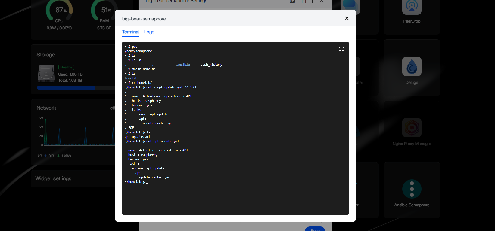

Desde el repo es mas facil crear los playbooks, simplemente los creas tu a mano desde el dispositivo que quieras y subes los cambios al repo.

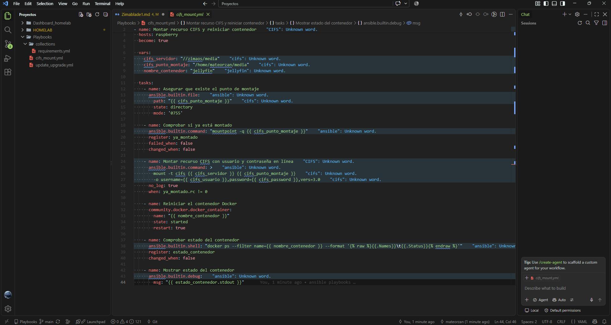

Ahora a vamos al ultimo paso vamos a crear la Task Template esto es simplemente añadir todo lo que acabamos de crear

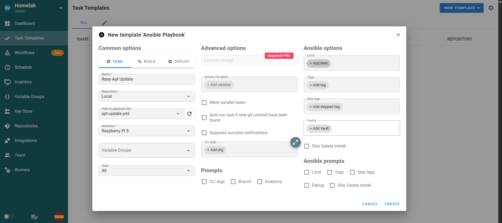

Luego ejecutamos y vemos si funciona como deberia

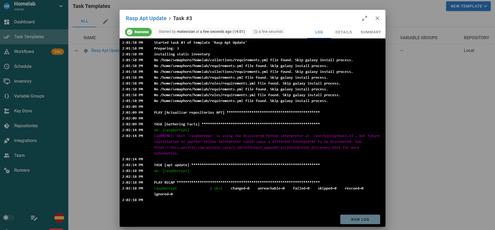

Por ultimo si queremos que sea una ejecucion periodica podemos añadirle un schedule pero esto es opcional

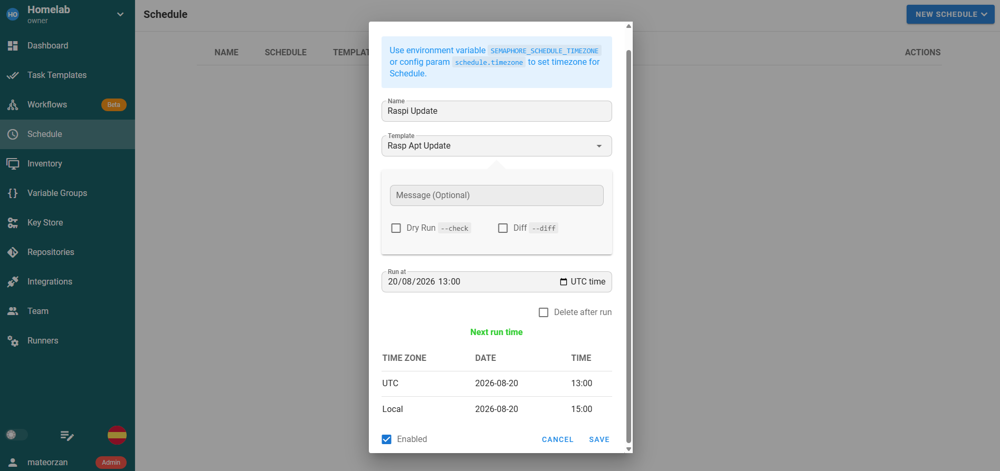

Con esto ya tendriamos un ejemplo rapido de una ejecucion que se podria hacer con este servicio las posibilidades son infinitas.
