## Preparación Instalación

### Software

Vamos a empezar con la instalación, lo primero que necesitamos es desde otro dispositivo es descargar la iso de nuestro nuevo sistema operativo, Proxmox. Para ello vamos a la pagina oficial de Proxmox([https://www.proxmox.com/en/downloads](https://www.proxmox.com/en/downloads)), en ella entramos en el apartado de downloads, aquí tenemos los diferentes sistemas que hay disponibles en este caso vamos a usar Proxmox Virtual environment, lo seleccionamos y dentro de el veremos las diferentes versiones, este proyecto fue creado con la ultima version actual, Proxmox VE 8.4 ISO.

### Disco de arranque

Una vez instalado nuestro archivo de instalación ISO necesitamos crear el dispositivo de arranque con el que realizaremos la instalación, para esto necesitamos una unidad de almacenamiento, por ejemplo, un USB. En este proyecto se uso un usb cualquiera de 8 gb, puedes usar cualquiera unidad extraible que supere el tamaño de la ISO.

Para poder crear nuestro dispositivo de arranque necesitamos un programa, en este caso utilizamos Rufus, lo puedes descargar en su pagina oficial([https://rufus.ie/es/#download](https://rufus.ie/es/#download)).

## Proceso de instalación

### Proxmox

Seguimos el tutorial creado por los propios creadores de zimablade ([ZimaBlade_proxmoxInstall](https://www.zimaspace.com/docs/es/zimaboard/ZimaBlades-Cluster-PVE-Makes-Your-Service-Migratable))

*El Hub si se inicia la zima con el no funciona hay q iniciar con el y mientras inicia meterlo.*

Creamos el usb de instalación con RUFUS y con esta configuración, es importante que el esquema de la partición sea MBR.

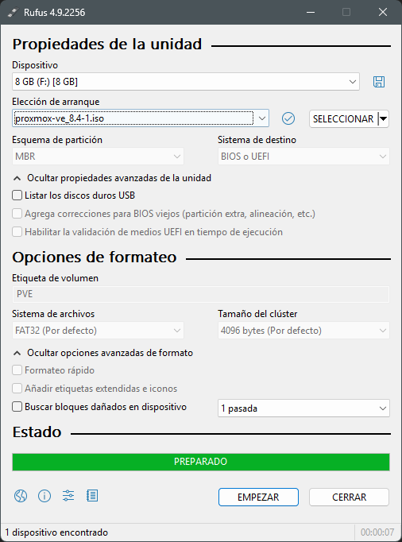

### Inicio de instalación

Una vez tenemos los pasos previos completados pasamos a la instalación del software para instalar el sistema operativo es como cualquier otro sistema operativo, arrancamos el servidor conectado a una pantalla, un teclado y con el disco de instalación, por esto es necesario el hub USB.

Mientras nuestro servidor inicia presionamos la teclear F2 asi entraremos en la BIOS, aquí tenemos que editar el orden de arranque y indicar que arranque con el disco de instalación USB o el que usaste para la instalación. Una vez seleccionado pulsamos F10 para salir guardando los cambios, el servidor se reiniciara y arrancara con la instalación.

Es importante que en la BIOS cambiar el Boot Options Priorities y seleccionar el usb como primero ya que sino iniciara con el almacenamiento interno y no instalara. Para entrar en la BIOS pulsamos DEL(Supr).

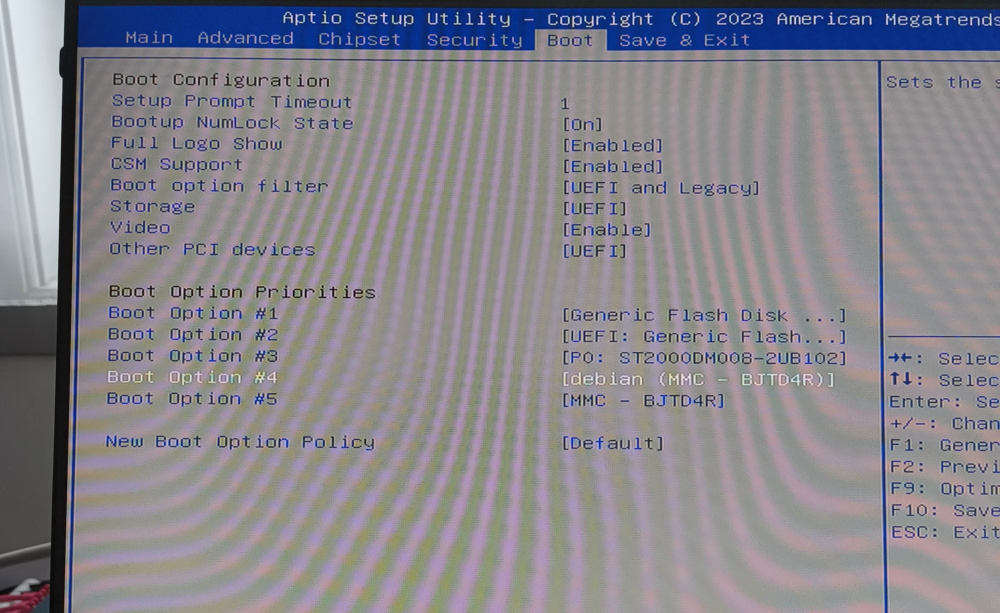

Una vez configurado dentro de la BIOS en el ultimo menu seleccionamos save and exit con esto se nos guardara y se reiniciara solo.

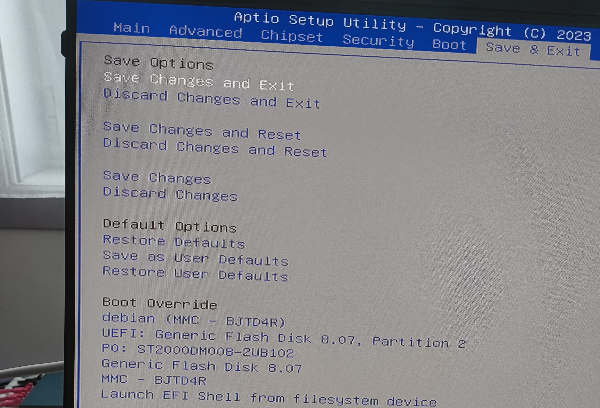

Una vez iniciado nos saldrá el menu de instalación en nuestro caso seleccionaremos modo graphical y seguiremos esta configuración. IMPORTANTE NO INSTALAR PROXMOX EN EL DISCO SSD INTERNO HAY QUE INSTALARLO EN EL DISCO HDD EXTERNO.

SI VES QUE CON EL GRÁFICO NO TE FUNCIONA PRUEBA CON EL TERMINAL CON LA MISMA CONFIGURACIÓN.

> *Una vez termina de instalar se nos reiniciara y antes de que se inicie hay que quitar el usb de instalación para que incie con el disco con el que hicimos la instalación.*

Ahora nos pedirá meternos en la web para hacer la instalación inicial.

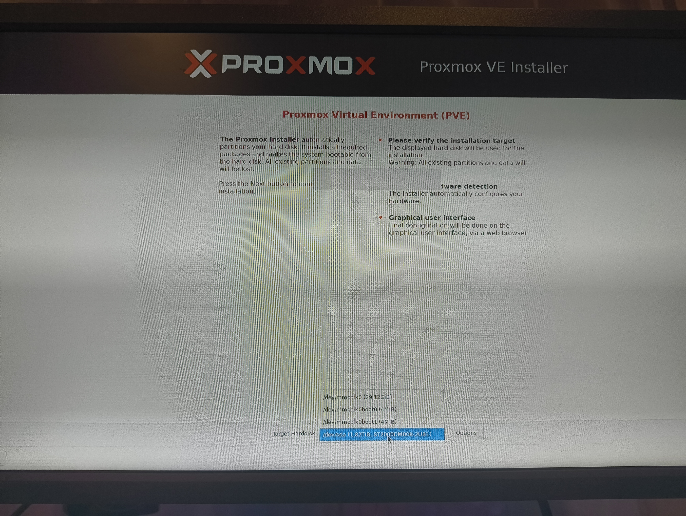

Luego de seleccionar el disco seleccionamos la region y nuestra franja horaria.

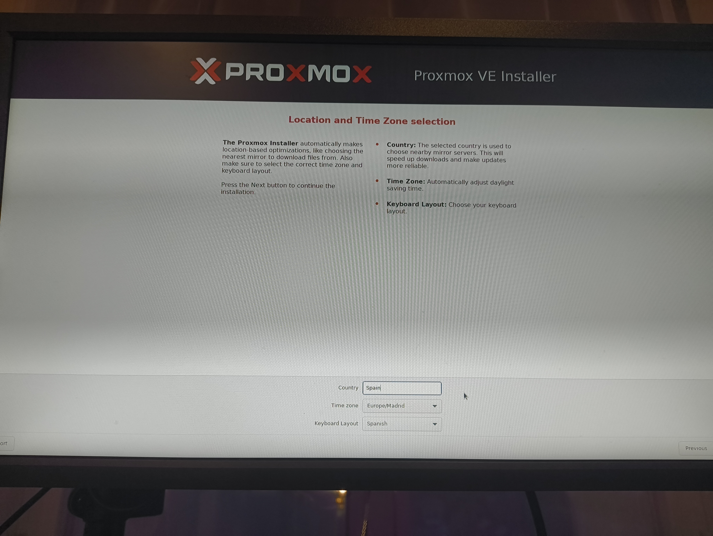

Añadimos la cuenta de admin con un correo y una contraseña.

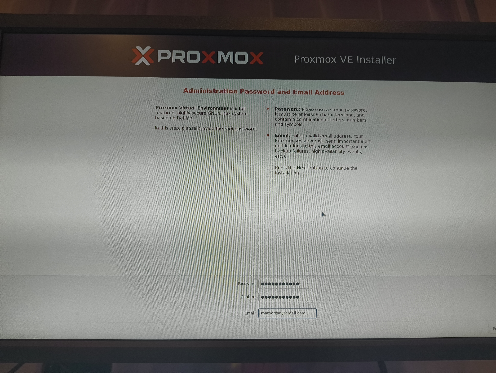

Por ultimo configuramos el hostname y la red, este paso es muy importante hacerlo bien.

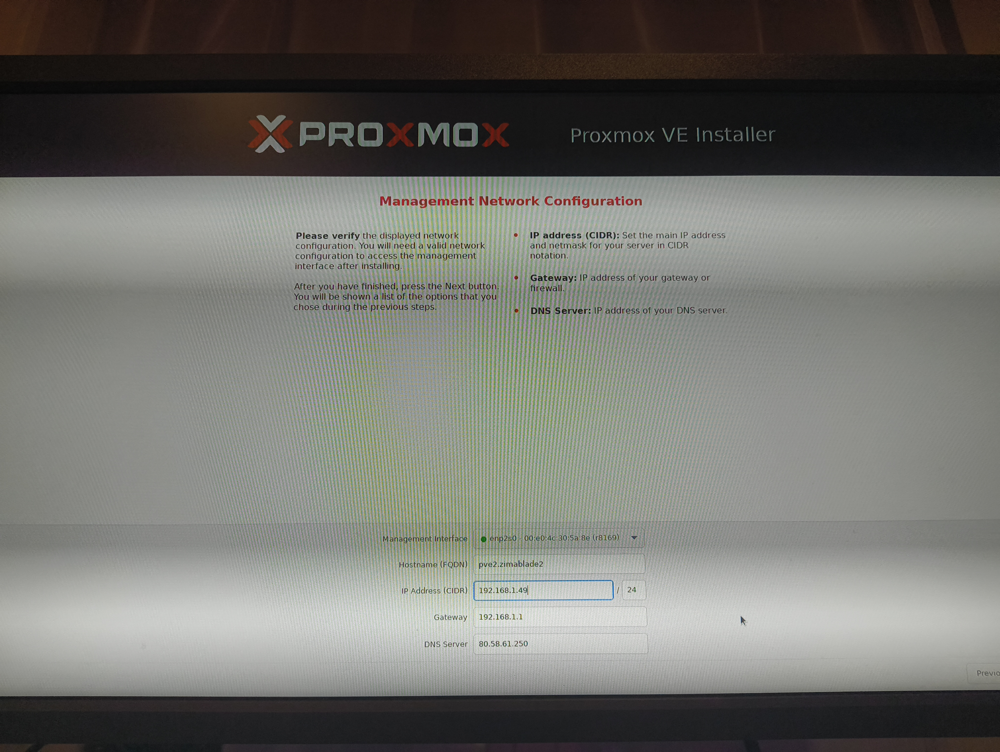

Si todo esta bien nos quedaría algo asi.

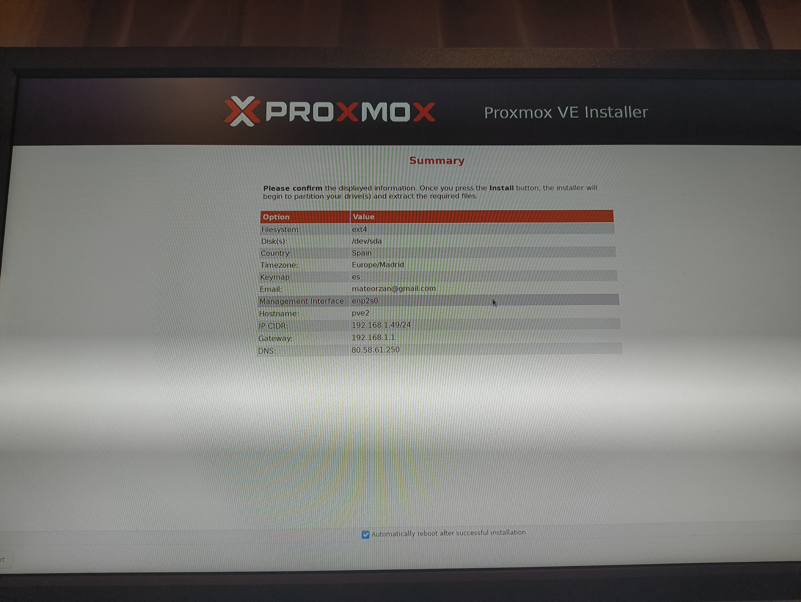

## Configuración

Una vez instalado Proxmox nos da una URL con la cual tenemos todo el panel de administración de el servidor.

```text
https://192.168.1.49:8006/
```

Aquí iniciaremos sesión con el usuario y contraseña creados durante la instalación, normalmente root.

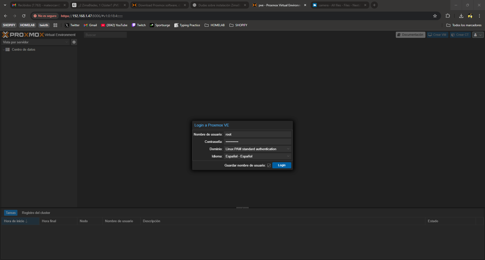

Luego cambiamos el repositorio de Proxmox al No-Subscription, eliminando los siguientes repositorios.

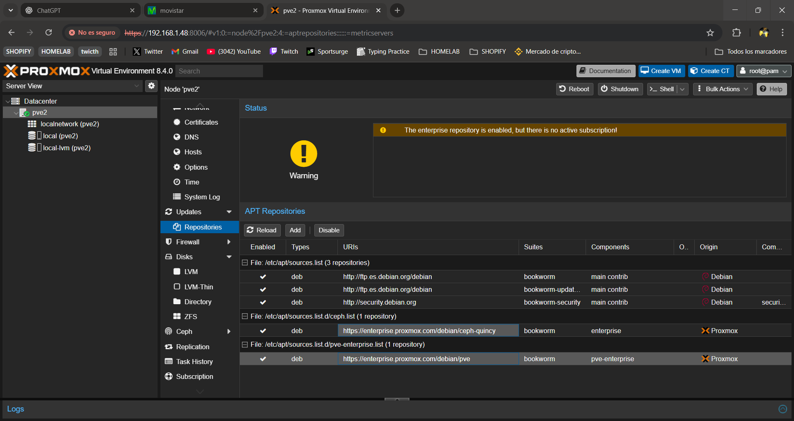

Y añadimos el No-Subscription.

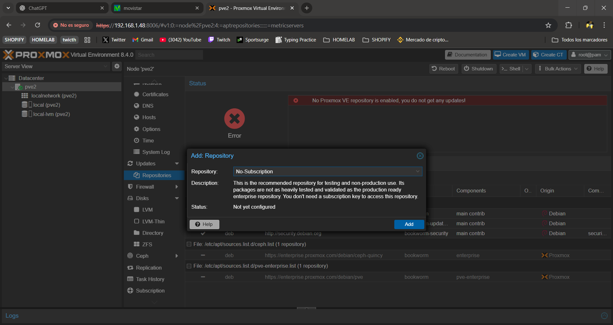

Luego actualizamos los repositorios.

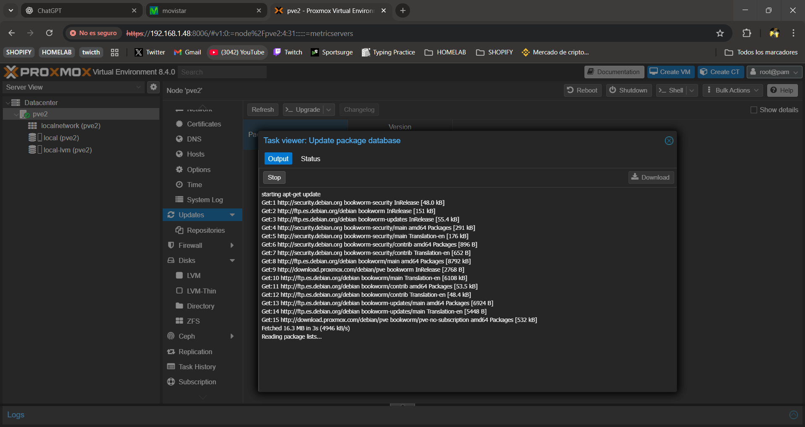

Y los upgradeamos.

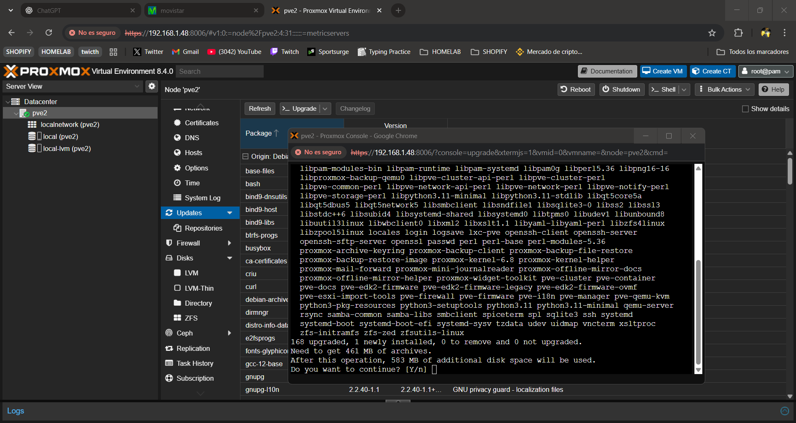

Una vez actualizado el servidor añadimos el equipos a Tailscale que es una VPN gratuita que nos permite acceder a los equipos y que los equipos se vean entre si aunque no estén en la misma red interna. En este caso no seria necesario ya que tengo los equipos en la misma red local, pero esto añade disponibilidad a nuestro servidor y facilidades de añadir próximos dispositivos a la red y poder acceder a ellos desde fuera de la red local, sin tener que configurar Proxys. En nuestro caso nos conectamos a la shell de nuestro servidor pve y ejecutamos los siguientes comandos.

### Tailscale

```bash
curl -fsSL https://tailscale.com/install.sh | sh
```

Instalamos Tailscale.

```bash
sudo tailscale up
```

Activamos Tailscale y seguimos las indicaciones para vincularlo.

```bash
tailscale status
```

Puedes ver que esta bien configurado.

### Cluster

En este paso vamos a unir este nodo al cluster para que los dos nodos estén unidos.

Vamos al nodo inicial, DataCenter --- Cluster --- Join Information.

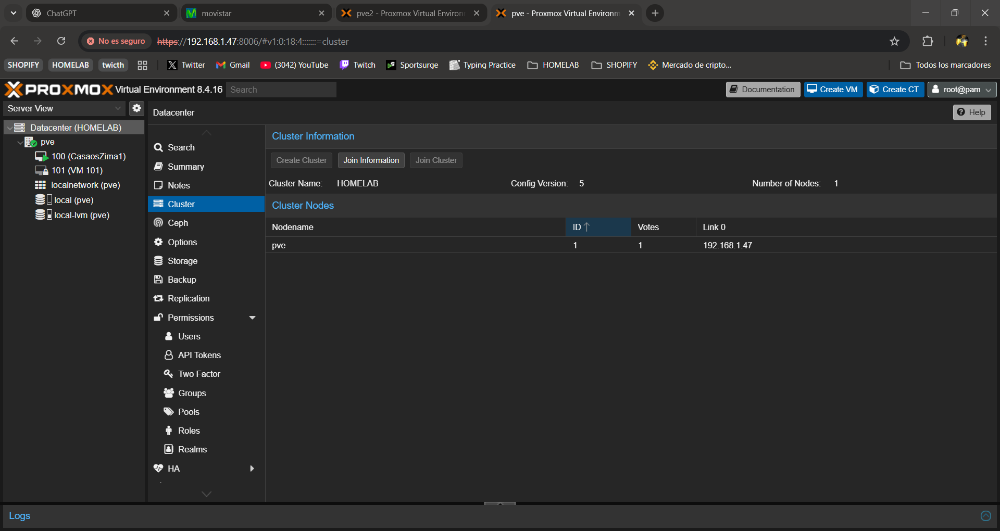

La copiamos y dentro del mismo menu pero del segundo servidor seleccionamos DataCenter --- Cluster --- Join Cluster

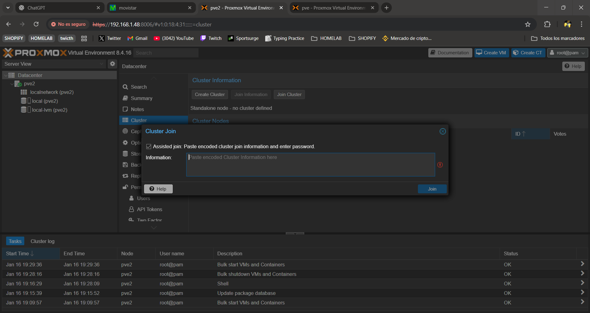

Aquí pegamos la información, y nos pedirá la contraseña del nodo principal y con esto ya se unirla al cluster.

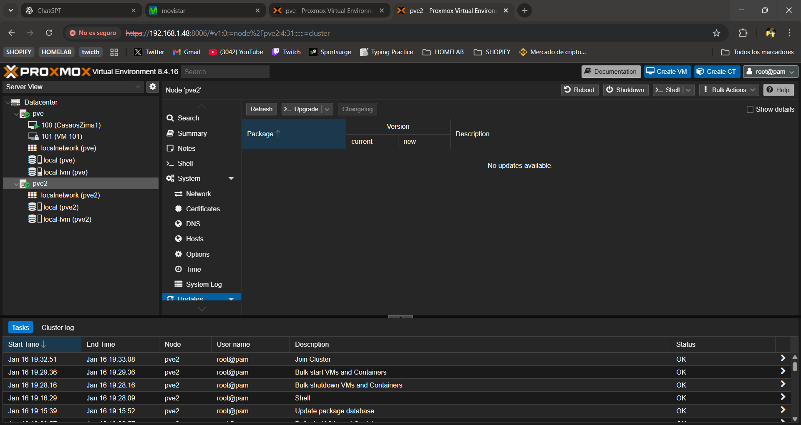
