# Virtual Machine PBS

## Backup

Ahora vamos a configurar el Backup de nuestra VM de el nodo principal, que es el principal trabajo de este servidor. Para realizar las Backups vamos a crear una VM dedicada a esto, vamos a usar el sistema operativo Proxmox Backup Server, descargamos la ISO desde su sitio web([https://www.proxmox.com/en/downloads](https://www.proxmox.com/en/downloads)) en este caso la ultima version 4.1.

### Config VM

Antes de nada vamos a crear los discos que vamos a usar en esta VM, en este caso son dos uno que lo vamos a llamar Sistema, este se va a encargar de alojar el sistema operativo PBS y otro que ya viene creado por defecto local-lvm es el encargado de guardar las Copias de seguridad.

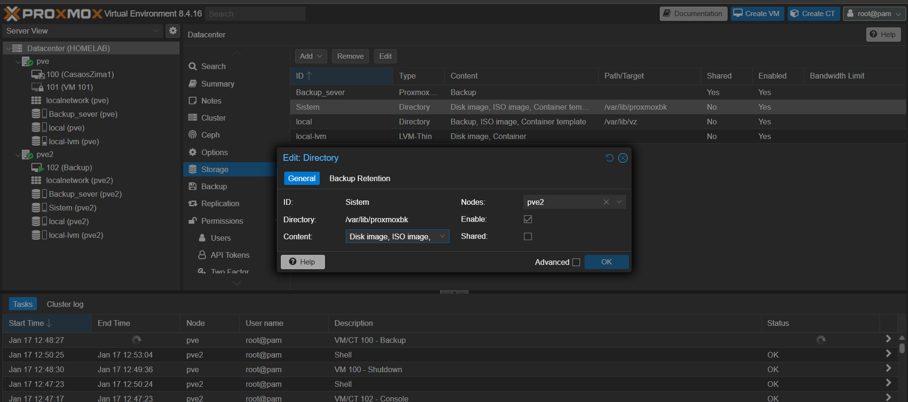

Iniciamos con la configuración de la VM, creamos la VM en el nodo secundario pve2.

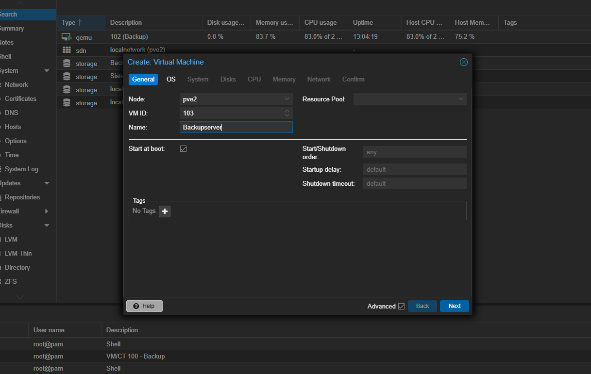

Ahora seleccionamos la ISO y Importante seleccionar el almacenamiento System y previamente a ver subido la ISO de la siguiente manera.

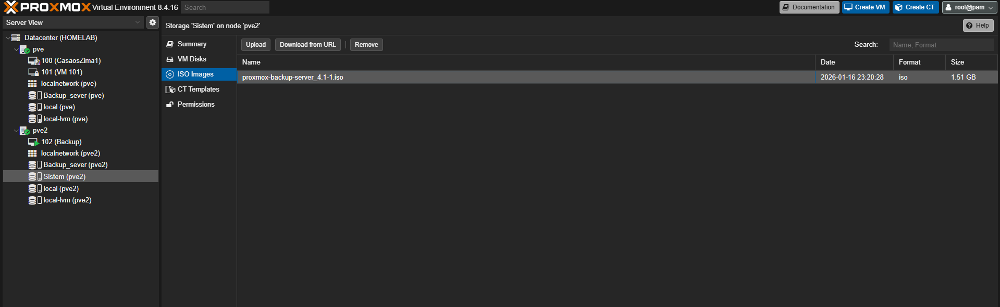

Luego ya podemos seleccionarla.

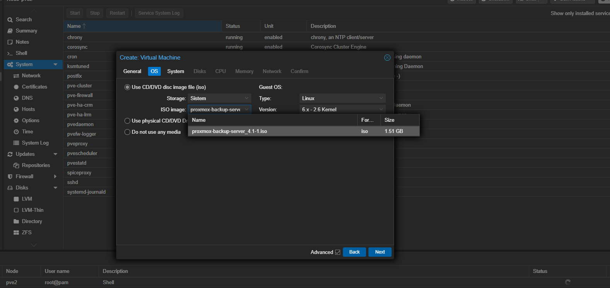

El sistema lo dejamos por defecto y pasamos al disco que también lo vamos a dejar por defecto.

En CPU vamos a aprovechar los dos Cores que tiene este dispositivo, lo demás por defecto.

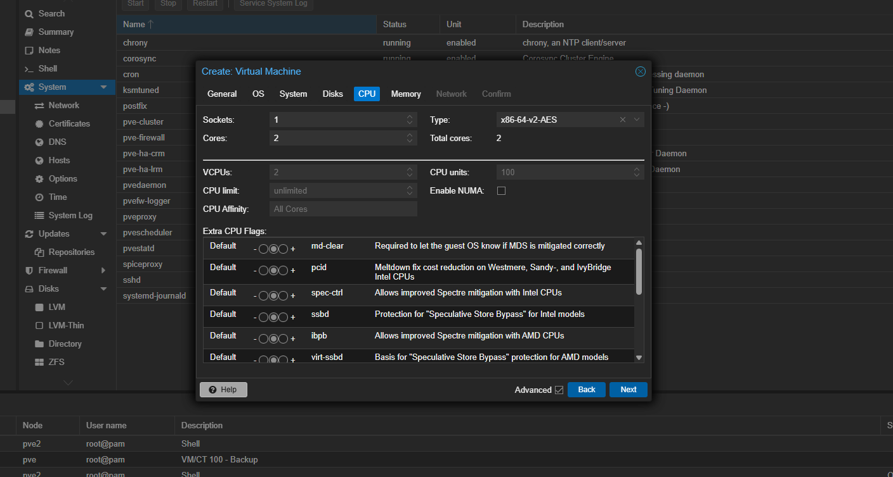

La memoria le vamos a poner 7000Mib ya que solo tenemos 8GB.

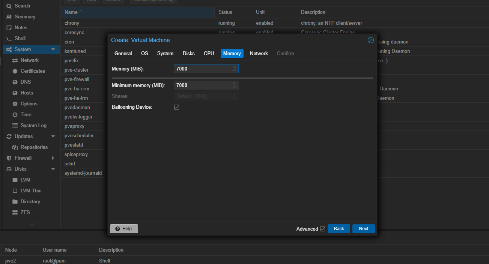

La Network la vamos a dejar en Bridge.

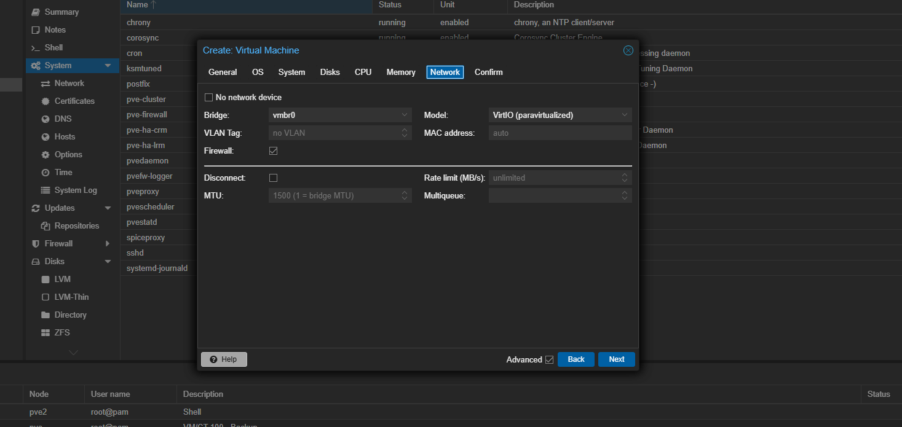

En resumen debería de quedar asi.

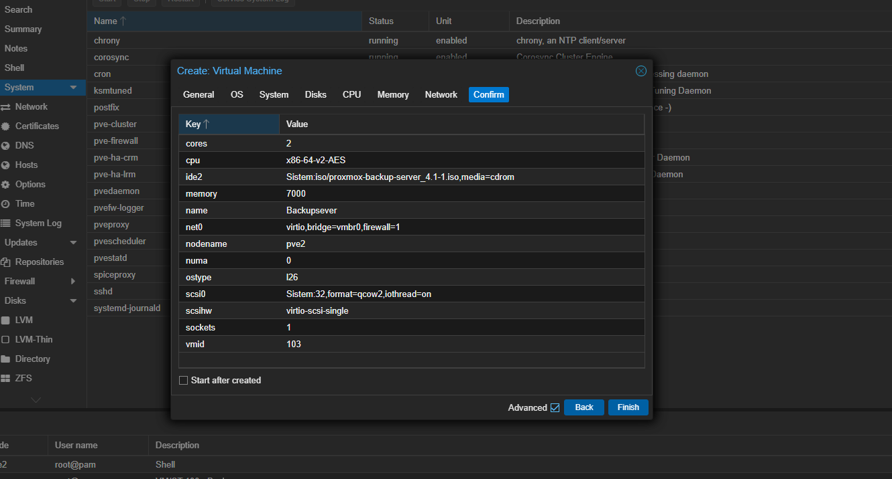

Una vez creada vamos a añadir el disco encargado de las Backups, yo lo voy a configurar con 1TB ya que mi VM ocupa aproximadamente 600GB.

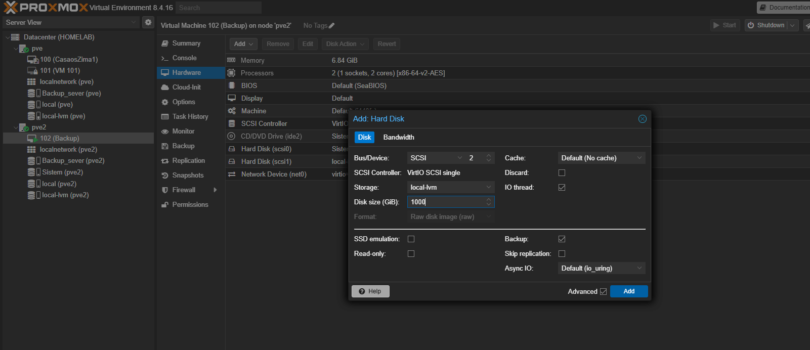

### Instalación PBS

Una vez creada la iniciamos y pasamos a la configuración del servidor PBS, esta configuración no la voy a documentar ya que es seguir el mismo proceso que con la instalación de Proxmox VE, ver mas arriba.

Una vez instalado nos metemos a su sitio web.

```text
https://192.168.1.51:8007
```

 Y vamos a empezar con la configuración, primero tenemos que crear el disco ZFS.

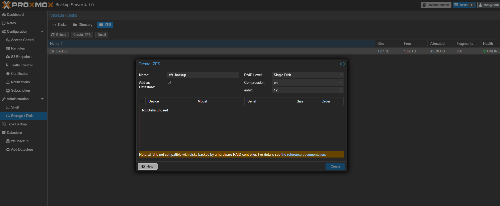

Con esto ya se nos crea automáticamente nuestro Datastore, esto es lo que vamos a conectar a nuestro DataCenter para hacer los Backups.

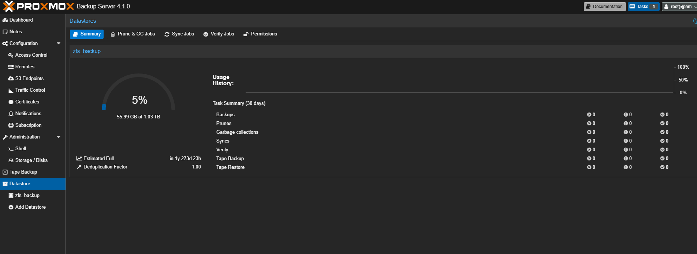

### Conexión DataCenter con PBS

Para conectar nuestro PBS al DataCenter vamos a ir a nuestro DataCenter y vamos a añadir este sistema de almacenamiento, toda la información de conexión se puede obtener desde nuestro    PBS

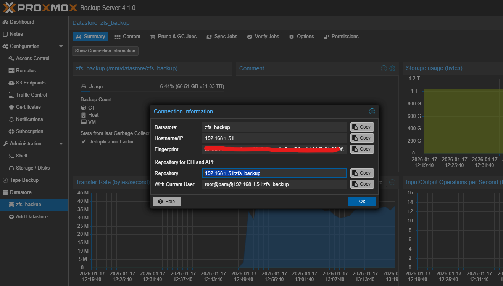

Ahora vamos a nuestro DataCenter y completamos los datos de conexión.

Si te da un error 401 probablemente la contraseña o el usuario están mal.

Ahora ya podemos hacer nuestro primer Backup para esto vamos a la VM que queremos hacer el Backup y seleccionamos Backup Now, yo en este caso voy a usar el modo parar.

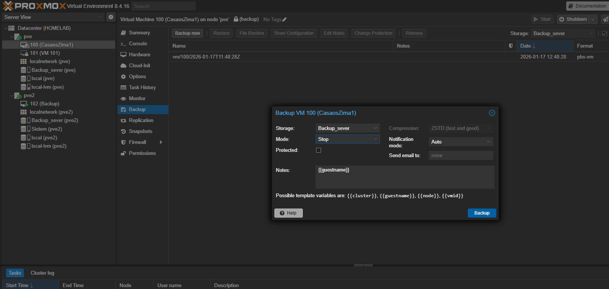
