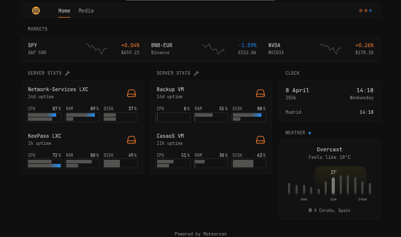
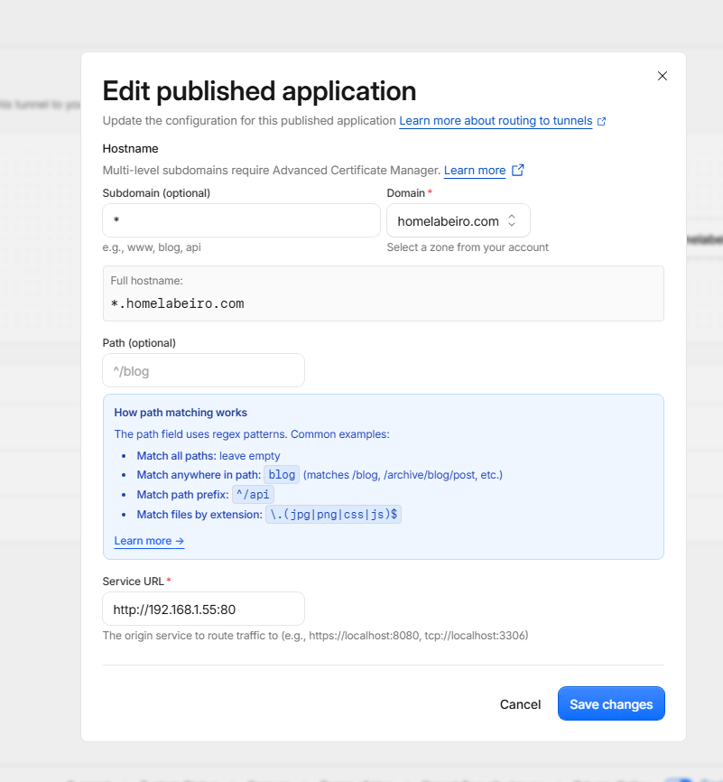
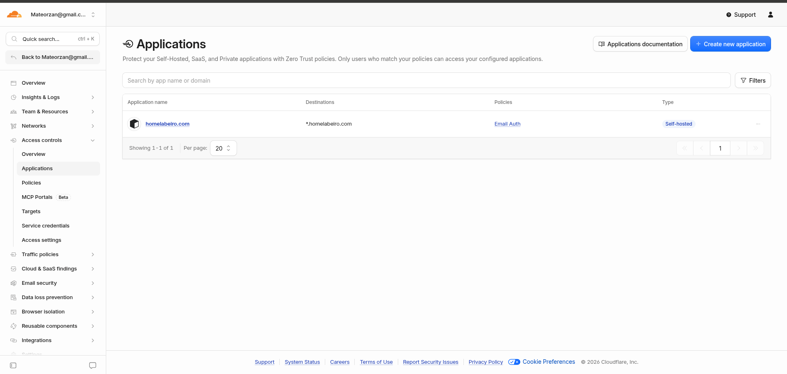
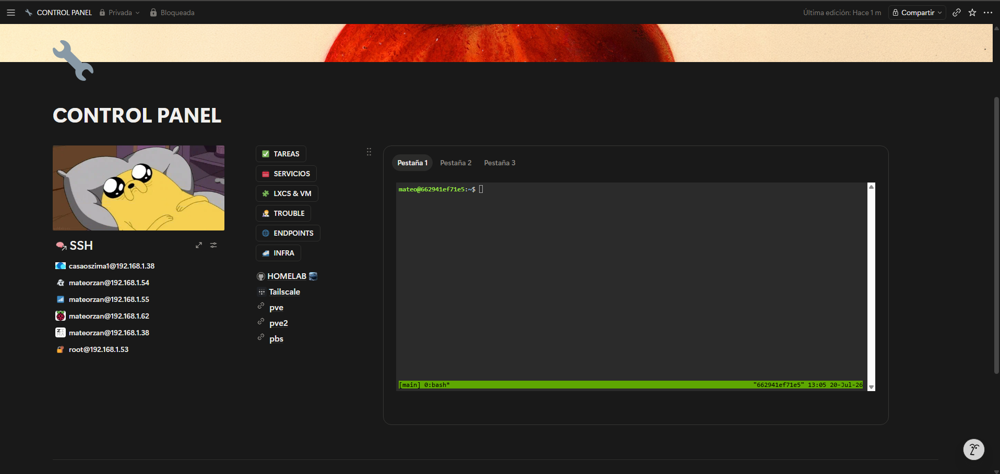

# Network-Services

Migre el servidor de mi PVE hacia mi PVE2 ya que con mi VM con ZimaOS mi PVE ya tiene mucha carga y mi PVE2 tiene menos carga, use la herramienta que viene integrada en Proxmox para migrar un contenedor de un cluster a otro.

Creamos esta LXC para descentralizar los servicios encargados de la exposición de ciertos servicios y asi sean mas accesibles y replicables el proceso de migración de estos servicios esta explicado en Migration.md de este Repositorio. Con esto vamos a aprovechar esta LXC para ademas crear un dashboard para poder ver que servicios hay en todo mi servidor y tener una vista general.

## NPM & Ddns-Updater & Cloudflared

Centralice estos tres servicios en un mismo compose.yml ya que asi me es mas comodo de gestionar y levantar los servicios a la vez, estos servicios son necesarios que esten arrancados siempre y uno depende del otro asi que me es util.

```Shell
services:
  nginxproxymanager:
    container_name: nginxproxymanager
    image: jc21/nginx-proxy-manager:2.12.3
    #network_mode: host
    ports:
      - "80:80"
      - "81:81"
      - "443:443"
    restart: unless-stopped
    volumes:
      - /DATA/AppData/nginxproxymanager/data:/data
      - /DATA/AppData/nginxproxymanager/etc/letsencrypt:/etc/letsencrypt

  ddns-updater:
    container_name: ddns-updater
    image: qmcgaw/ddns-updater:v2.9.0
    #network_mode: host
    ports:
      - "8000:8000"
    restart: unless-stopped
    environment:
      - PERIOD=5m
      - UPDATE_COOLDOWN_PERIOD=5m
      - PUBLICIP_FETCHERS=all
      - HTTP_TIMEOUT=10s
      - LOG_LEVEL=info
    volumes:
      - /DATA/AppData/ddns-updater/data:/updater/data

  cloudflared:
    image: cloudflare/cloudflared:latest
    container_name: cloudflared
    restart: unless-stopped
    #network_mode: host
    command: tunnel --no-autoupdate run --token
```

## Dashboards

### Glance

Elegí [Glance](https://github.com/glanceapp/glance?tab=readme-ov-file#installation) ya que me gusta su estética y sus funcionalidades, aunque no es un dashboard fácil de configurar. Vamos a seguir la instalación recomendada a traves de docker compose.

```bash
mkdir glance && cd glance && curl -sL https://github.com/glanceapp/docker-compose-template/archive/refs/heads/main.tar.gz | tar -xzf - --strip-components 2
```

Una vez instalado lanzamos el contenedor con docker compose.

```bash
docker compose up -d
```

Una vez lo tenemos corriendo podemos configurar a nuestra manera dentro de la carpeta `./glance/config/` ahi tenemos dos archivos que vienen ya con configuraciones de ejemplo `/home` es la pagina inicial y `glance` en la configuración del dashboard en general.

Yo borre esta configuración y cree la mia propia aunque aun sigue en proceso de construcción.



Para acceder al dashboard es desde la url que hayas configurado en tu docker-compose, por ejemplo `http://192.168.1.xx:8080/`

La configuración de server stats lo hice tanto usando el binaria como usando el docker-compose.yml para obtener las métricas de los contenedores.

```bash
services:
  glance-agent:
    container_name: glance-agent
    image: glanceapp/agent:latest
    restart: unless-stopped
    # environment:
      # TOKEN: your_auth_token_here
    volumes:
      - /:/host:ro
      - /proc:/proc:ro
      - /sys:/sys:ro
      - /dev:/dev:ro
      - /var/run/docker.sock:/var/run/docker.sock:ro
      - /etc/os-release:/etc/os-release:ro
    ports:
      - "27973:27973"
```

### Homepage Dashboard

Vamos a crear un Dashboard para nuestro Homelab

#### Docker

Instalación con docker compose.

```
services:
  homepage:
    image: ghcr.io/gethomepage/homepage:latest
    container_name: homepage
    ports:
      - 3000:3000
    volumes:
      - ./config:/app/config # Make sure your local config directory exists
      - /var/run/docker.sock:/var/run/docker.sock:ro # (optional) For docker integrations
    environment:
      HOMEPAGE_ALLOWED_HOSTS: 192.168.1.55:3000 # required, may need port. See gethomepage.dev/installation/#homepage_allowed_hosts
    restart: unless-stopped
```

## Cloudfared

Ahora cambiamos como estan expuestos mis servicios publicos, compre un dominio "homelabeiro.com" y a traves de tuneles de Cloudfare cree Routes y voy a cerrar los puertos de mi Router.

### Docker

Nos conectamos a traves de docker creando el servicio Cloudfared

```
  cloudflared:
    image: cloudflare/cloudflared:latest
    container_name: cloudflared
    restart: unless-stopped
    command: tunnel --no-autoupdate run --token
```

Luego simplemente creamos la ruta que apunta a todos nuestros nuevos subdominios que contengan nuestro dominio, y que esta apunte a nuestro NPM.



Dentro de nuestro NPM creamos los nuevos Proxys con el nuevo dominio y el NPM redirige las conexiones a nuestros servicios.

Con este sencillo cambio ganamos en seguridad , comodidad y autocontrol.

Para añadir más seguridad aun añadi un control de acceso a todo mi dominio `*.homelabeiro.com`desde Cloudfare , Zero Trust, Access Control. Con esto si accedes a uno de mis dominios primero te tendras que autenticar via correo y un pin unico que te llegara al mismo.



## TTYD

Vamos a crear un contenedor docker con TTYD lo cual es una herramienta que te permite ejecutar terminales via WEB.

Un problema que hay con estas terminales es la persistencia de la informacion si actualizas la web pierdes la sesion actual por lo que para solucionar este problema voy a crear una imagen personalizada que tenga tmux integrado.

### DockerFile

```
FROM tsl0922/ttyd
RUN apt update && apt install -y openssh-client tmux sudo && \
    useradd -m -s /bin/bash mateo && \
    echo "mateo:TU_PASSWORD" | chpasswd && \
    usermod -aG sudo mateo

USER mateo
WORKDIR /home/mateo

CMD ["ttyd", "-W", "tmux", "new-session", "-A", "-s", "main", "bash"]
```

Por seguridad vamos a crear un usuario no root llamada wetty y a root le vamos a poner una contraseña, esto es opcional.

### Docker Compose

```
services:
  ttyd:
    build: .
    ports: ["7681:7681"]
    restart: unless-stopped
```

En mi caso voy a crear una terminal basica con bash tmux para persistencia de la sesion.

Como es una imagen modificada con un Dockerfile tener que hacer un build

`docker compose up -d --build`

Con esto corriendo ya podemos acceder a la terminal desde.

`http://IP-SERVER:7681/`

En mi caso la voy a integrar en mi Notion, para que funcionara tuve que crear un proxy con URL HTTPS, a esta url le configure una access list para que solo fuera accesible desde mi red local.



## Whats Up Docker(WUD)

WUD es una herramienta para monitorizar tus servidores y mantenerlos siempre actualizados de una forma comoda. Esto es útil cuando tienes muchos contenedores.

### Docker Compose

```
services:
  whatsupdocker:
    image: getwud/wud
    container_name: wud
    volumes:
      - /var/run/docker.sock:/var/run/docker.sock
    ports:
      - 3005:3000
```

## Rathole

Rathole es un servicio que nos permite configurar un tunnel gestionado por nosotros, es muy parecido a lo que hace Cloudflared, pero una de sus diferencias es que hay que crear un archivo client.toml.

```
nano client.toml

[client]
remote_addr = "IP_VPS:Puerto"

[client.services.http]
token = "token"
local_addr = "127.0.0.1:80"

[client.services.https]
token = "token"
local_addr = "127.0.0.1:443"
```

### Docker Compose

```Shell
services:
  rathole-client:
    image: rapiz1/rathole:latest
    container_name: rathole-client
    restart: always
    network_mode: host
    volumes:
      - ./client.toml:/app/config.toml
    command: --client /app/config.toml
```
