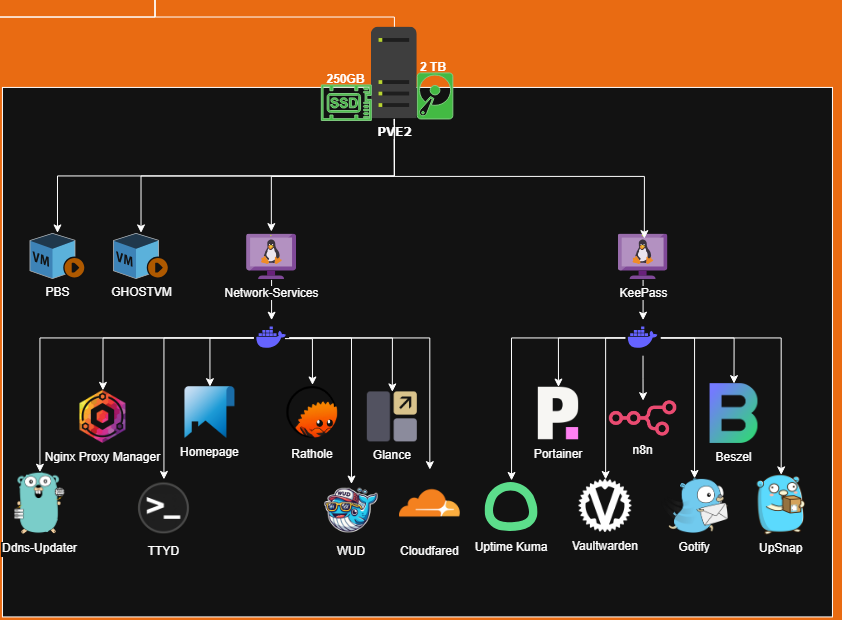

# Set Up Zimablade2 servidor secundario/BACKUP 👮

## Objetivo

Usaremos uno de los Zimablades como servidor secundario/nodo2, en este servidor vamos a ejecutar las copias de seguridad diarias para asegurar que no se pierda información, tambien vamos a correr otras LXCs y VMs para asi balancear la carga en nuestro nodo.

## Requisitos

* Zimablade con RAM 8gb / S*e amplio a 16gb de Ram*
* Pincho USB 8gb
* Cable Ethernet
* Monitor y adaptador miniDP a DP
* HUB usb (recomendado)

[Instalacion](./1-Instalación.md)

## Estado Actual

Aqui voy a ir documentando el estado actual y todo lo que se va montando en este nodo de manera visual, para mas información revisa el resto de .mds.

### Servidores *LXCs/VMs*

|      Nombre      | Tipo |       Utilidad       | Estado |
| :--------------: | :--: | :-------------------: | :----: |
|       PBS       |  VM  |        Backups        | Activo |
|     Keepass     | LXC | Servicios y Monitoreo | Activo |
|      Ghost      |  VM  |          CMS          | Activo |
| Network-Services | LXC |   Servicios de Red   | Activo |

### Servicios

|  Servicio  |      Tipo      |  Máquina  | Estado |
| :---------: | :-------------: | :---------: | :----: |
|   Upsnap   |   Wake-On-LAN   | LXC.keepass | Activo |
|     n8n     | Automatización | LXC.keepass | Activo |
| Vaultwarden |  Contraseñas  | LXC.keepass | Activo |
|   Gotify   |     Alertas     | LXC.keepass | Activo |
|   Beszel   |    Monitoreo    | LXC.keepass | Activo |
| Uptime Kuma |    Monitoreo    | LXC.keepass | Activo |
|  Portainer  |     Docker     | LXC.keepass | Activo |

|   Servicio   |     Tipo     |       Máquina       |   Estado   |
| :----------: | :-----------: | :------------------: | :---------: |
|     NPM     | Proxy Inverso | LXC.Network-Services |   Activo   |
|   Hompage   |   Dashboard   | LXC.Network-Services |   Desuso   |
|    Glance    |   Dashboard   | LXC.Network-Services |   Desuso   |
|     WUD     | Docker Images | LXC.Network-Services | En Progreso |
|     TTYD     | Terminal Web | LXC.Network-Services |   Activo   |
| Ddns-Updater |      IP      | LXC.Network-Services |   Activo   |
|   Rathole   |    Tunnel    | LXC.Network-Services |   Activo   |
| Cloudflared |    Tunnel    | LXC.Network-Services |   Activo   |
